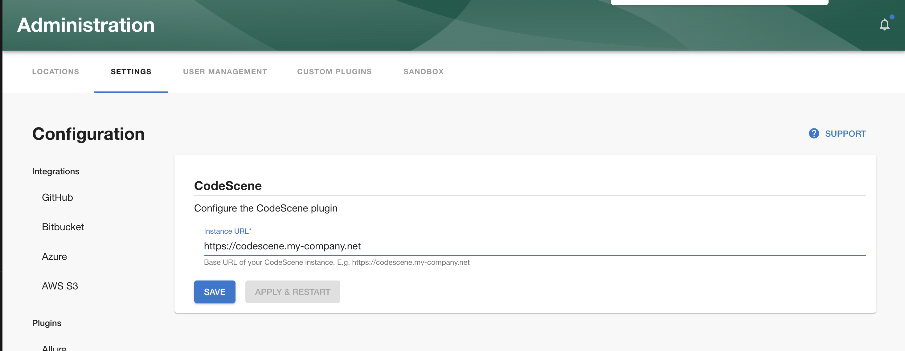

## Introduction

This page describes how to set up the CodeScene plugin on Roadie.

## Prerequisites

You'll need a CodeScene account and a basic Auth token.

## Step 1: Configure the CodeScene API token

Navigate to `/administration/settings/secrets` and click the edit icon beside the `CODESCENE_AUTH_CREDENTIALS` secret then
enter your basic auth token.

## Step 2: Configure the CodeScene API token

Navigate to `/administration/settings/codescene` and enter your CodeScene instance url then click "save" and then "Apply & restart". 

## Step 3: Create a Link to the CodeScene plugin

Enter the [sidebar edit mode](/docs/getting-started/updating-the-ui#updating-the-sidebar) and click the add icon. Then,
enter `Link` as the component, enter a title and set the path to `/code-scene` (exactly this value). Click Save.

Note: It might take some moments for the secret you configured to be available to the backend. You can check its status
on the secrets page.

## More information:

* [CodeScene plugin](https://github.com/backstage/backstage/tree/master/plugins/codescene)
