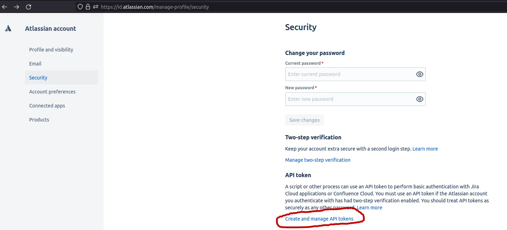
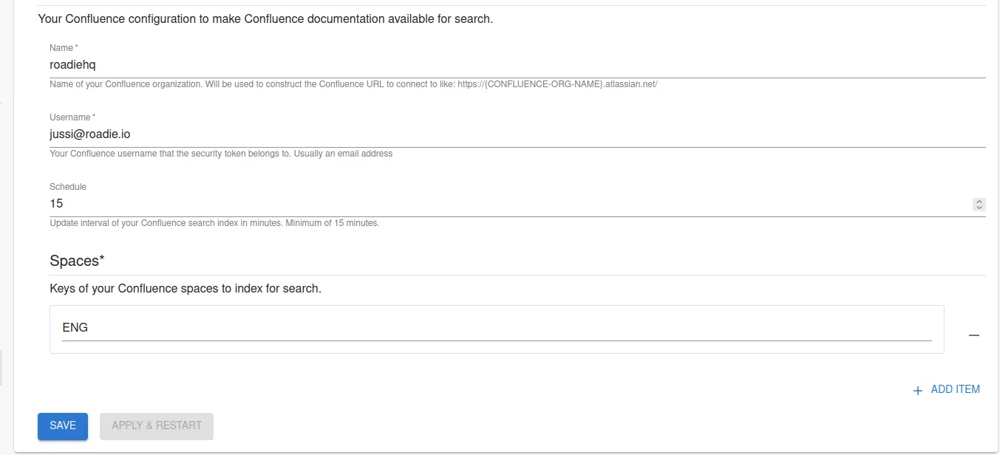

## Introduction

Roadie supports integration with Atlassian Confluence wiki platform to enable cross application search functionality. Roadie indexes documents from Confluence so they are available for you to search within the Roadie search bar. 

## At a Glance
| | |
|---: | --- |
| **Prerequisites** |  |
| **Considerations** |  |
| **Supported Environments** | ☐ Private Network via Broker   ☐ Internet Accessible via IP Whitelist   ☒ Cloud Hosted |

## Prerequisites

You'll need an Atlassian account with an ability to create an API token and the name of your Confluence organization.

## Configuring Confluence Integration

### Generate Atlassian API token

Roadie uses Atlassian Confluence API to retrieve indexable information from the wiki platform. To be able to connect to your Confluence instance, we need an API token. 
You can create an Atlassian token by navigating to your [**Atlassian** profile security page](https://id.atlassian.com/manage-profile/security) and Clicking 'Create and Manage API Tokens'.

On the page navigated into you are able to generate API tokens which can be used to connect Roadie to your Confluence workspaces.

### Store Token as a Secret to Roadie

When you have successfully generated your token, you can navigate to `https://<your-roadie-instance>.roadie.so/administration/confluence` and add the token to Roadie as `CONFLUENCE_TOKEN`.

### Configure Confluence Search Indexing

To enable your Confluence wiki for search indexing,  navigate to `https://<your-roadie-instance>.roadie.so/administration/confluence` and input your organization name, username, the Confluence Spaces keys you want to index, Confluence API token, and indexing interval. The fastest interval rate we support is scheduling indexes every 15 minutes to prevent excessive use of Confluence's API token.

After clicking "Apply & Restart", the search engine on Roadie will start populating the search index with Confluence documents. Note that the first time we retrieve your Wiki may take some time to populate, depending on the number of documents in Confluence.

## More information:

* Confluence API token documentation: https://support.atlassian.com/atlassian-account/docs/manage-api-tokens-for-your-atlassian-account/
