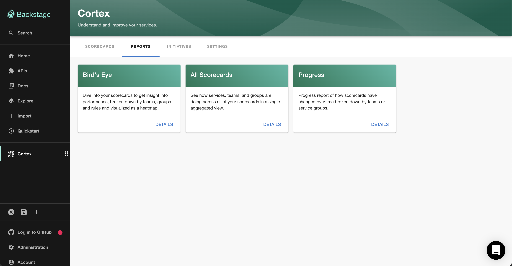

## Introduction

The [Backstage Cortex plugin](https://www.npmjs.com/package/@cortexapps/backstage-plugin) integrates with Cortex to sync your entities with Cortex and display reports.

## Prerequisites

You'll need a Cortex account with an API token and the url of your Cortex backend.

## Adding the plugin

### Add the Cortex secrets

First, add the `CORTEX_TOKEN` and `CORTEX_BACKEND_HOST_URL` secrets via `Administration -> Settings -> Secrets`. Note you'll
need to wait for the secrets to be marked as "Available" before you can use the Cortex plugin.

### Add the plugin to the UI

The cortex plugin provides three components which can be added to the Backstage UI. You must be a Backstage admin to
add components to the UI.

The `CortexScorecardWidget` component can be [added to component dashboards](/docs/getting-started/updating-the-ui/#updating-dashboards).

The `EntityCortexContent` component provides a tab which [can be added to component layouts](/docs/getting-started/updating-the-ui#updating-tabs).

Finally, the `CortexPage` is a top level page which [can be added to the sidebar](/docs/getting-started/updating-the-ui#updating-the-sidebar)

