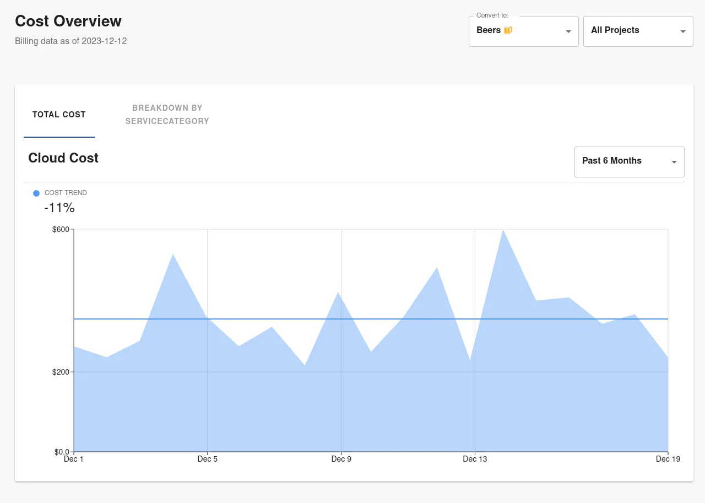
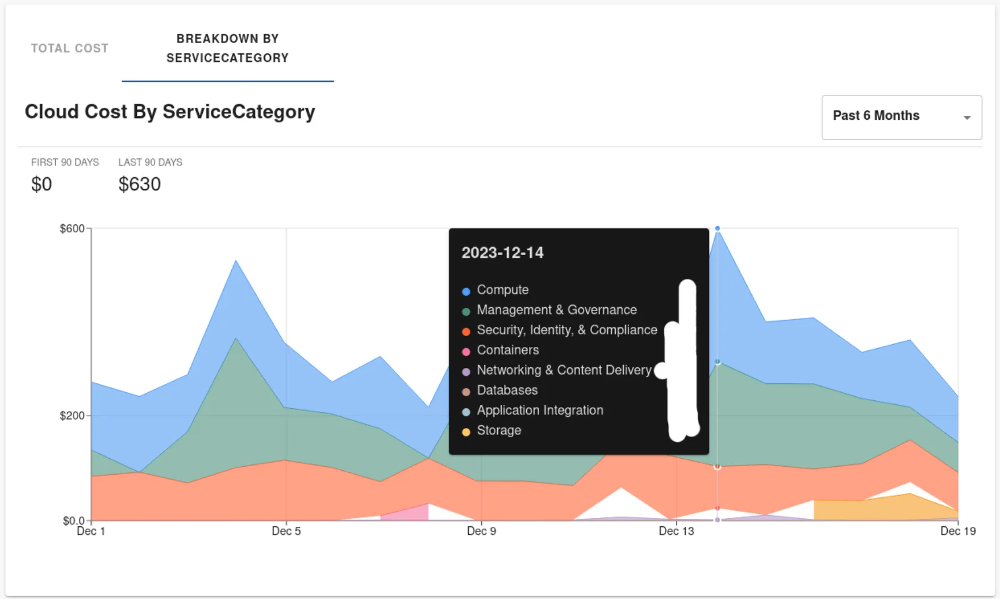
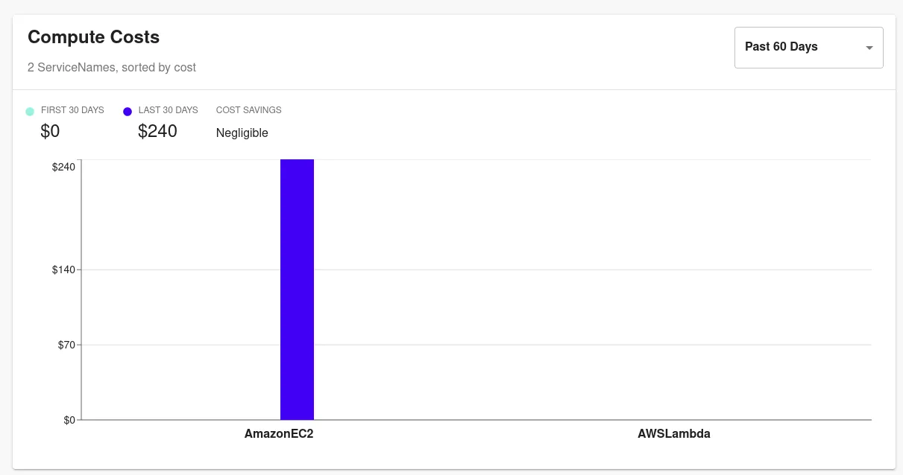
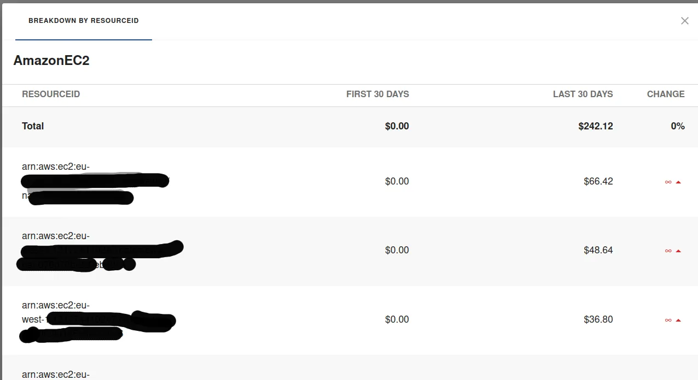
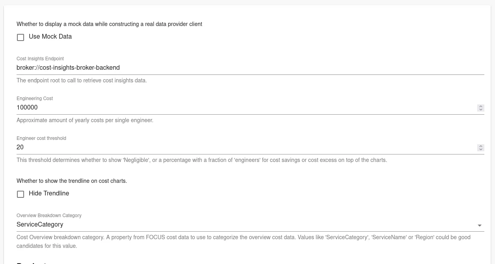
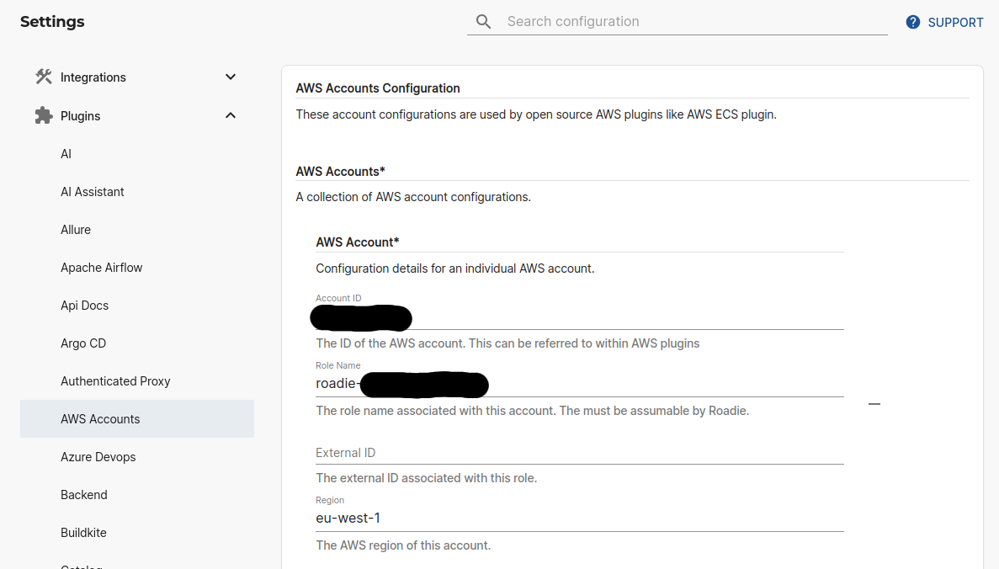
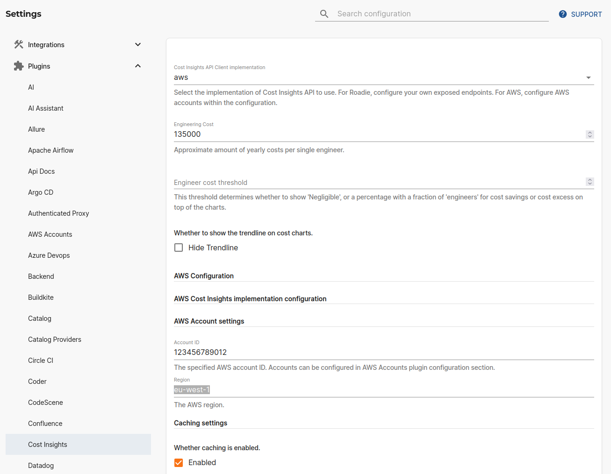

## At a Glance
| | |
|---: | --- |
| **Prerequisites** |  |
| **Considerations** |  |
| **Supported Environments** | ☐ Private Network via Broker <br /> ☐ Internet Accessible via IP Whitelist <br /> ☒ Cloud Hosted |

Roadie provides two easy ways to track your cloud costs directly within your Roadie instance. The cost insights plugin is based on the open source [Cost Insights plugin](https://github.com/backstage/backstage/tree/master/plugins/cost-insights) and provides the same functionality in an easily customizable way. The available implementations include an implementation provided by AWS, which allows you to display AWS Cost Explorer data in your Roadie and Roadie provided implementation which support FOCUS standard date set to allow displaying more fine-grained cost information.

## Overview

Cost Insights plugin provides the possibility to view and track cost fluctuations on few different levels. 


### Cost Overview

The overall cost overview view displays costs overview based on different teams within the organization.



The breakdown tab of cost overview allows you to dig in deeper to identify the cost trends for each individual subcategory within the provided cost data. The breakdown dimension is fully configurable. Within the image below we are displaying breakdown of costs based on "ServiceCategory", which is a dimension of the provided data set. 




### Product costs

Within the plugin you also have configuration options to track cost for individual product dimensions. Within the image below we are tracking costs for category value "Compute" within the ServiceCategory dimension. With this we are able to drill in deeper to see more granular cost information about items. 



There is also possibility to investigate individual product category values. You can see the breakdown of a single category value and costs of items related to that. Within the image below we are looking at costs of the individual resources within the category values selected on the items displayed above.


Both of these dimensions, on the higher level, and drilling in deeper, are fully configurable and can be set up to show various important cost dimensions based on needs. 

## Configuration (Roadie API)

The plugin needs to be configured on 2 different levels. 
1. To be able to use the Cost Insights functionality, you need to configure a data source which provides relevant cost data using the open source [FOCUS](https://focus.finops.org/) format defined by the FinOps foundation, as well as all the biggest cloud providers. 
2. The Cost Insights plugin needs to be configured through the Roadie UI to use correct data points and dimensions from the provided data.

### Cost Insights Backend

The plugin configuration depends on a backend server which provides the cost data to be displayed. Roadie has created an example client which provides more information about the needed endpoints and their purposes, as well as OpenAPI specs on what payload shapes are expected. More information and the demo backend server (written in node.js) can be found from here: https://github.com/RoadieHQ/demo-cost-insights-client.

The repository contains more information about the shape of the data that is expected as well as explanations on how the endpoints should be constructed.

#### Roadie Broker Connection

In most use cases the backend would likely be hosted on an internal server within an internal network. This causes problems with connectivity between Roadie and the data providing service which can be solved in few different ways. 

A simple solution for externally exposed backend services is to add Roadie's IP address ranges to an allowlist. You can find the ranges and hostnames Roadie uses from the ["Allowlisting Roadie Traffic" documentation](/docs/details/allowlisting-roadie-traffic/).

A more secure and usually preferred solution is to run the Cost Insights backend API in a secure internal network and allow only specific traffic from Roadie through to that service. This can be achieved using [the broker connection](/docs/integrations/broker/). 

Roadie provides a preconfigured Broker Docker image which can be deployed to your infrastructure to act as a connection _broker_ between Roadie and your implemented Cost Insights backend. The broker image with pre-built configuration options can be pulled from DockerHub with command `docker pull roadiehq/broker:cost-insights`. 
The needed Cost Insights specific environment variable to run this Docker image is `COST_INSIGHTS_API_URL`, which should point to the server IP or URL providing the cost-insights data. For other configuration regarding the broker connection, please take a look at the Broker documentation linked above. 


### UI configuration

The Cost Insights UI configuration within Roadie is divided into 2 different sections. 

In the first section we have general configuration to point to the correct Cost Insights backend which acts as a data source for the underlying data. See more information about this on the above configuration sections. 

The Engineering Cost value is something that is mandatory within the open source Cost Insights plugin and is used to compare costs to used engineering hours. 

On "Overview Breakdown Category" you can choose the most relevant breakdown column name from the FOCUS schema which will be used to generate the breakdown information on the overall level.



The second section of the configuration is to add configure "Products" into the Cost Insights UI. There can be multiple of these and in most cases it is recommended to create multiple of these to look at the related cost data from different view points. 

The first two configuration values are related to each other and must be chosen wisely.
* The first configuration item (**Category**) is a selection of a _Column Name_ from the FOCUS schema.
* The second configuration item (**Kind**) is a selection of a value that is present in the column name defined as _Category_ mentioned above.
* Additionally, you need to add further Grouping configuration which is used to construct the different groups of bar charts to show in the UI.

There is also a possibility to configure further Breakdowns within these groupings which can be used to identify more granular information about the provided cost data.


## Configuration (AWS API)

AWS implementation of the Cost Insights plugin allows you to display cost data from AWS Cost Explorer based on cost allocation tags and groupings.

### AWS Cost Insights API connection configuration

The AWS Cost Insights implementation uses the same AWS credential chain as other AWS plugins. Roadie allows you to expose an assumable role from your AWS account which can be used to gather information from AWS Cost Explorer. You can set up this role and needed configurations for it within the `Plugins` -> `AWS Accounts` configurations section in the Administration screen.  



Note that Roadie dictates that the assumable role must have a name starting with `roadie-<your-tenant-name>` for security reasons. 


The needed policy for the role should contain at least the following permissions:

```json
{
  "Version": "2012-10-17",
  "Statement": [
    {
      "Effect": "Allow",
      "Action": ["ce:GetCostAndUsage"],
      "Resource": "*"
    }
  ]
}
```

### AWS Cost Insights configuration

The configuration for AWS Cost Insights implementation can be set up in the `Administration` -> `Cost Insights` settings section. Within there you have the option to select eiter `roadie` or `aws` implementation of the API. 



Within the configuration you can set a reference to the AWS account id configured in the AWS Accounts settings section. Additionally, you have to set an engineering cost and potentially select if you want to enable caching of the API calls. Making API calls towards AWS Cost Explorer incur costs when data is retrieved.

### Cost Insights Content Tab setup

AWS Cost Insights exposes a content tab which can be added to your entity pages. This tab uses entity annotations to display cost information for the entity.  

You can configure the entity pointing to relevant AWS tags by using either `aws.amazon.com/cost-insights-tags` or `aws.amazon.com/cost-insights-cost-categories` annotations. 

```yaml
apiVersion: backstage.io/v1alpha1
kind: Component
metadata:
  # ...
  annotations:
    aws.amazon.com/cost-insights-tags: component=myapp,environment=prod
spec:
  type: service
  # ...
```

This allows flexibility regarding how costs are retrieved for different entities. For example a Group entity might look like this:

```yaml
apiVersion: backstage.io/v1alpha1
kind: Group
metadata:
  name: guests
  annotations:
    aws.amazon.com/cost-insights-tags: owner=guests
spec:
  type: team
```

Categories annotation allows to configure the entity to display cost information based on the AWS Cost Explorer category.

```yaml
apiVersion: backstage.io/v1alpha1
kind: Component
metadata:
  # ...
  annotations:
    aws.amazon.com/cost-insights-cost-categories: myapp-category
spec:
  type: service
  # ...
```

## More information:

* [AWS Cost Insights plugin implementation](https://github.com/awslabs/backstage-plugins-for-aws/blob/main/plugins/cost-insights/README.md)

