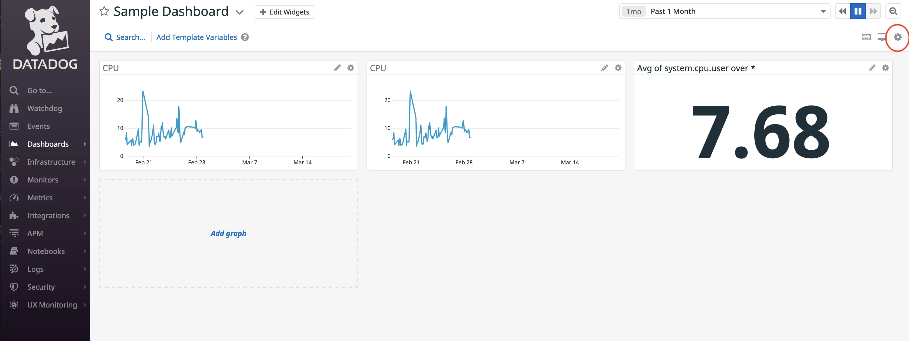
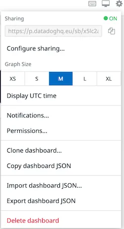
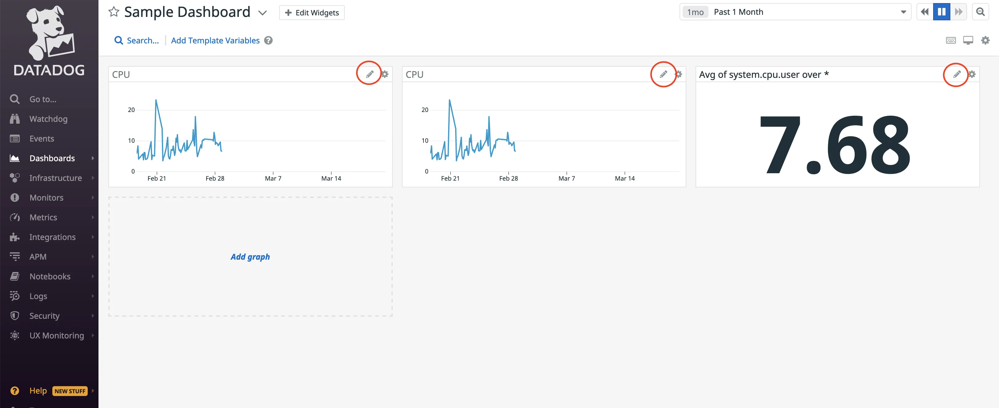
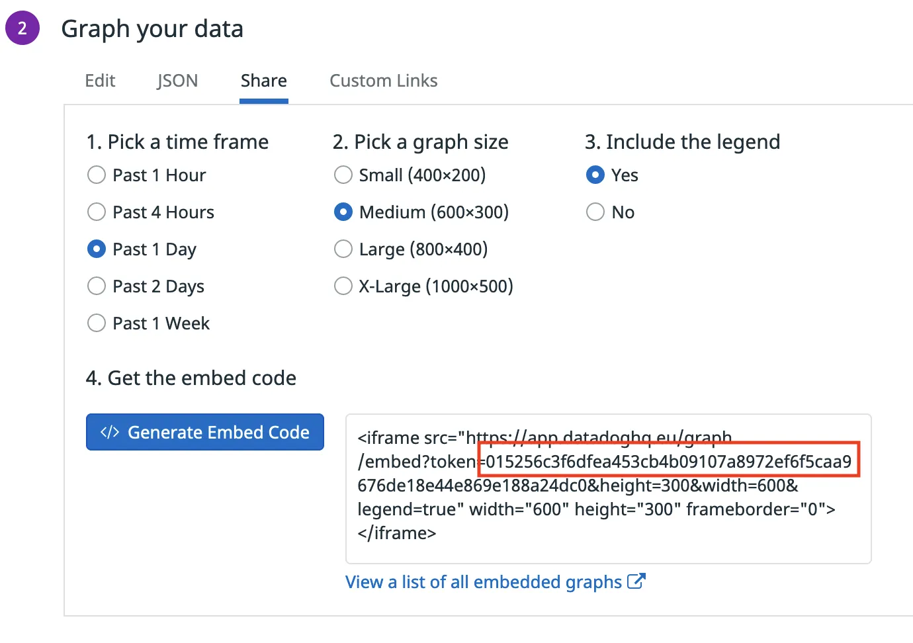
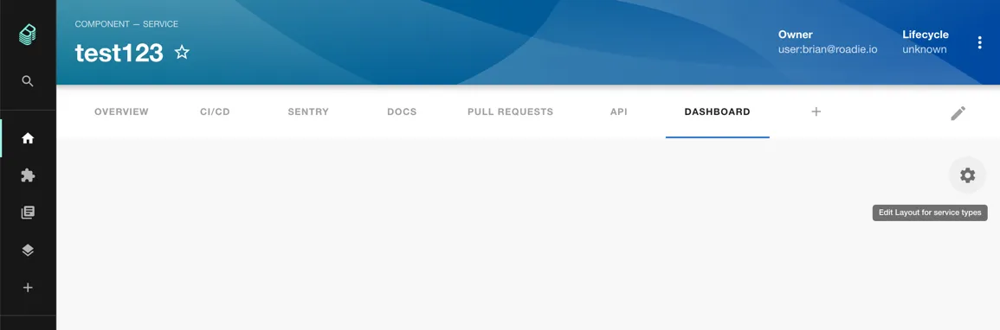
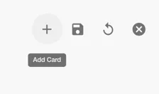
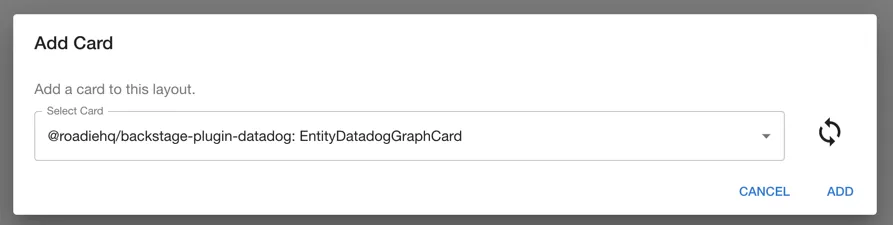

## Introduction

With this plugin, you can embed Datadog graphs and dashboards into Roadie Backstage. Datadog is a monitoring service for cloud-scale applications, providing monitoring of servers, databases, tools, and services through a SaaS-based data analytics platform.

## At a Glance
| | |
|---: | --- |
| **Prerequisites** | **Configuration Data:** <ul><li>Graph Embed Token</li><li>Dashboard URL</li><li>Datadog instance domain</li></ul> |
| **Considerations** | ⚠️ Due to the limitation of Datadog sharing, the dashboard or graph must be publicly accessible in order for the plug-in to display the data. Make sure you do not share these URLs with untrusted actors. |
| **Supported Environments** | ☐ Private Network via Broker <br /> ☐ Internet Accessible via IP Whitelist <br /> ☑ Cloud Hosted |

## How to embed a datadog dashboard in Roadie

### Obtain the dashboard URL from Datadog that you will need for your metadata.

* Login to your Datadog account.

### Get the dashboard URL.

* Navigate to the dashboards list by hovering over dashboards on the page's left-hand side and selecting the dashboard list.

* Select a dashboard from this list.

* Within the dashboard you have chosen, click the settings cog on the screen's right-hand side, circled in red.



* Copy the URL from the Sharing textbox.

* This URL is the value you need for the `datadoghq.com/dashboard-url` annotation.




### Adding the annotations and the values from Datadog to your component's metadata file.

```yaml
apiVersion: backstage.io/v1alpha1
kind: Component
metadata:
  name: sample-service
  description: |
    A sample service
  annotations:
    datadoghq.com/dashboard-url: <<DATADOGURL>>
```

## How to embed a datadog graph in Roadie

* Login to your Datadog account.

### Get the graph token.

* Click on the graph pencil, circled in red, from your dashboard.



* Click on the Share tab, choose a timeframe, graph size and legend. Click generate the embedded code.

* Copy the token value that is highlighted in the red square.

* this token is the value you need for the `datadoghq.com/graph-token` annotation



### Customize graph size.

In order to customize size of the graph you may specify datadoghq.com/graph-size annotations and specify one of the following options:

* 'small'

* 'medium'

* 'large'

* 'x-large';

If not specified, your graph will be 'medium' size per default.

### Adding the annotations and the values from Datadog to your component's metadata file.

```yaml
apiVersion: backstage.io/v1alpha1
kind: Component
metadata:
  name: sample-service
  description: |
    A sample service
  annotations:
    datadoghq.com/graph-token: <<TOKEN>
```


## Adding UI components

The Datadog plugin exposes two different component that can be used in your Roadie application:

1. EntityDatadogGraphCard, a card component that can be added as a widget to Overview and dashboard tabs
2. EntityDatadogContent, acomponent that can be used as a standalone tab


The `EntityDatadogGraphCard` uses `datadoghq.com/graph-token` annotation and displays individual graphs on your dashboard.
For more information how to add card components to Roadie take a look at [the documentation on how to update dashboards.](/docs/details/updating-the-ui/#updating-dashboards).


The `EntityDatadogContent` uses `datadoghq.com/dashboard-url` annotation as displays Datadog dashboards.
This component can be [added as a tab](/docs/getting-started/updating-the-ui#updating-tabs) to component layouts.


### Add a Datadog card to the overview tab of the Entity Page

Click the cog icon on the top right of a component page. Then click add card.




Select the datadog graph card from the drop down and Click add. Press save to submit.




## Specify datadog domain

The Datadog Backstage plugin uses `datadoghq.eu` as the default top-level domain. If you would like to use a different Datadog domain, you must specify it with a corresponding annotation on your `catalog-info.yaml` file.

### Adding the annotations and the values from Datadog to your component's metadata file.

```yaml
apiVersion: backstage.io/v1alpha1
kind: Component
metadata:
  name: sample-service
  description: |
    A sample service
  annotations:
    datadoghq.com/site: datadoghq.com
```

