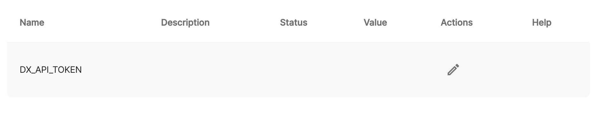
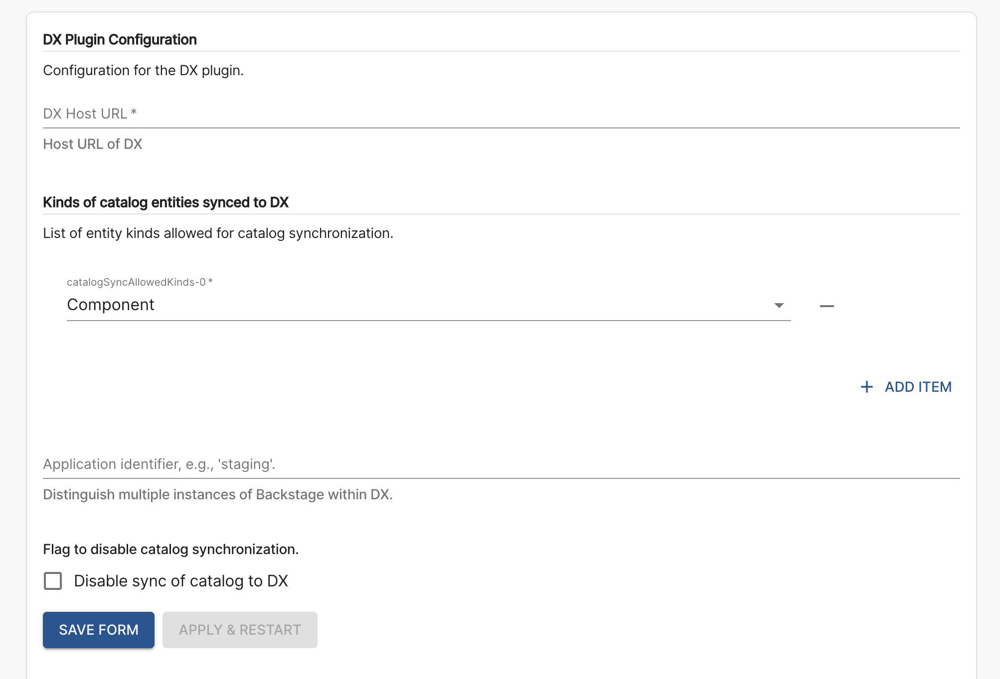
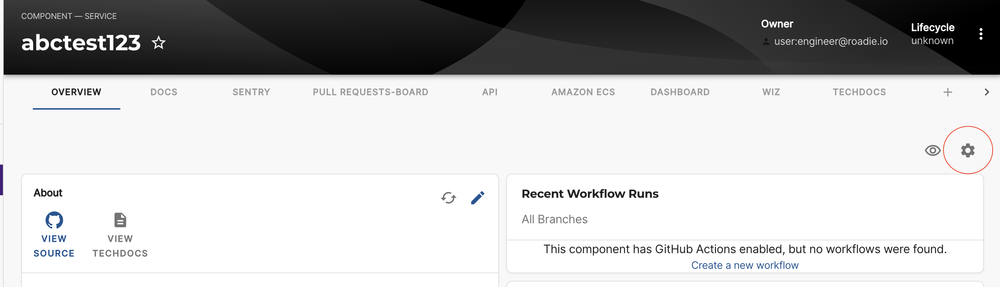
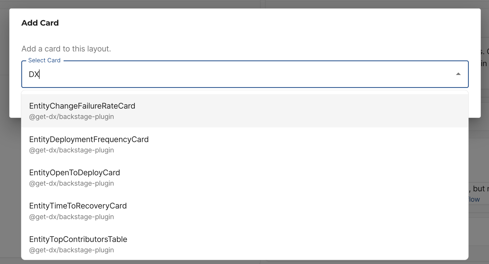
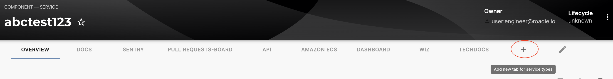
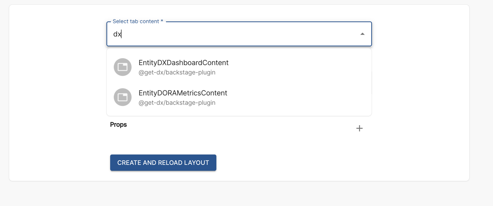

## Introduction

The [Backstage DX plugin](https://github.com/get-dx/backstage-plugin) is a Backstage plugin designed to improve the overall developer experience within a Backstage platform. It aims to simplify and streamline the development process by offering insights, tools, and integrations tailored to enhance development workflow.

It includes the [Backstage DX Frontend Plugin](https://github.com/get-dx/backstage-plugin), which displays DX data and [Backstage DX Backend Plugin](https://github.com/get-dx/backstage-backend-plugin/) which enables automatic synchronization of Backstage data with the DX Data Cloud.

## At a Glance
| | |
|---: | --- |
| **Prerequisites** |  |
| **Considerations** |  |
| **Supported Environments** | ☐ Private Network via Broker <br /> ☐ Internet Accessible via IP Whitelist <br /> ☒ Cloud Hosted |

## Add DX to your components

### Add the needed DX annotation(s)

In order to use the plugin you will need to set one of the required gitlab.com/project-slug annotations under metadata section

```yaml
apiVersion: backstage.io/v1alpha1
kind: Component
metadata:
  # ...
  annotations:
    github.com/project-slug: 'project-slug'
  # ...
```

### Create and add an DX API Token

Retrieve an API token of your DX account which can be found within [your DX instance](https://app.getdx.com/datacloud/api_keys)

Then add it to Roadie at `https://<tenant-name>.roadie.so/administration/settings/dx` by entering the token value from above into `DX_API_TOKEN`.



or by entering token value under `DX_API_TOKEN` on `https://<tenant-name>.roadie.so/administration/settings/secrets`

### Enable and configure the plugin

In the same DX configuration section, provide the relevant DX proxy to be able to retrieve information. Proxy can also be found in [your DX instance](https://app.getdx.com/datacloud/api_keys) (e.g 'https://dx.com').

### Additional configuration options

You can provide several optional configuration options in this section.



Kinds of catalog entities synced to DX - An optional entity kind filter for syncing catalog entities to DX. By default, we sync Component kind but this allows you to expand that list and select which kinds of entities are synced.

Application identifier - Optional attribute used by DX to differentiate Backstage applications. Can be any string as long as it's unique within your DX account.

Disable sync of catalog to DX - In order to start using the plugin make sure this field is **unchecked**. It is automatically checked per default in order to avoid unnecessary catalog sync so once you start using the plugin you will need to uncheck this field.

### Adding DX card components to overview tab of the Entity Page

Click the cog icon on the top right of a component page.



Then click the plus icon and select the card you wish to add from the list card.



Press save to submit.

### Adding DX as a separate tab

DX provides 2 dashboards which you can select from the list and add as a tab by navigating to



and selecting option which you want to add



EntityDXDashboardContent provides Dashboard with all available DX Charts and EntityDORAMetricsContent provides dashboard with all the DORA metric charts.

## References

- [DX Plugin Documentation](https://github.com/get-dx/backstage-plugin)
- [DX Backend Plugin Documentation](https://github.com/get-dx/backstage-backend-plugin)
