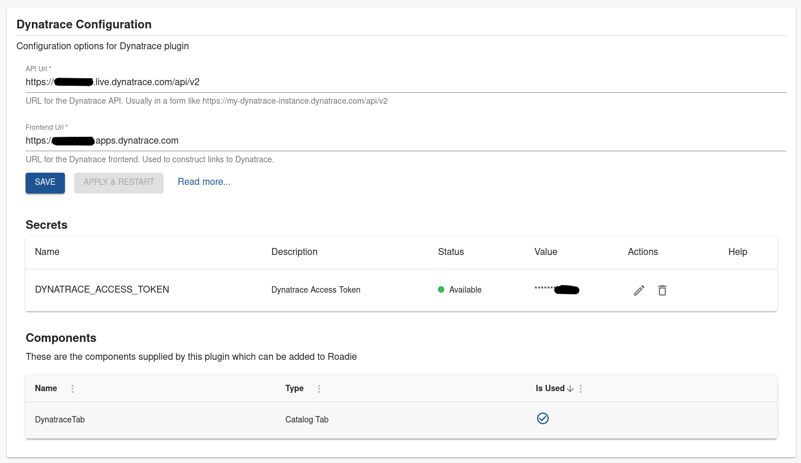
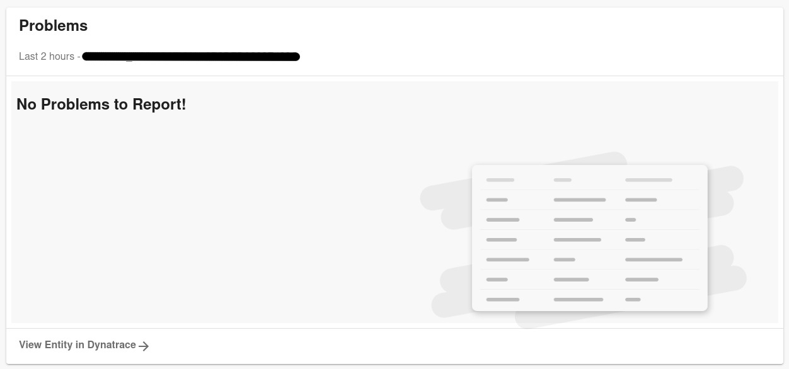

## Introduction

With this plugin, you can embed information about Dynatrace problems into your entity pages within Roadie. 

## Step 1 - Obtain Dynatrace API key

You need a Dynatrace API access token to be able to use the Dynatrace plugin. You can follow the instructions on how to retrieve the token in the Dynatrace documentation: https://docs.dynatrace.com/docs/dynatrace-api/basics/dynatrace-api-authentication. 

The plugin requires an access token with the following permissions to be able to retrieve relevant information from the Dynatrace REST API:
* `entities.read`
* `problems.read`
* `DataExport` and/or `ExternalSyntheticIntegration` and/or `ReadSyntheticData`

## Step 2 - Configure your Dynatrace in Roadie

Navigate to `Administration` -> `Settings` -> `Dynatrace` and configure your instance URLs and the access token.

The configuration expects 2 different URLs:
1. An API endpoint URL
    * For SaaS Dynatrace this is usually in form of `https://{your-environment-id}.live.dynatrace.com/api/v2/`
    * For managed Dynatrace the URL should look like `https://{your-domain}/e/{your-environment-id}/api/v2/`
2. A URL pointing to your Dynatrace application frontend
    * For SaaS Dynatrace the URL is something like `https://{your-environment-id}.apps.dynatrace.com`

Add your generated access token created in step 1 as a secret to the application. The secret to use for Dynatrace is called `DYNATRACE_ACCESS_TOKEN`. 

## Step 3 - Add Dynatrace annotations to your Entities

The Dynatrace plugin uses the following annotation to link Dynatrace entities to entities within Roadie: 
* `dynatrace.com/dynatrace-entity-id`
  * for example: `dynatrace.com/dynatrace-entity-id: SERVICE-1234ABCD4321DCBA`

The Dynatrace entity id can be found in Dynatrace by browsing to the entity (a service, synthetic, frontend, workload, etc.). It will be located in the browser address bar in the id parameter and has the format ENTITY_TYPE-ENTITY_ID, where ENTITY_TYPE will be one of SERVICE, SYNTHETIC_TEST, or other, and ENTITY_ID will be a string of characters containing uppercase letters and numbers. 

If you want to display Dynatrace Synthectics results within Roadie you can also annotate your entities with annotation:
* `dynatrace.com/synthetics-ids`
  * for example: `dynatrace.com/synthetics-ids: SYNTHETIC_ID, SYNTHETIC_ID_2, SYNTHETIC_ID_3`

The annotation can also contain a comma or space separated list of Synthetic Ids to surface details for multiple monitors!

The SYNTHETIC_ID can be found in Dynatrace by browsing to the Synthetic monitor. It will be located in the browser address bar in the resource path - https://example.dynatrace.com/ui/http-monitor/HTTP_CHECK-1234 for an HTTP check, or https://example.dynatrace.com/ui/browser-monitor/SYNTHETIC_TEST-1234 for a browser clickpath.

## Step 4 - Add Dynatrace tab into your application

Navigate to a Catalog Entity page as an administrator and add a new tab. The name of the component you want to add in is  `DynatraceTab` from package `@backstage/plugin-dynatrace`. Once you have configured the plugin URLs and authentication token, you should be able to see your Dynatrace problems for the entity.

## Resources:
* [Dynatrace API Documentation](https://docs.dynatrace.com/docs/dynatrace-api/basics)
* [Dynatrace open source plugin](https://github.com/backstage/backstage/tree/master/plugins/dynatrace)