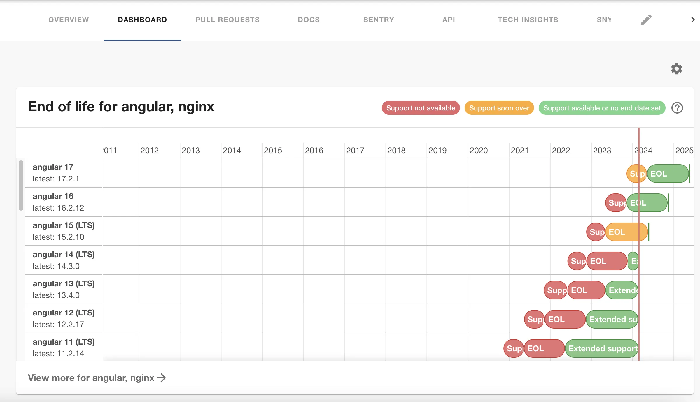

## Introduction

The End Of Life plugin can display end of life data relevant to your entities from endoflife.date or your own sources. 



This page explains how to configure it in Roadie Backstage.

## At a Glance
| | |
|---: | --- |
| **Prerequisites** |  |
| **Considerations** |  |
| **Supported Environments** | ☐ Private Network via Broker <br /> ☐ Internet Accessible via IP Whitelist <br /> ☑ Cloud Hosted |

## Step 1: Add the Card to the Roadie UI

Add the card named `EntityEndOfLifeCard` to any layouts you wish such as all Services or all Resources. You can read more 
about this [here](/docs/details/updating-the-ui/).

## Step 2: Annotate your entities 

Annotate your entities with the products you wish to display EOL information for. For example, to track EOL
information for angular and nginx annotate your entities with the `endoflife.date/products` annotation: 

```yaml
metadata:
  #...
  annotations:
    #....
    endoflife.date/products: angular,nginx
```

For more information on the options available such as custom sources please read the [plugin documentation](https://github.com/dweber019/backstage-plugins/tree/main/plugins/endoflife#annotations)

## References
* [endoflife.date](https://endoflife.date/)
* [Plugin documentation](https://github.com/dweber019/backstage-plugins/tree/main/plugins/endoflife)
