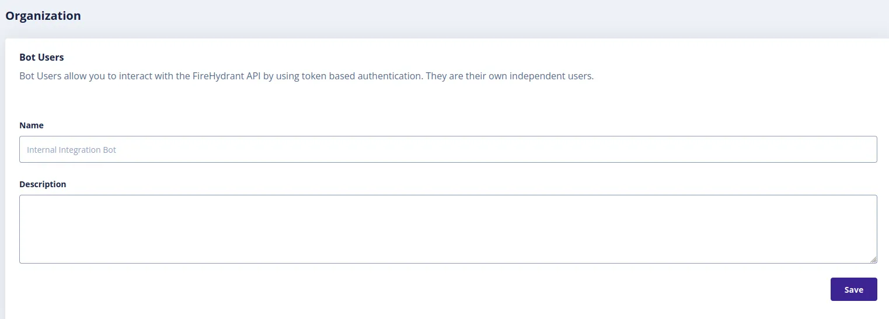

## Introduction

In order to use the FireHydrant plugin, Roadie needs an API token to communicate with FireHydrant APIs.


This is set within backstage at the following url:

## At a Glance
| | |
|---: | --- |
| **Prerequisites** |  |
| **Considerations** |  |
| **Supported Environments** | ☐ Private Network via Broker <br /> ☐ Internet Accessible via IP Whitelist <br /> ☒ Cloud Hosted |

```text
https://<tenant-name>.roadie.so/administration/firehydrant
```

This page describes how to create and set up the FireHydrant Bot token.

## Steps

### Step 1: Create an API token

Start by visiting the [account settings page in FireHydrant]( https://app.firehydrant.io/organizations/bots).

Click on the "Create bot user" button and you should see the following screen.

   

After you have added your preferred name and description to the bot, you should be presented with a bot token. Copy this token to clipboard and continue to step 2

### Step 2: Store the token in Roadie

Visit `https://<tenant-name>.roadie.so/administration/firehydrant` and enter the token value from above into `FIREHYDRANT_BOT_TOKEN`.

### Step 3: Configure FireHydrant services to match Roadie service names

FireHydrant plugin uses the fully qualified entity name to identify a service in FireHydrant. This consists of kind, name, and namespace. An example of a fully qualified name would be `Component:default/sample-service`. In a catalog-info.yaml file that would have the following values:
```yaml
...
kind: Component
metadata:
  name: sample-service
...
```

You can create services in FireHydrant on the [New Service page](https://app.firehydrant.io/services/new).

## References

- [FireHydrant plugin documentation](https://github.com/backstage/community-plugins/tree/main/workspaces/firehydrant/plugins/firehydrant/README.md)
- [FireHydrant plugin page on roadie.io](https://roadie.io/backstage/plugins/firehydrant/)
