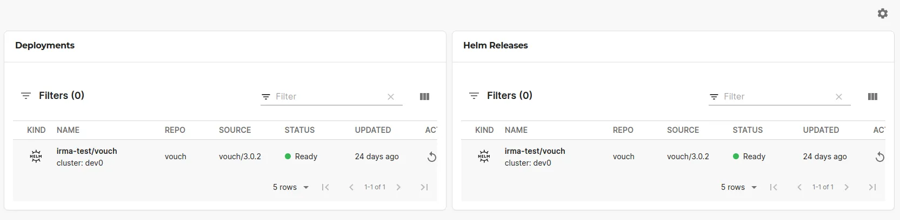

## Introduction

The Flux plugin allows you to view and manage your Flux controlled workloads directly via the Roadie UI. The plugin exposes multiple _Card_ components which can be combined into a rich dashboard of information. 



## At a Glance
| | |
|---: | --- |
| **Prerequisites** |  |
| **Considerations** |  |
| **Supported Environments** | ☐ Private Network via Broker <br /> ☐ Internet Accessible via IP Whitelist <br /> ☒ Cloud Hosted |

## Configuration

The base configuration of the plugin is handled by the Kubernetes plugin, so make sure you have configured a working Kubernetes connection first. You can find instructions on how to do that from the [Kubernetes plugin documentation.](/docs/integrations/kubernetes/)  

To complement the base configuration, the Flux plugin also needs additional permissions to be able to query the correct resources from within the Kubernetes cluster. These permissions can be added to complement the same, already configured, Kubernetes roles and bindings.

There are two sets of permissions that can be configured for the plugin, "view" and "sync" permissions. The permission rules for the "view" role are:

```yaml
rules:
 - apiGroups:
    - notification.toolkit.fluxcd.io
    - source.toolkit.fluxcd.io
    - helm.toolkit.fluxcd.io
    - image.toolkit.fluxcd.io
    - kustomize.toolkit.fluxcd.io
   resources:
    - "*"
   verbs:
    - get
    - list
    - watch
```

The permission rules for the "sync" role are:

```yaml
rules:
  - apiGroups:
     - source.toolkit.fluxcd.io
    resources:
      - buckets
      - helmcharts
      - gitrepositories
      - helmrepositories
      - ocirepositories
    verbs:
      - patch
  - apiGroups:
      - kustomize.toolkit.fluxcd.io
    resources:
      - kustomizations
    verbs:
      - patch
  - apiGroups:
      - helm.toolkit.fluxcd.io
    resources:
      - helmreleases
    verbs:
      - patch
```


You can find a full configuration options from the [plugin documentation.](https://github.com/weaveworks/weaveworks-backstage/tree/main/plugins/backstage-plugin-flux#readme).


## Adding Flux Cards to Roadie

The Flux plugin exposes multiple different _Card_ type components that can be added to your Roadie instance. The recommended way to display a god amount of information about your Flux configurations related to your entity is to create a new "Dashboard" tab and add the wanted cards in there. The available card components are as follows:

| Component                        | Description                                                               |
|----------------------------------|---------------------------------------------------------------------------|
| `EntityFluxDeploymentsCard`      | Displays associated Kustomizations and HelmReleases                       |
| `EntityFluxSourcesCard`          | Displays associated GitRepositories, OCIRepositories and HelmRepositories |
| `EntityFluxHelmReleasesCard`     | Shows HelmReleases associated to the Entity                               |
| `EntityFluxKustomizationsCard`   | Shows Kustomizations associated to the Entity                             |
| `EntityFluxGitRepositoriesCard`  | Shows GitRepositories associated to the Entity                            |
| `EntityFluxOCIRepositoriesCard`  | Shows OCIRepositories associated to the Entity                            |
| `EntityFluxHelmRepositoriesCard` | Shows HelmRepositories associated to the Entity                           |
| `EntityFluxImagePoliciesCard`    | Shows ImagePolicies associated to the Entity                              |


## Configuring your entities

The Flux plugin reuses the already existing `Kubernetes` plugin annotations. The available annotations for an entity are:
* `backstage.io/kubernetes-id: something` - Identify the kubernetes resource having the matching label
* `backstage.io/kubernetes-namespace: roadie` - To configure the namespace where to look resources from

## Configuring your Kubernetes resources

After you have added wanted annotations to your entities, modify your Kubernetes resources to have the matching annotation. For example:

```yaml
apiVersion: helm.toolkit.fluxcd.io/v2beta1
kind: HelmRelease
metadata:
  name: carts-nginx
  namespace: carts
  labels:
    backstage.io/kubernetes-id: carts-service
spec:
  chart:
    spec:
      chart: nginx
      reconcileStrategy: ChartVersion
      sourceRef:
        kind: HelmRepository
        name: podinfo
  interval: 1m0s
```


### References
* [Weaveworks Flux plugin documentation](https://github.com/weaveworks/weaveworks-backstage/tree/main/plugins/backstage-plugin-flux#readme)
* [Backstage Kubernetes plugin docs](https://backstage.io/docs/features/kubernetes/configuration#common-backstageiokubernetes-id-label)
* [Broker Configuration documentation](/docs/integrations/broker)
