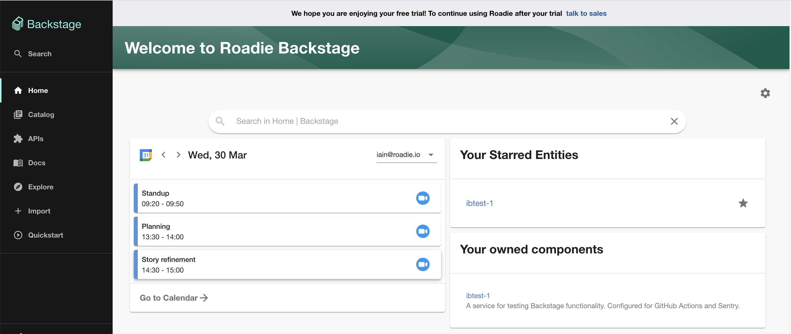
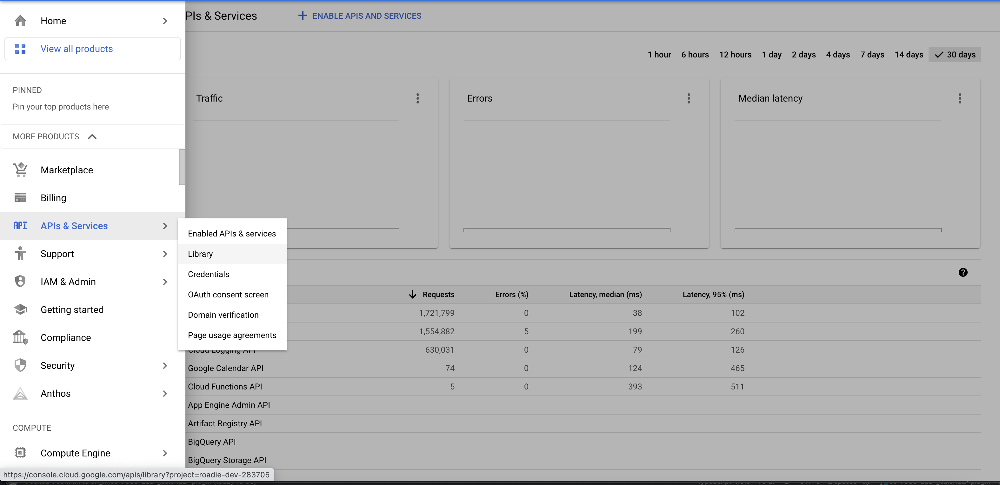
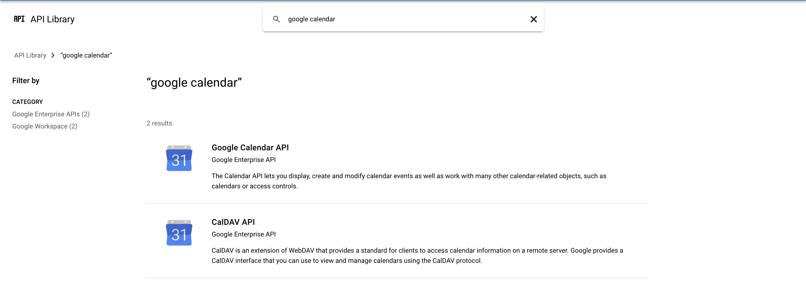
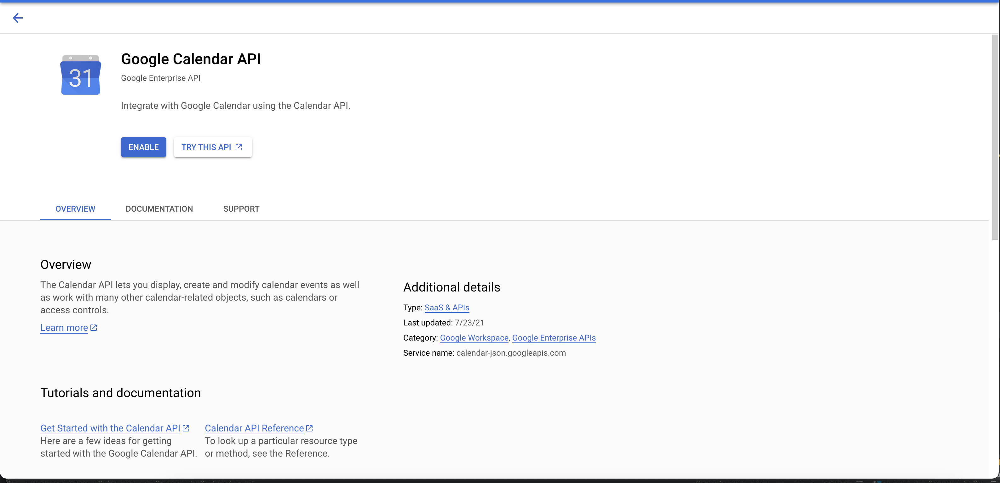

## Introduction

The Google Calendar plugin provides a home page card you can use to display your agenda in Backstage.

## Installation

## Configure Google authentication

1. Set up a Google OAuth app in Roadie following [this guide](/docs/integrations/google-oauth-client)

2. Ensure the Google calendar API is enabled in GCP.
   1. In GCP console navigate to `APIs & Services > Library`
   

   2. Search for "Google Calendar"
   

   3. Select Google Calendar from the results and click "enable"
   

## Add the calendar card to the home page
   
Add the card `HomePageCalendar` from the `@backstage/plugin-gcalendar` package to the home page ([read how](/docs/details/updating-the-ui#updating-the-home-page)).
