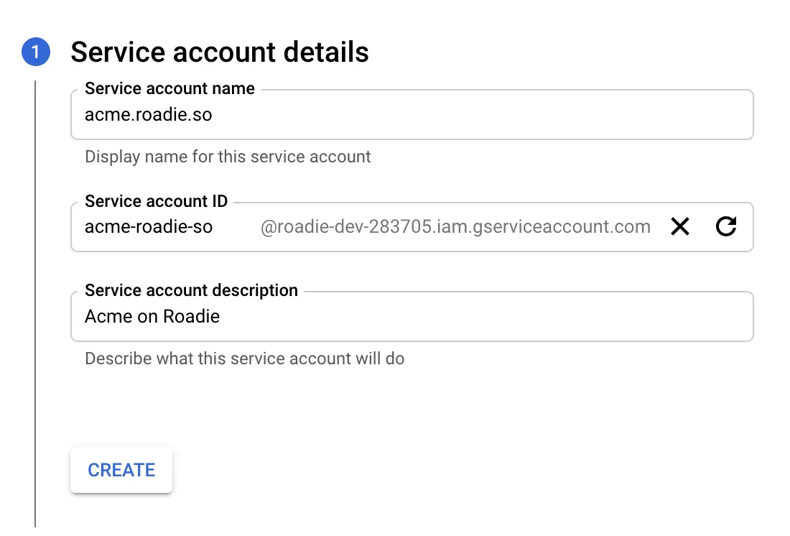

## Introduction

This Google Cloud Platform (GCP) client in Roadie may be used to periodically to collect Roadie catalog information from Google Cloud
Storage. These settings are configured in `https://<tenant-name>.roadie.so/administration/secrets`.

This page describes how to get the client id and private key for GCP.

## At a Glance

|                            |                                                                                                  |
| -------------------------: | ------------------------------------------------------------------------------------------------ |
|          **Prerequisites** |                                                                                                  |
|         **Considerations** |                                                                                                  |
| **Supported Environments** | ☐ Private Network via Broker   ☐ Internet Accessible via IP Whitelist   ☒ Cloud Hosted |

## Steps

### Step 1. Create a new GCP Service Account

1. Start by logging into the cloud console of GCP
   [https://console.cloud.google.com/iam-admin/serviceaccounts?project=<project-id>]()
2. Click “Create Service Account”
3. If your tenant name was acme, you would enter the following information
   
4. Click create and then give the service account appropriate permissions to read the Google Cloud storage bucket.
5. The following optional settings are not required, you may complete creating the service account.
6. Click on the service account you have created to view the service account details page and then click on the “add key” drop down and then the “create new key” button.
   
7. Select JSON and then click Create.

This will download a JSON file containing the credentials needed for next step.

### Step 2. Enter the credentials into Roadie

1. Copy the client email and the private key from the downloaded JSON file.
2. Visit the page `https://<tenant-name>.roadie.so/administration/secrets`
3. Enter the details you have copied into `GCP_CLIENT_EMAIL` and `GCP_PRIVATE_KEY`

## Conclusion

After adding the credentials for GCP your Roadie instance will be able to authenticate against Google and fetch data
for components registered in GCS locations.
