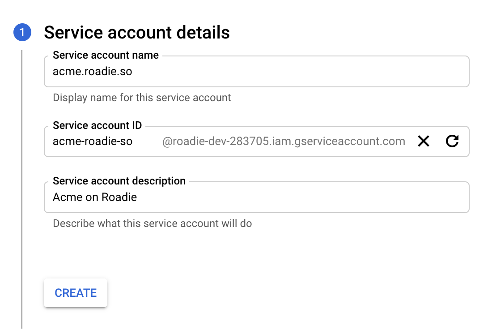
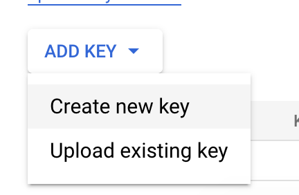

This GCP client in Roadie may be used to periodically to collect backstage catalog information from google cloud
storage. These settings are configured in `https://<tenant-name>.roadie.so/secrets`.

This page describes how to get the client id and private key for gcp.

1. Start by logging into the cloud console of GCP
   [https://console.cloud.google.com/iam-admin/serviceaccounts?project=<project-id>]()
2. Click “Create Service Account”
3. If your tenant name was acme, you would enter the following information
   
4. Click create and then give the service account appropriate permissions to read the google cloud storage bucket.
5. The following optional settings are not required, you may complete creating the service account.
6. Click on the service account you have created to view the service account details page and then click on the “add key” drop down and then the “create new key” button.
   
7. Select JSON and then click Create.
8. It’ll download a json file.
9. Copy the client email and the private key from the downloaded json.
10. Visit the page `https://<tenant-name>.roadie.so/secrets`
11. Enter the details you have copied into `GCP_CLIENT_EMAIL` and `GCP_PRIVATE_KEY`
