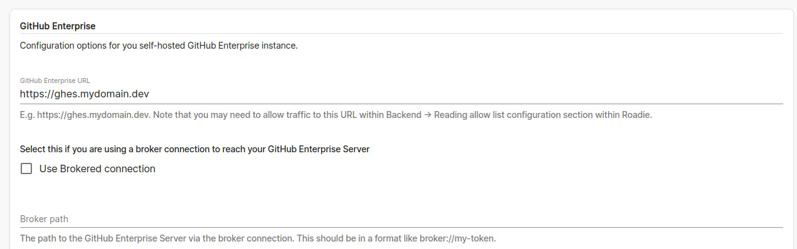

## Introduction

Roadie integrates with both cloud and self-hosted GitHub installations. This guide instructs how to set up self-hosted GitHub Enterprise Server to work with your Roadie instance. With this integration, it is possible to ingest entities and connect and use GitHub plugins.

Roadie supports GitHub Enterprise Servers via both public access via the Internet and a via the [secured broker access](/docs/integrations/broker/).


## Steps

### Step 1. Create a new GitHub Enterprise Server token
1. Start by logging into the GitHub Enterprise server
2. Navigate to Developer settings and create a new Access Token. You can find this from URL `https://<your-server-instance>/settings/tokens/new`.
3. The minimum scope for the token is to at least be able to read repositories and repository contents.


### Step 2a. Store GitHub Enterprise Server token into Roadie (public GHES)

1. Navigate to your Roadie instance URL `https://<your-roadie-tenant>.roadie.so/administration/integrations/github-enterprise`
2. Input the GHES token from step 1 as a value to secret `GHE_TOKEN`


### Step 2b. Store GitHub Enterprise Server token into Roadie (GHES behind broker)

1. Modify the environment variables of your running broker client to reference the API token created in step 1.

### Step 3. Create a new GitHub Enterprise Server OAuth Client

1. Create a new OAuth app within GitHub Enterprise Server developer settings
   * You can find the possibility to do that the URL `https://<your-server-instance>/settings/applications/new`.
2. For `Homepage URL` set a value like `https://<your-roadie-tenant>.roadie.so`
3. For `Authorization callback URL` set a value like `https://<your-roadie-tenant>.roadie.so/api/auth/ghes/handler/frame`
4. When the app has been created, generate a new secret for it by clicking `Generate a new client secret` button


5. You can use the following as a logo for your app if you wish 


### Step 4. Store id and secret into Roadie

1. Navigate to your Roadie instance URL `https://<your-roadie-tenant>.roadie.so/administration/integrations/github-enterprise`
2. Input the client id from step 3 as a value to secret `GHE_CLIENT_ID`
2. Input the generated client secret from step 3 as a value to secret `GHE_CLIENT_SECRET`

### Step 5a. Configure GitHub Enterprise Server on Roadie (public GHES)

1. Configure you GitHub Enterprise Server URL within `https://<your-roadie-tenant>.roadie.so/administration/integrations/github-enterprise`
   * The URL should have a value like `https://<your-roadie-tenant>.mydomain.dev`


### Step 5b. Configure GitHub Enterprise Server on Roadie (GHES behind broker)
1. Configure you GitHub Enterprise Server URL within `https://<your-roadie-tenant>.roadie.so/administration/integrations/github-enterprise`
   * The URL should have a value like `https://<your-roadie-tenant>.mydomain.dev`
2. Enable the broker connection and configured your broker connection path. 
   * The path should have a value like `broker://my-ghes-broker-token` 
3. (Optionally, not recommended) disable subdomain isolation configuration for raw URLs
   * If you have not enabled subdomain isolation on your GHES instance, you can check the configuration flag to allow path based URLs to be used when retrieving raw files. Note that you need to manually modify the Broker client `accept.json` configuration file to support this access pattern (see below).



### Step 6. (GHES behind broker only) Configure broker client
1. Configure your broker client connection as defined in [the Roadie broker documentation](/docs/integrations/broker/#setup-broker-client).
   * You can find the recommended initial configurations and/or dockerfiles from the repository linked in broker documentation above.

The easiest way to get started with broker configuration is to run the client locally with an `accept.json` configuration file that makes it easier to configure. The example files are listed below:

<details><summary>Standard GHES broker file</summary>

```json
{
   "public": [
      {
         "//": "Get broker connection status",
         "method": "GET",
         "path": "/healthcheck"
      }
   ],
   "private": [
      {
         "method": "POST",
         "path": "/graphql",
         "origin": "${GHES_URL}",
         "auth": {
            "scheme": "token",
            "token": "${GHES_TOKEN}"
         }
      },
      {
         "method": "GET",
         "path": "/*",
         "origin": "${GHES_RAW_URL}",
         "auth": {
            "scheme": "token",
            "token": "${GHES_TOKEN}"
         }
      }
   ]
}
```

</details>

<details><summary>GHES broker file with path based RAW URLs</summary>

```json
{
   "public": [
      {
         "//": "Get broker connection status",
         "method": "GET",
         "path": "/healthcheck"
      }
   ],
   "private": [
      {
         "method": "POST",
         "path": "/graphql",
         "origin": "${GHES_URL}",
         "auth": {
            "scheme": "token",
            "token": "${GHES_TOKEN}"
         }
      },
      {
         "method": "GET",
         "path": "/raw/*",
         "origin": "${GHES_URL}",
         "auth": {
            "scheme": "token",
            "token": "${GHES_TOKEN}"
         }
      }
   ]
}
```

</details>


## Next Steps


After setting up these configurations, you should be able to start [setting up your catalog](/docs/getting-started/adding-a-catalog-item/).
