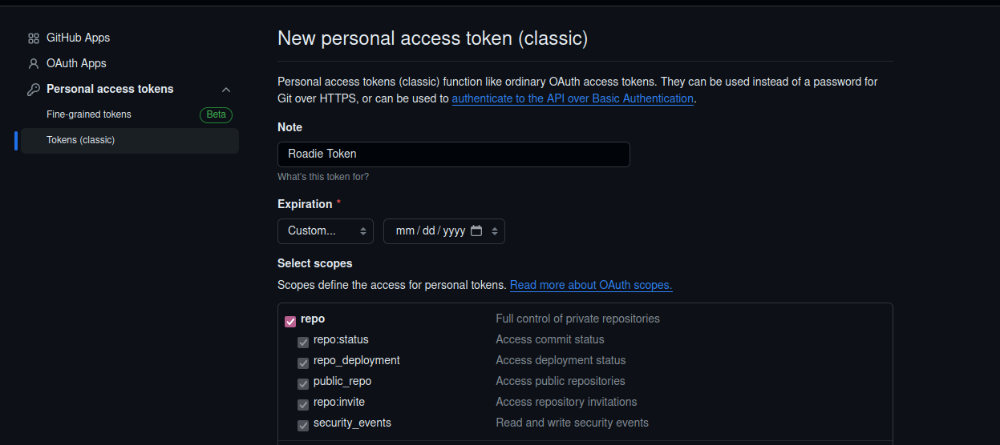
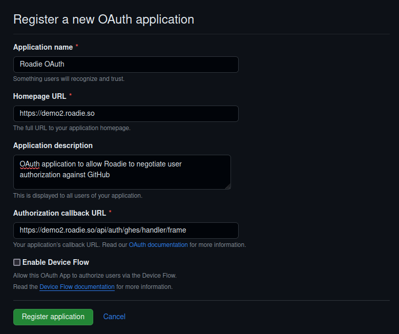
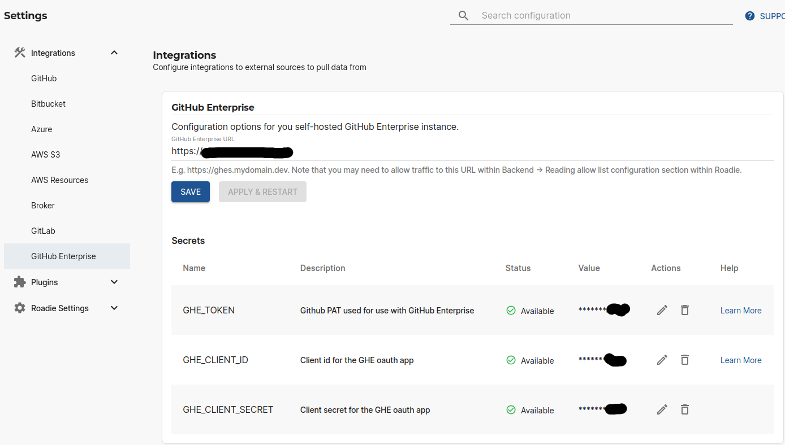

## Introduction

Roadie integrates with both cloud and self-hosted GitHub installations. This guide instructs how to set up self-hosted GitHub Enterprise Server to work with your Roadie instance. With this integration, it is possible to ingest entities and connect and use GitHub plugins.

## Steps

### Step 1. Create a new GitHub Enterprise Server token
1. Start by logging into the GitHub Enterprise server
2. Navigate to Developer settings and create a new Access Token. You can find this from URL `https://<your-server-instance>/settings/tokens/new`.
3. The minimum scope for the token is to at least be able to read repositories and repository contents.

### Step 2. Store GitHub Enterprise Server token into Roadie

1. Navigate to your Roadie instance URL `https://<your-roadie-tenant>.roadie.so/administration/integrations/github-enterprise`
2. Input the GHES token from step 1 as a value to secret `GHE_TOKEN`

### Step 3. Create a new GitHub Enterprise Server OAuth Client

1. Create a new OAuth app within GitHub Enterprise Server developer settings
   * You can find the possibility to do that the URL `https://<your-server-instance>/settings/applications/new`.
2. For `Homepage URL` set a value like `https://<your-roadie-tenant>.roadie.so`
3. For `Authorization callback URL` set a value like `https://<your-roadie-tenant>.roadie.so/api/auth/ghes/handler/frame`
4. When the app has been created, generate a new secret for it by clicking `Generate a new client secret` button

### Step 4. Store id and secret into Roadie

1. Navigate to your Roadie instance URL `https://<your-roadie-tenant>.roadie.so/administration/integrations/github-enterprise`
2. Input the client id from step 3 as a value to secret `GHE_CLIENT_ID`
2. Input the generated client secret from step 3 as a value to secret `GHE_CLIENT_SECRET`

### Step 5. Configure GitHub Enterprise Server on Roadie

1. Configure you GitHub Enterprise Server URL within `https://<your-roadie-tenant>.roadie.so/administration/integrations/github-enterprise`
   * The URL should have a value like `https://<your-roadie-tenant>.enginehouse.io`

## Next Steps

After setting up these configurations, you should be able to start [setting up your catalog](/docs/getting-started/adding-a-catalog-item/).
