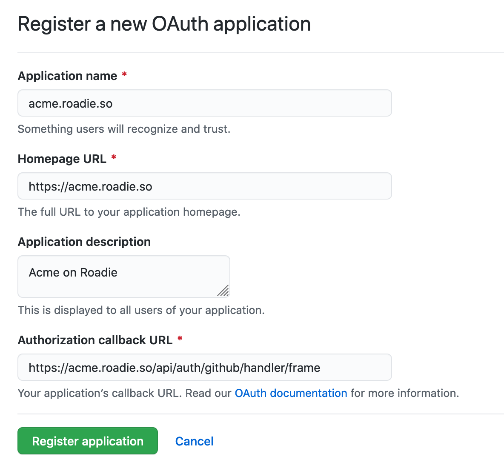

## Introduction

In order to enable user driven front end operations against GitHub APIs (e.g. viewing a README.md file inline in the backstage UI) Backstage will need to be configured with a client id and client secret.

These are set within backstage at the following url:

```text
https://<tenant-name>.roadie.so/secrets
```

This page describes how to get the client id and secret.

## Steps

1. Start by visiting the organization application settings page for your github organization `https://github.com/organizations/<github organization name>/settings/applications`
2. Click on the "New OAuth App" button.
3. If your tenant name was "acme" you would enter the following settings as follows:

   

4. Click Generate a new secret
5. Copy the client id and client secret
6. Visit `https://<tenant-name>.roadie.so/secrets` and enter these values into `GITHUB_CLIENT_ID` and `GITHUB_CLIENT_SECRET`.
