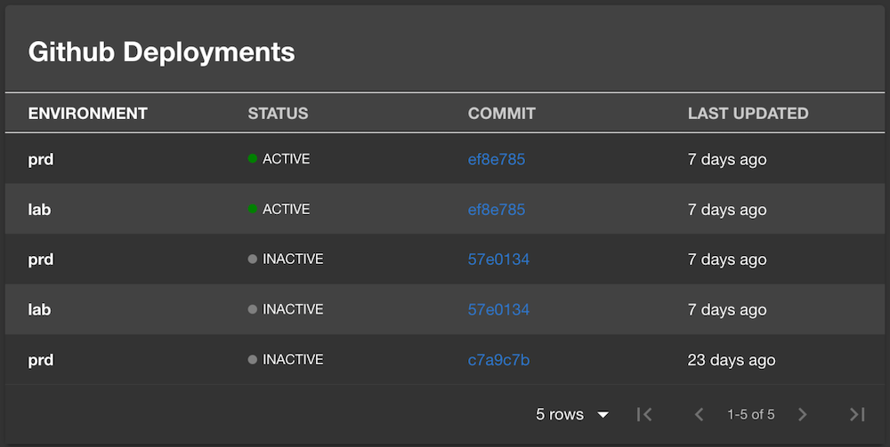

The Github Deployments plugin will display a table of deployments for this repo made through Github Actions. 


Credit: [Andrew Johnson](https://github.com/anderoo)


## Prerequisites
- The [Roadie Github App installed](/docs/getting-started/adding-a-catalog-item)
- A `github.com/project-slug` annotation present in your `catalog-info.yaml` file

## Adding the Plugin

Ask a Roadie Admin to add the `EntityGithubDeploymentsCard` as a new tab in an Entity [using the Dynamic UI editor](/docs/getting-started/configuring-backstage-plugins).

It should then pick up and display any deployments for the repository listed in the `github.com/project-slug` annotation.

You can configure how many deployments are shown per page by passing in props to the card when adding it or editing it like so:

```json
{
  "last": 10,
  "lastStatuses": 2
}
```
