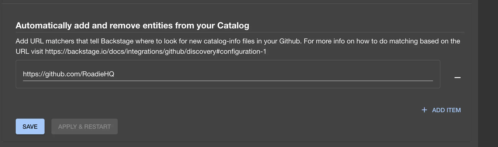

## At a Glance
| | |
|---: | --- |
| **Prerequisites** | <ul><li>You must have installed the Roadie GitHub app in your organisation as described [here](/docs/getting-started/adding-a-catalog-item/)</li><li>You must be an Admin of Backstage, as [described here](/docs/getting-started/assigning-admins/).</li></ul> |
| **Considerations** |  |
| **Supported Environments** | ☐ Private Network via Broker <br /> ☐ Internet Accessible via IP Whitelist <br /> ☒ Cloud Hosted |

## Introduction

Roadie will ingest every file called `catalog-info.yaml` by default without any configuration.

This document explains how to use a different file name, customize the files that Roadie automatically ingests, how to decorate entities automatically with additional metadata, and how to support multiple organizations.

## Steps to add new auto discovery paths

1. Visit the Administration > Settings page and click on GitHub under Integrations
2. Scroll down to the `Automatically add and remove entities from your Catalog` section.
   
3. Press the `+ ADD URL` button.
4. In the input that appears enter a url that you'd like to have Roadie to listen for additions and deletions.
   This url accepts regex in every segment
5. Press `ADD`

## Steps to remove auto discovery paths

1. Visit the Administration > Settings page and click on GitHub under Integrations
2. Scroll down to the `Automatically add and remove entities from your Catalog` section.
   
3. Press the DELETE sign next to the url under the actions column.
4. Press `DELETE`

## Example configs

### Exact url

If you do not specify any wildcards it will load only the specified exact path.

```yaml
https://github.com/RoadieHQ/roadie-backstage-plugins/blob/main/catalog-info.yaml
```

In this example, Roadie will only load a `catalog-info.yaml` file from the `main` branch when it gets added/removed from the repo `roadie-backstage-plugins` in the `RoadieHQ` organization.

### Using the default branch

If you have default branch configured differently for your repos you can use the - sign as a substitution in your url and it will get replaced by your repo's default branch.

```yaml
https://github.com/RoadieHQ/roadie-backstage-plugins/blob/-/catalog-info.yaml
```

In this example, Roadie will only load a `catalog-info.yaml` file from the `default` branch when it gets added/removed from the repo `roadie-backstage-plugins` in the `RoadieHQ` organization.

### Using wildcards

If you would like to catalog a file from all of your repos you can use the \* as a wildcard in any of the segments.

```yaml
https://github.com/RoadieHQ/*/blob/-/catalog-info.yaml
```

In this example, Roadie will load a `catalog-info.yaml` file from the default branch when it gets added/removed from any repo in the RoadieHQ organization.

### Putting your catalog files inside a folder

You can specify a folder in the resource part of the URL any depth you would like. This gives the possibility to specify the following url.

```yaml
https://github.com/RoadieHQ/*/blob/-/.roadie/*.yaml
```

In this example, Roadie will load any `.yaml` file inside a root level `.roadie` folder from the default branch when it gets added/removed from any repo in the RoadieHQ organization.

## Confirming it worked

Add a Backstage component file to a repository which matches the configured discovery url. After committing it to the correct branch, you should see it almost immediately in your catalog.

## Decorating Catalog Entities

You can add the primary language used by a repository as a tag or label to the Roadie Backstage entity without updating your yaml files by turning on the decoration feature in `/administration/catalog`.

It will take approximately 10 minutes for all entities to be tagged. Similarly, when disabling this feature, it will take approximately 10 minutes for the tags to be removed.

NB: This feature only adds the tag/label in Roadie's representation of your catalog files, and does not modify the base YAML files in your repos.
