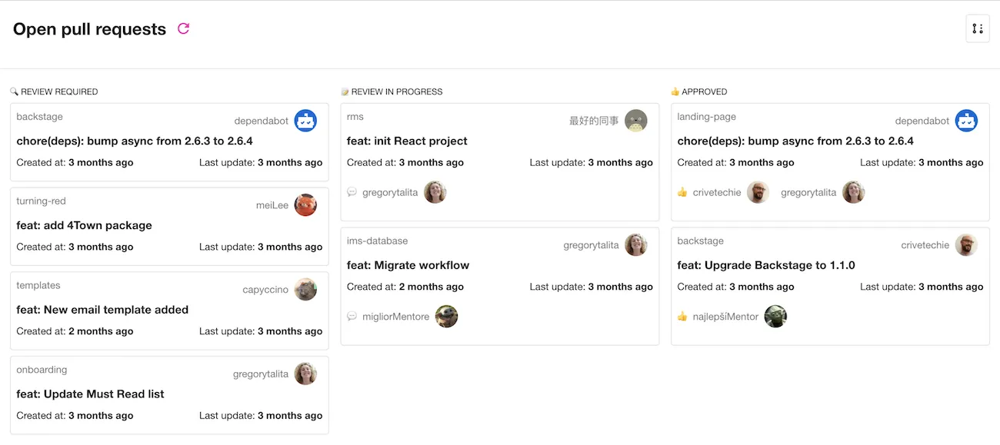

*Image Credit: Talita Gregory Nunes Freire*
## Introduction

The GitHub Pull Requests Board Plugin shows an overview of a Group's open pull requests. 

It will show PRs in any repositories connected to entities in Roadie Backstage that are owned by the Group.

This page explains how to configure it in Roadie Backstage.

## At a Glance
| | |
|---: | --- |
| **Prerequisites** | <ol><li>You must be an admin in Roadie. By default, all users are admins. Learn how to designate certain users as admins [here](/docs/getting-started/assigning-admins/).</li><li>You must have the [Roadie GitHub app installed](/docs/getting-started/adding-a-catalog-item/) in your GitHub organisation.</li><li>You must have [Groups in the catalog](/docs/getting-started/teams/#creating-users-and-groups) with [owned entities](https://backstage.io/docs/features/software-catalog/descriptor-format/#specowner-required) connected to them.</li></ol> |
| **Considerations** |  |
| **Supported Environments** | ☐ Private Network via Broker   ☐ Internet Accessible via IP Whitelist   ☒ Cloud Hosted |

## Step 1: Add the Plugin to the Group view in Roadie

The plugin provides an UI component with a name `EntityTeamPullRequestsCard` which can be added as a tab into your Roadie Groups. Learn how to do that in [here](/docs/details/updating-the-ui/).

## References

- [GitHub Pull Request Plugin in GitHub](https://github.com/backstage/community-plugins/tree/main/workspaces/github-pull-requests-board/plugins/github-pull-requests-board)
