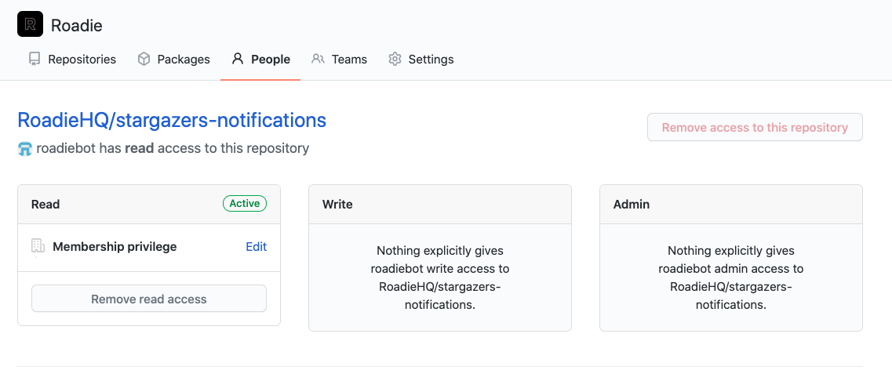
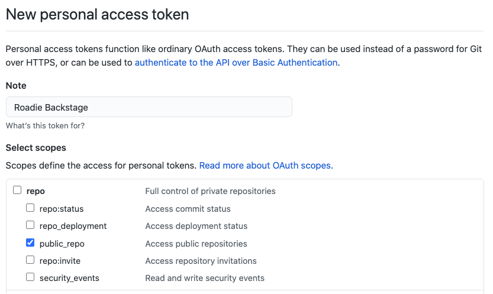
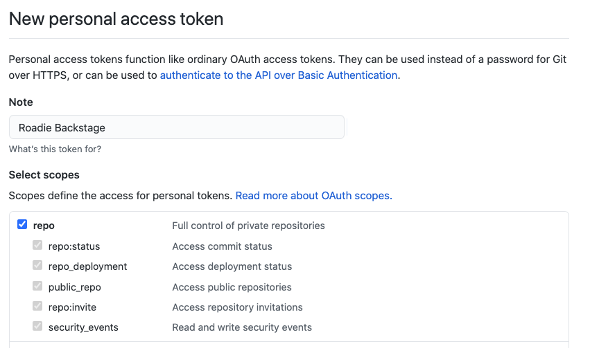

## Introduction

Roadie needs an access token to authenticate with the GitHub APIs in order to perform various functions.

For example

1. Roadie uses the access token to read the `catalog-info.yaml` files in the root of each repo.
1. Roadie uses the access token to create repos and write code to them when users use the scaffolder to create new services.
1. Roadie uses the access token to read users and teams from your GitHub organization so it can associate teams with the services they own.

There are multiple ways to create and grant scopes on the access token, depending on the level of access that you wish Backstage to have.

This doc covers example number 1 only. Examples 2 and 3 require additional scopes - repository write access and user/org read access.

Unfortunately, Roadie cannot import any repositories, even open-source repositories, without access to a GitHub personal access token.

## Option 1: Read only access to public repositories only

Create a new GitHub user (bot account), and give them a username and password.

Add the user to your GitHub organization, in a way which ensures that they have Read only access to the repositories in the organization.

For example, here's a `roadiebot` user, which does not have write access to the private RoadieHQ/stargazers-notifications repository.

Create a personal access token for this user which has the `public_repo` scope only.

Use this personal access token in Backstage. Backstage now has read only access to public repos only.

## Option 2: Read only access to public and private repositories

Create a new GitHub user (or reuse the user from Option 1 above), and give them a username and password.

Add the user to your GitHub organization, in a way which ensures that they have read only access to the repositories in the organization.

For example, here's a `roadiebot` user, which does not have write or admin access to the private RoadieHQ/stargazers-notifications repository.

Create a personal access token for this user, give it the “repo” scope.

The repo scope traditionally provides both read and write abilities to both public and private repositories. In this case however, because the user associated with the token only has read access, no writes can occur.

## References

- [GitHub docs for creating personal access tokens](https://docs.github.com/en/github/authenticating-to-github/creating-a-personal-access-token)
- [GitHub explanation of access token scopes](https://docs.github.com/en/developers/apps/scopes-for-oauth-apps)
