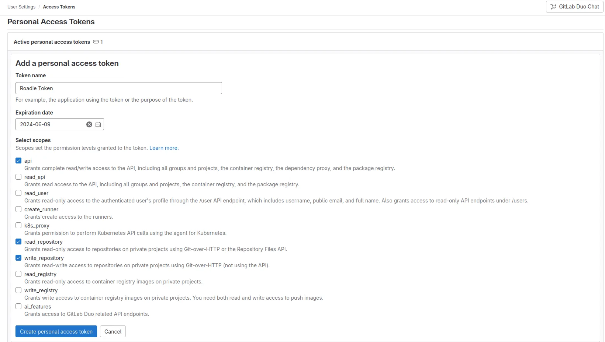
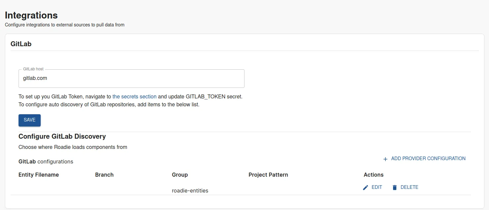
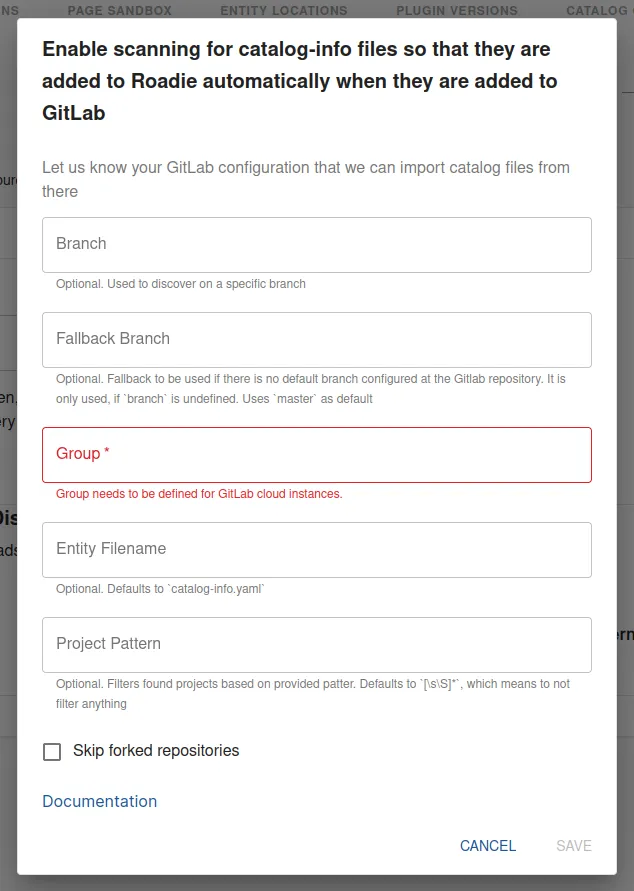

## At a Glance
| | |
|---: | --- |
| **Prerequisites** |  |
| **Considerations** |  |
| **Supported Environments** | ☐ Private Network via Broker   ☐ Internet Accessible via IP Whitelist   ☒ Cloud Hosted |

## Introduction

GitLab is a popular alternative to GitHub as an SCM provider. 

This guide describes how to set up access for Roadie to your GitLab repositories and retrieve relevant entities from that source.

##  Step 1: Generate GitLab access token (PAT)

In your GitLab instance navigate to your User Settings > Access Tokens page. In GitLab cloud the URL is `https://gitlab.com/-/user_settings/personal_access_tokens`. Within this page you can generate a token to grant Roadie access to read your entity manifest files.

1. Click 'Add new token'
2. Create an access token with _at least_ permissions `api`, `read_repository`, `write_repository`.

##  Step 2: Store GitLab access token as a secret in Roadie

Navigate to `https://<tenant-name>.roadie.so/administration/settings/secrets` and locate a secret with a name `GITLAB_TOKEN`. Update the value of this secret with the token created in the step above.

The updating of secrets within the Roadie application takes a few minutes. You will see the status of the secret change when it becomes available.

##  Step 3: Configure your Roadie instance to use GitLab as a source to retrieve entities

Navigate to `https://<tenant-name>.roadie.so/administration/settings/integrations/gitlab`.

Within this page you can add configuration values to identify the URL of your GitLab instance and add necessary provider configuration to automatically discover and retrieve entities from your SCM. 

   

Add a provider configuration pointing to your entities within your GitLab group. The updating of provider configurations within the Roadie application takes a few minutes. When the update cycle is complete, you should be able to find your discovered entities in the catalog and the [locations log](/docs/details/location-management/#managing-locations). Note that the Group value is mandatory _on cloud hosted_ GitLab integrations.

## References

- [GitLab Discovery documentation in Backstage](https://backstage.io/docs/integrations/gitlab/discovery/)

