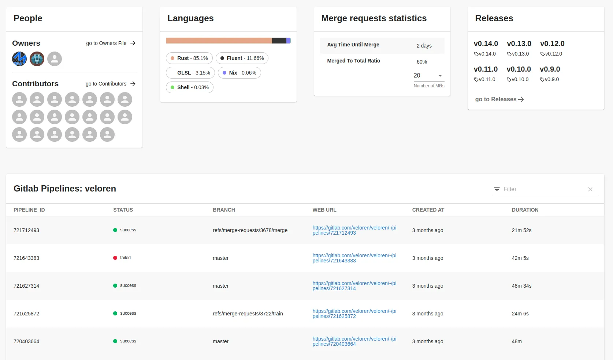
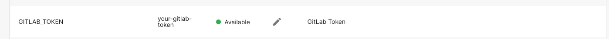
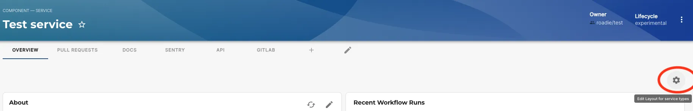
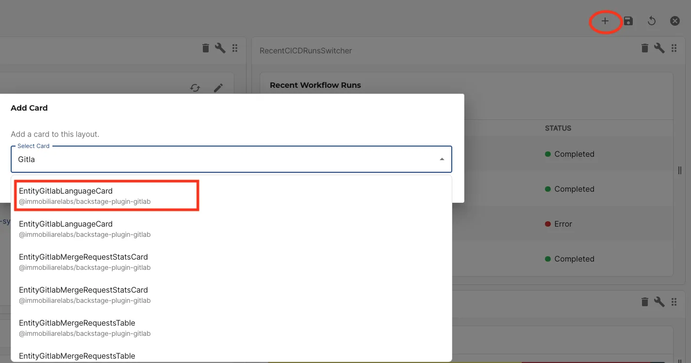
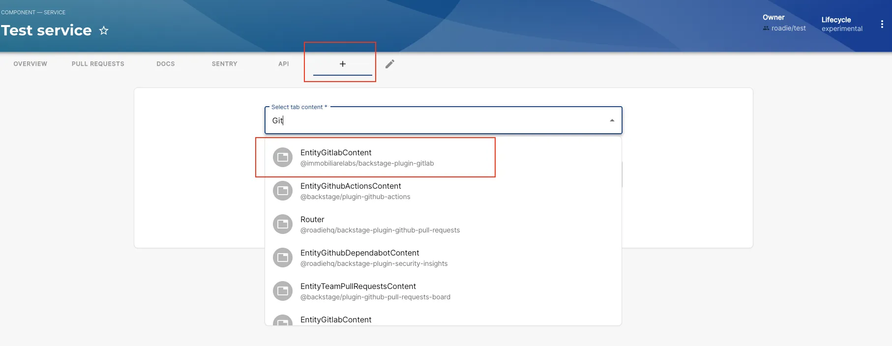

## Introduction

The [Backstage GitLab plugin](https://github.com/immobiliare/backstage-plugin-gitlab) integrates with GitLab and provides various useful information such as top builds, merge requests, and issues for a project, last releases, code owners, languages, contributors etc. 


Credit: [Immobiliare Labs](https://github.com/immobiliare)

## At a Glance
| | |
|---: | --- |
| **Prerequisites** |  |
| **Considerations** |  |
| **Supported Environments** | ☐ Private Network via Broker <br /> ☐ Internet Accessible via IP Whitelist <br /> ☒ Cloud Hosted |

## Add GitLab plugin to your components

### Create GitLab access token and add it as a secret in Roadie

Generate an access token in your GitLab environment by navigating to https://gitlab.com/-/user_settings/personal_access_tokens, and then add it to Roadie at `https://<tenant-name>.roadie.so/administration/settings/secret` by entering the token value from above into `GITLAB_TOKEN` as shown below.




### Add the necessary annotation(s)

In order to use the plugin you will need to set one of the required options. So you will need to add gitlab.com/project-id, gitlab.com/project-slug or gitlab.com/instance annotations under metadata section. 

The available annotations can be seen below on the example catalog-info.yaml file:

```yaml
metadata:
  annotations:
    gitlab.com/project-id: 'project-id' #1234. This can be found under Settings --> General in GitLab 
    gitlab.com/project-slug: 'project-slug' # group_name/project_name
    gitlab.com/instance: gitlab.internal.abcd # abcd, represents local instance used
```

### Adding GitLab plugin components to UI

The GitLab plugin exposes two different type of components that can be used in your Roadie application:

1. A card component that can be added as a widget to Overview and dashboard tabs
2. EntityGitlabContent, a component that can be used as a standalone tab, containing all the cards mentioned above

Please note only admins can add or remove cards and tabs from entity layouts.

### Adding GitLab card component to overview tab of the Entity Page

Click the cog icon on the top right of a component page. 



Then click the plus icon and select the card you wish to add from the list card, e.g Language card.



Press save to submit.

### Adding GitLab as a separate tab

Click the plus icon and select EntityGitlabCntent.



This will create a new tab containing all GitLab cards currently available at one page. 


## References

- [GitLab Plugin Documentation](https://github.com/immobiliare/backstage-plugin-gitlab)

