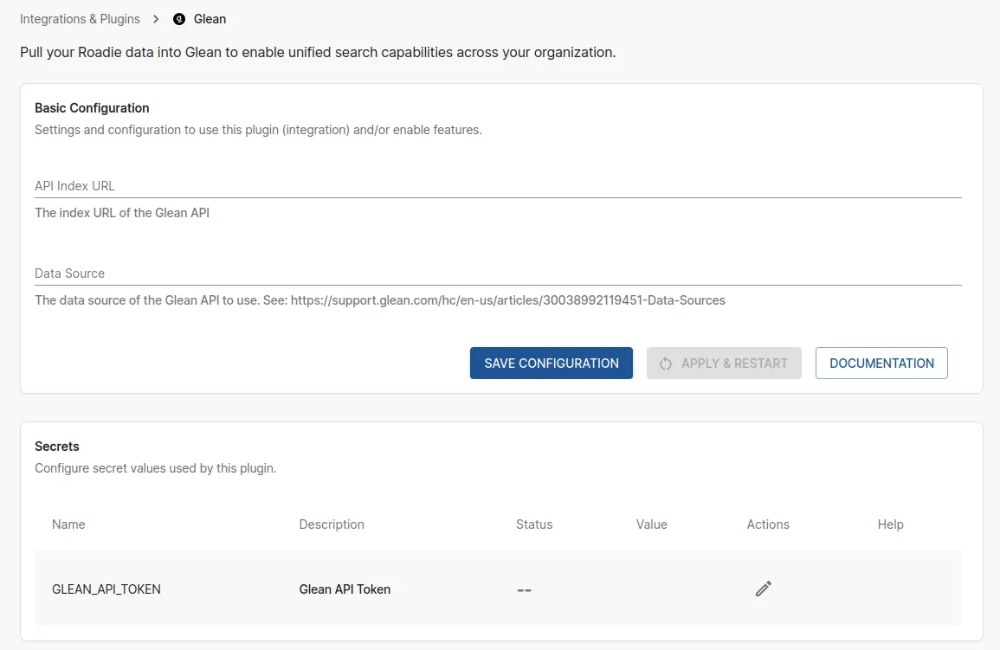

## Introduction

The Glean plugin allows you to pull your Roadie data into Glean to enable unified search capabilities across your organization. This integration helps centralize your organization's knowledge and makes it searchable from Glean.

## Basic Configuration

### API Index URL

The index URL of the Glean API. This is the endpoint where Roadie will send your data to be indexed in Glean.

### Data Source

The data source of the Glean API to use. This identifies which data source in Glean should receive the Roadie data. 

For more information about data sources, see: [Glean Data Sources Documentation](https://support.glean.com/hc/en-us/articles/30038992119451-Data-Sources)

## Connection Configuration Steps

### Step 1: Configure Glean Connection

Visit `https://<tenant-name>.roadie.so/administration/glean` to configure your Glean connection.

Configure the following settings:

- **API Index URL**: The index URL of your Glean API instance
- **Data Source**: The data source identifier for Glean to categorize the Roadie data

### Step 2: Add Glean API token

Navigate to Administration -> Secrets and add in you Glean API token to the secret called `GLEAN_API_TOKEN`.

## References

- [Glean Backend Plugin on npm](https://www.npmjs.com/package/@roadiehq/backstage-plugin-glean-backend)
- [Glean Data Sources Documentation](https://support.glean.com/hc/en-us/articles/30038992119451-Data-Sources)
- [Glean Documentation](https://support.glean.com/)