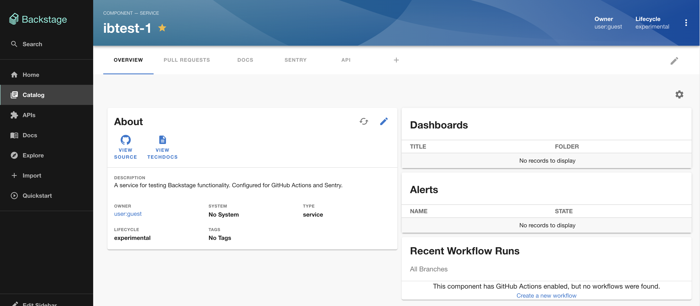
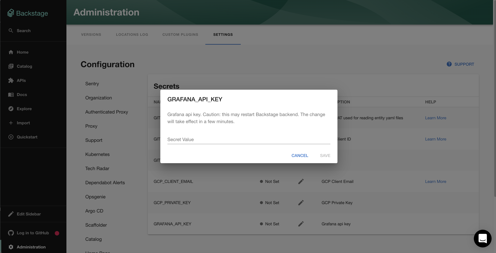

## Introduction

The [Backstage Grafana plugin](https://www.npmjs.com/package/@k-phoen/backstage-plugin-grafana) integrates with Grafana to list alerts and dashboards for your entities.



## Prerequisites

You'll need a Grafana account with an API key and the url of your Grafana UI and API (if different).

## Adding the plugin

### Add the Grafana secrets

First, add the `GRAFANA_API_KEY` secret via `Administration -> Settings -> Secrets`. Note you'll
need to wait for the secret to be marked as "Available" before you can use the Grafana plugin.



### Add the plugin to the UI

The Grafana plugin provides two components which can be added to the Backstage UI. You must be a Backstage admin to
add components to the UI.

The `EntityGrafanaDashboardsCard` and `EntityGrafanaAlertsCard` components can be [added to catalog dashboards](/docs/getting-started/updating-the-ui/#updating-dashboards). These
list dashboards and alerts respectively.

### Set the grafana annotation on entities

The grafana plugin uses an annotation to link entities in the Backstage catalog to data in Grafana. This annotation should
have a tag in Grafana as its value. Any alerts or dashboards with this tag will be displayed once the annotation is set and 
the components added to the UI.

Make a PR to the following to your catalog-info.yaml file:
```yaml
annotations:
  grafana/tag-selector: "my-grafana-tag"
```


