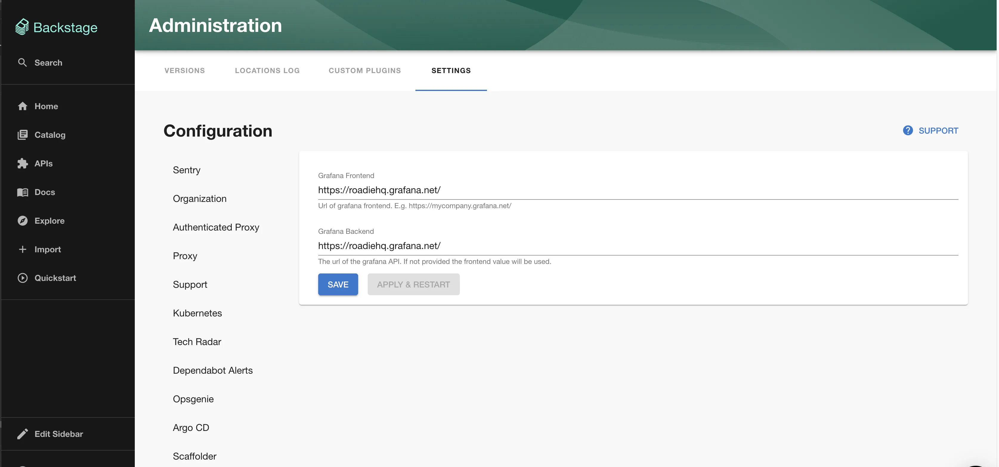

## Introduction

The [Backstage Grafana plugin](https://www.npmjs.com/package/@k-phoen/backstage-plugin-grafana) integrates with Grafana to list alerts and dashboards for your entities.


## At a Glance
| | |
|---: | --- |
| **Prerequisites** | **Configuration Data:** <ul><li>API Key</li><li>Grafana Frontend URL</li><li>Grafana Backend URL</li></ul> **Component Annotations:** <ul><li>Tag Selector / Dashboard Selector</li></ul> |
| **Considerations** |  |
| **Supported Environments** | ☐ Private Network via Broker <br /> ☐ Internet Accessible via IP Whitelist <br /> ☒ Cloud Hosted |

## Prerequisites

You'll need a Grafana account with an API key and the url of your Grafana UI and API (if different).

## Adding the plugin

### Configure the Grafana endpoints

Configure the Grafana endpoints to use via `Administration -> Settings -> Grafana`. If you're using grafana.net your
frontend and backend endpoints should be the same e.g. `https://<your-company>.grafana.net/`. If you're using hosting
Grafana yourself you'll need to specify a url to the frontend which is used by backstage to generate links and an API
endpoint which the plugin uses to query alerts and dashboards. 



### Add the Grafana API Key

Add the `GRAFANA_API_KEY` in the same page at `/administration/grafana`. 

NB: You'll need to wait for the secret to be marked as "Available" before you can use the Grafana plugin.

### Add the plugin to the UI

The Grafana plugin provides two components which can be added to the Backstage UI. You must be a Backstage admin to
add components to the UI.

The `EntityGrafanaDashboardsCard` and `EntityGrafanaAlertsCard` components can be [added to catalog dashboards](/docs/details/updating-the-ui/#updating-dashboards). These
list dashboards and alerts respectively.

### Set the Grafana annotation on entities

The Grafana plugin uses an annotation to link entities in the Backstage catalog to data in Grafana. This annotation should
have a tag in Grafana as its value. Any alerts or dashboards with this tag will be displayed once the annotation is set and 
the components added to the UI.

Make a PR to the following to your catalog-info.yaml file:
```yaml
annotations:
  grafana/tag-selector: "my-grafana-tag"
```


