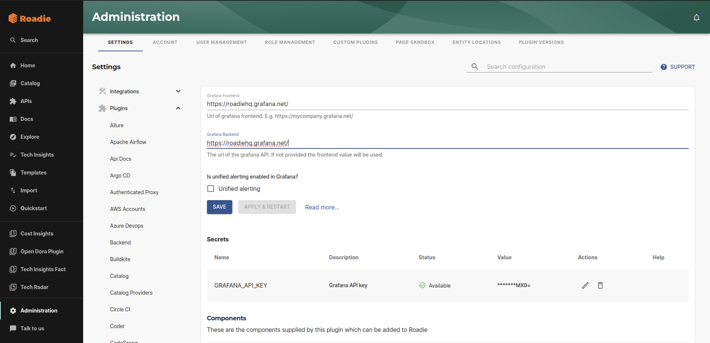
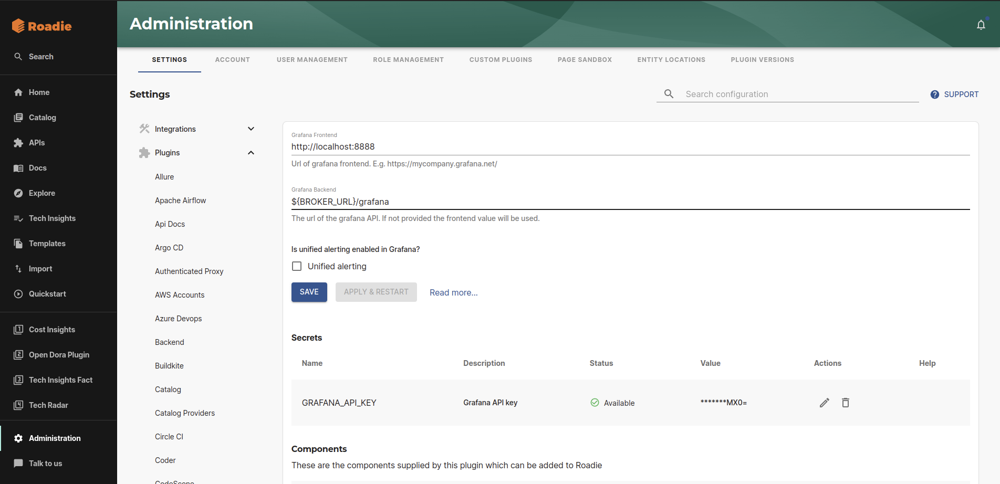

## Introduction

The [Backstage Grafana plugin](https://www.npmjs.com/package/@k-phoen/backstage-plugin-grafana) integrates with Grafana to list alerts and dashboards for your entities.


## At a Glance
| | |
|---: | --- |
| **Prerequisites** | **Configuration Data:** <ul><li>API Key</li><li>Grafana Frontend URL</li><li>Grafana Backend URL</li></ul> **Component Annotations:** <ul><li>Tag Selector / Dashboard Selector</li></ul> |
| **Considerations** |  |
| **Supported Environments** | ☒ Private Network via Broker <br /> ☒ Internet Accessible via IP Whitelist <br /> ☒ Cloud Hosted |

## Adding the plugin

### Configuring Grafana Credentials

You can choose to configure Grafana in one of two ways:

- Assuming that there is network connectivity between Roadie and Grafana you can configure this using direct access.
- or you can choose to run the Roadie Grafana broker internally to open a connection between Roadie and Grafana.

#### Configure the Grafana endpoints for direct access

Configure the Grafana endpoints to use via `Administration -> Settings -> Grafana`. 

#### Cloud Hosted & IP Whitelist Restricted

If you're using grafana.net, your frontend and backend endpoints should be the same e.g. `https://<your-company>.grafana.net/`. If you're using hosting Grafana yourself you'll need to specify a URL to the frontend which is used by backstage to generate links and an API endpoint which the plugin uses to query alerts and dashboards. 



#### Private Network via Broker

When connecting Grafana from your private network via Broker, you will set the following values for the frontend and backend endpoints.

**Frontend**: URL of your internal frondend (e.g. http://localhost:8888)

**Backend**: `${BROKER_URL}/[BROKER_TOKEN]` (e.g. `${BROKER_URL}/myGrafana`)



##### Add the Grafana API Key

Set the Grafana Frontend URL, Backend URL and the `GRAFANA_API_KEY` in same page at `/administration/grafana`. 

NB: You'll need to wait for the secret to be marked as "Available" before you can use the Grafana plugin.

#### Configure Grafana via the Roadie Broker

You will need to run the broker container in an environment that has connectivity to the Grafana API as follows:

```bash
docker run \
  -e GRAFANA_TOKEN=<your grafana token> \
  -e GRAFANA_URL=http://<your grafana backend api> \
  -e "BROKER_TOKEN=grafana" \
  -e "BROKER_SERVER_URL=https://<your tenant name>.broker.roadie.so" roadiehq/broker:grafana
```

In `Administration -> Settings -> Grafana`, set the Frontend url to the URL at which the Grafana UI is available your users. Set the Backend URL to broker://grafana. You should leave the `GRAFANA_API_KEY` blank.

### Add the plugin to the UI

The Grafana plugin provides two components which can be added to the Backstage UI. You must be a Backstage admin to
add components to the UI.

The `EntityGrafanaDashboardsCard` and `EntityGrafanaAlertsCard` components can be [added to catalog dashboards](/docs/details/updating-the-ui/#updating-dashboards). These
list dashboards and alerts respectively.

### Set the Grafana annotation on entities

The Grafana plugin uses an annotation to link entities in the Backstage catalog to data in Grafana. This annotation should
have a tag in Grafana as its value. Any alerts or dashboards with this tag will be displayed once the annotation is set and 
the components added to the UI.

Make a PR to the following to your catalog-info.yaml file:
```yaml
annotations:
  grafana/tag-selector: "my-grafana-tag"
```


