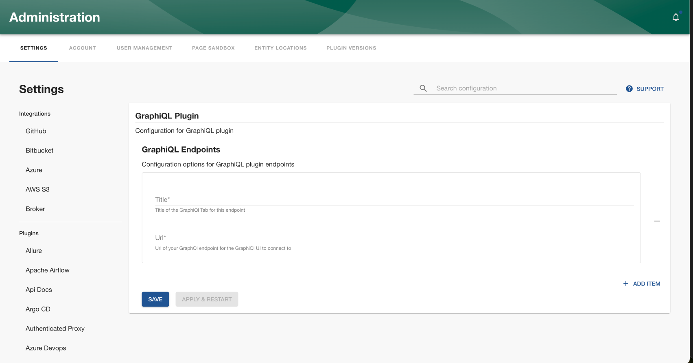

## Introduction

The [Backstage GraphiQL plugin](/backstage/plugins/graphiQL) integrates with GraphiQL to provide a UI playground for querying GraphQL endpoints directly from Roadie.

## Prerequisites

You'll need your GraphQL endpoint URLs.

## Configuration

### Configure the GraphiQL endpoints

Configure the GraphQL endpoints to use in your GraphiQL plugin via `Administration -> Settings -> GraphiQL`. Each endpoint needs a title and a URL. The title will be used to identify the endpoint in the GraphiQL UI, while the URL is the GraphQL endpoint URL you want to query.

### Authentication

Currently, the GraphiQL plugin only supports authentication via the UI, which means that you'll need to configure the authentication using the `Headers` tab in the GraphiQL UI in JSON format.

## References

- [Backstage GraphiQL plugin](/backstage/plugins/graphiQL)
