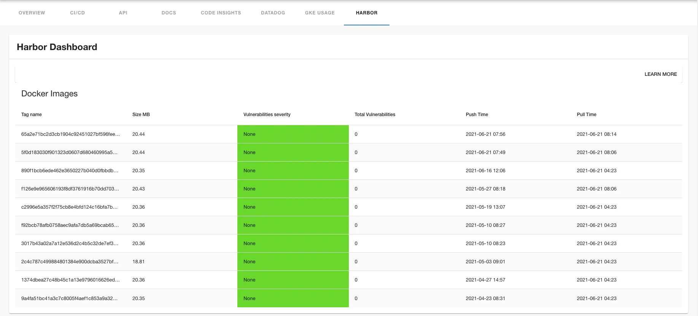
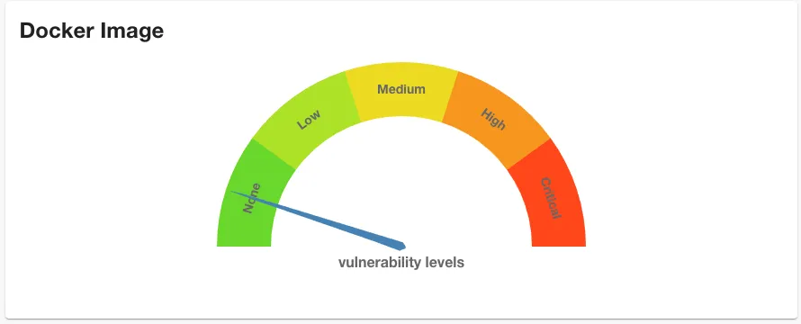

## Introduction

Harbor is an open-source container image registry that secures images with policies and role-based access control, ensures images are scanned and free from vulnerabilities, and signs images as trusted.

The Harbor plugin allows you to view information about your Docker images stored in Harbor directly within Backstage. This plugin provides both a dedicated Harbor tab and a widget that can be displayed on entity overview pages, giving you quick access to container image details, vulnerabilities, and other Harbor-specific information.





## At a Glance

|                            |                                                                                                                                                                        |
|---------------------------:|------------------------------------------------------------------------------------------------------------------------------------------------------------------------|
|          **Prerequisites** | **Configuration Data:** <ul><li>Harbor Base URL</li><li>Harbor Username</li><li>Harbor Password</li></ul> **Component Annotations:** <ul><li>Repository Slug</li></ul> |
| **Supported Environments** | ☒ Private Network via Broker <br /> ☒ Internet Accessible via IP Whitelist <br /> ☒ Cloud Hosted                                                                       |

## Harbor Entity Configuration

### Step 1: Add the Harbor Tab and Widget

The Harbor plugin is available as both a tab and widget on entity pages in Roadie. 

### Step 2: Annotate your entities

Add the following annotation to entities to link Harbor repositories to the entity:

```yaml
metadata:
  annotations:
    goharbor.io/repository-slug: [PROJECT]/[REPOSITORY]
```

The value for `goharbor.io/repository-slug` should be in the format `project/repository` where:
- `project` is your Harbor project name
- `repository` is your repository name within that project

For example:
```yaml
metadata:
  annotations:
    goharbor.io/repository-slug: my-project/my-repository
```

## Connection Configuration Steps

### Step 1: Configure Harbor Connection

Visit `https://<tenant-name>.roadie.so/administration/harbor` to configure your Harbor connection.

You need to configure the following:

- **Base URL**: The URL of your Harbor instance (e.g., `https://harbor.yourdomain.com`)

For secrets you need to set 
- **HARBOR_USERNAME**: Harbor username with appropriate permissions
- **HARBOR_PASSWORD**: Harbor password or access token


## Troubleshooting

### Harbor information not appearing

1. Verify that the `goharbor.io/repository-slug` annotation is correctly set on your entity
2. Ensure the project and repository names match exactly with those in Harbor
3. Check that your Harbor connection configuration is correct
4. Verify that the Harbor user has appropriate permissions to access the specified project and repository

### Authentication issues

1. Visit `https://<tenant-name>.roadie.so/administration/harbor` and confirm that the Harbor username and password are correct
2. Ensure the Harbor user has the necessary permissions (at minimum, read access to the project)
3. Check if the Harbor instance requires specific authentication methods

## References

- [Harbor Plugin Frontend on npm](https://www.npmjs.com/package/@bestsellerit/backstage-plugin-harbor)
- [Harbor Plugin Backend on npm](https://www.npmjs.com/package/@bestsellerit/backstage-plugin-harbor-backend)
- [Harbor Plugin GitHub Repository](https://github.com/container-registry/backstage-plugin-harbor)
- [Harbor Plugin Backend GitHub Repository](https://github.com/container-registry/backstage-plugin-harbor-backend)
- [Harbor Documentation](https://goharbor.io/docs/)