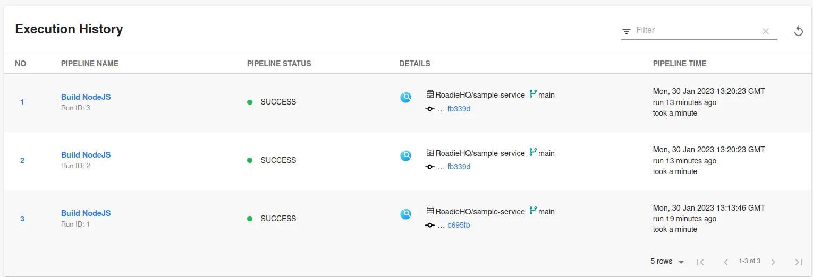
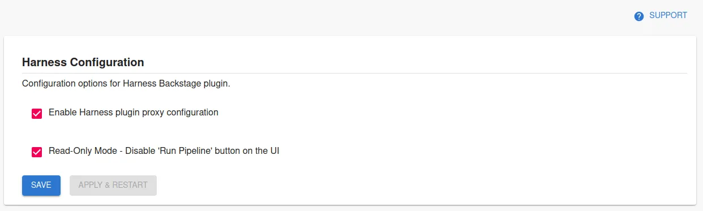

## Introduction

The [Backstage Harness plugin](https://github.com/harness/backstage-plugins/tree/main/plugins/harness-ci-cd) integrates with Harness to show your build information inside Backstage where it can be associated with your services.



## At a Glance
| | |
|---: | --- |
| **Prerequisites** |  |
| **Considerations** |  |
| **Supported Environments** | ☐ Private Network via Broker <br /> ☐ Internet Accessible via IP Whitelist <br /> ☒ Cloud Hosted |

## Add Harness to one of your components

### Add the needed Harness annotation(s)

The Harness plugin enables 3 usable annotations that are available to correctly identify the Harness pipelines. 

The main annotations can be seen below on the example catalog-info.yaml file: 

```yaml
apiVersion: backstage.io/v1alpha1
kind: Component
metadata:
  # ...
  annotations:
    
    # optional annotation
    harness.io/pipelines: |
      labelA: <harness_pipeline_url>
      labelB: <harness_pipeline_url>
    # here labelA / labelB denotes the value you will see in dropdown in execution list. 
    harness.io/services: |
      labelA: <harness_service_url>
      labelB: <harness_service_url>
spec:
  type: service
  # ...
```
Note that the annotations needs to be formatted as displayed above. A `pipe` character indicating a multiline string and then key-value pairs of pipeline/service configurations. 


The plugin also allows users to use an older legacy annotation called `harness.io/project-url: <harness_project_url>` 


To find the correct values to use for annotations, refer to the [official plugin documentation in their GitHub repository](https://github.com/harness/backstage-plugins/blob/main/plugins/harness-ci-cd/PluginConfiguation.md).


### Create and add an API Key

Generate an API key on your Harness account using [the official API key generation instruction on Harness website.](https://developer.harness.io/docs/platform/role-based-access-control/add-and-manage-api-keys/)

Then add it to Roadie at `https://<tenant-name>.roadie.so/administration/harness` by entering the token value from above into `HARNESS_API_KEY`.

### Enable and configure the plugin

In the same Harness configuration section, enable the relevant Harness proxy to be able to retrieve information from Harness.io. Additionally, you can disable the possibility to run pipelines via Roadie UI if needed.



### Configure Roadie UI to display Harness information

In Roadie, find and select a relevant entity via the Catalog page or using Search.

Click the plus icon on the tab bar to add a new plugin for your component.

Select the `EntityHarnessCiCdContent` card from the drop-down and click Create.

You should now see your Harness pipeline runs inside Roadie!


## References

- [Harness Plugin Documentation](https://github.com/harness/backstage-plugins/tree/main/plugins/harness-ci-cd)
- [Harness Plugin Configuration Options](https://github.com/harness/backstage-plugins/blob/main/plugins/harness-ci-cd/PluginConfiguation.md)
- [Harness Documentation to generate API keys](https://developer.harness.io/docs/platform/role-based-access-control/add-and-manage-api-keys/)

