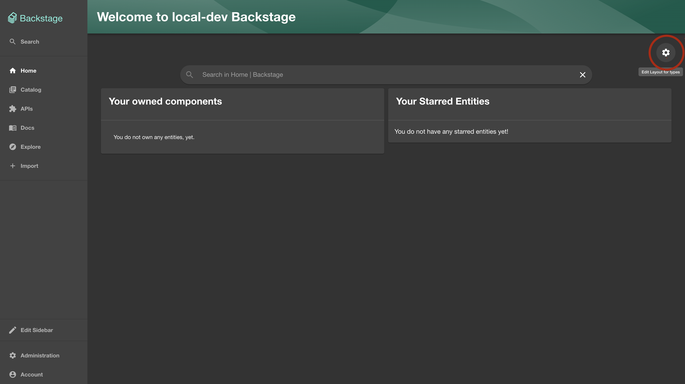
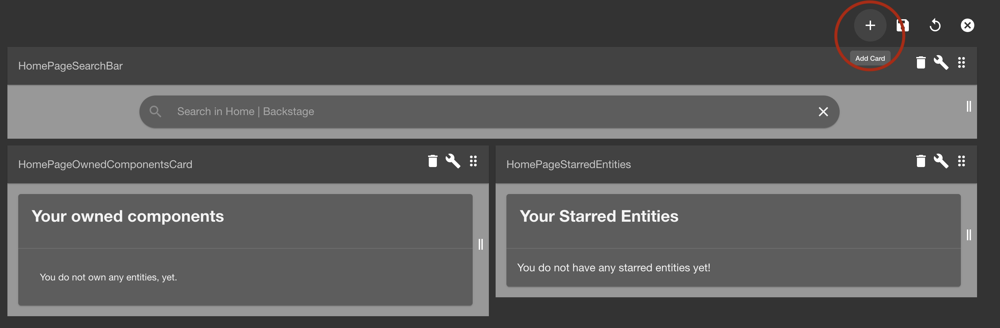
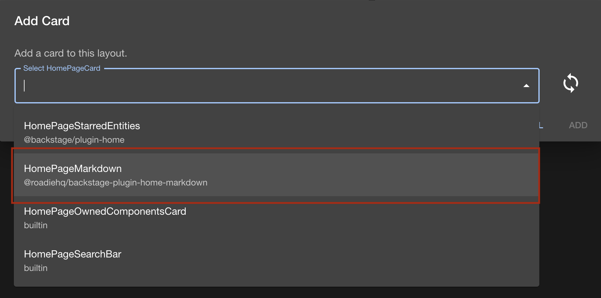
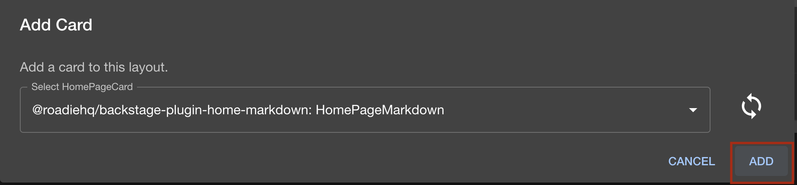
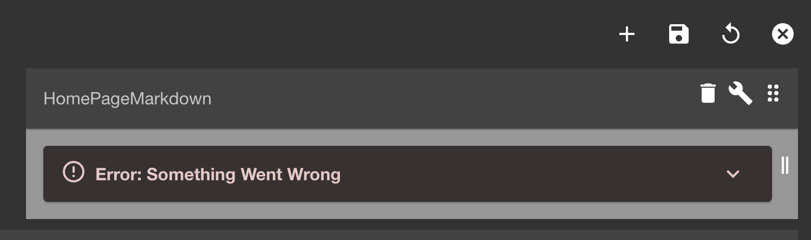
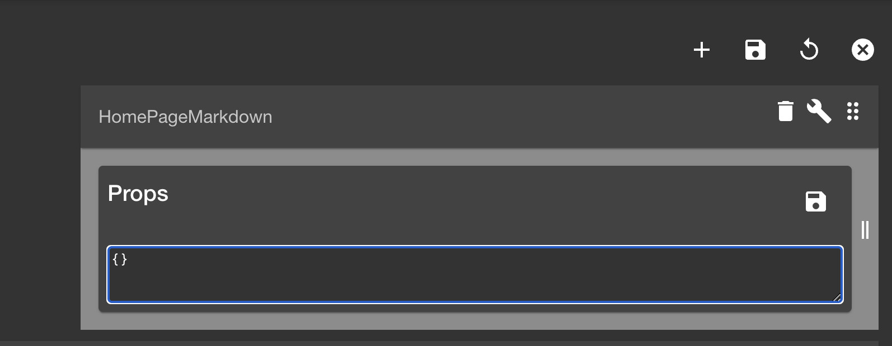

## Introduction

This is a plugin that renders a markdown file from github as a homepage componenet.

It fetches the .md file from github on every load and caches it's content.
To be able to see the rendered content make sure you are logged into github.

## Setup

To use this plugin make sure you already have the [Backstage Home plugin](https://github.com/backstage/backstage/blob/master/plugins/home/README.md) enabled.

### Add Markdown card to your homepage

1.  To enable this plugin go to your `Home` page via the sidebar.

    Once you are on the home page click on the cogwheel icon.

    

2.  Click the plus sign to add a new Card
    

3.  Select `HomePageMarkdown` from the list.
    

    Click add
    

    You will see a similar error message for the added component, but do now worry, we need to configure the plugin to point to your markdown file. You'll see instructions in the next section
    

## Configure plugin via props

Now configure the props of the plugin to point to your desired location, where you'll host your makrdown file that will be rendered by this plugin.

1.  Click on the `wrench` icon to edit the props of the component.
    
    Add the following json as props, where the keys are the valid properties for the `HomePageMarkdown` [component](https://www.npmjs.com/package/@roadiehq/backstage-plugin-home-markdown) Make sure you change the values to the appropriate for your own markdown file.

    ```json
    {
      "path": ".backstage/home-page.md",
      "owner": "RoadieHQ",
      "repo": "roadie-backstage-plugins",
      "title": "Roadie.io Neeews!"
    }
    ```

    - `path` is the path to the .md file inside the repository
    - `owner` is the github owner of the repository that hosts the .md file
    - `repo` is the github repository name
    - `title` will be the name of the card in the header of the card
    - `branch` (optional) param if you want to point to a specific branch in your repo instead of the default one.

2.  Click Save

    Now it should load and render the markdown file you provided the path for.

3.  Move and/or resize the card the way you see it fit

4.  Click Save

    Now the HomepageMarkdown component should be added to your home page.

## Writing the markdown file for the homepage.

There is one important thing in the current version (1.1.1) of the plugin. You'll need to refer to resources (links & images) with absolute urls.

```diff
- 
+ 
```

Make sure you replace `/blob/` with `/raw/` if you copy the file url from github
