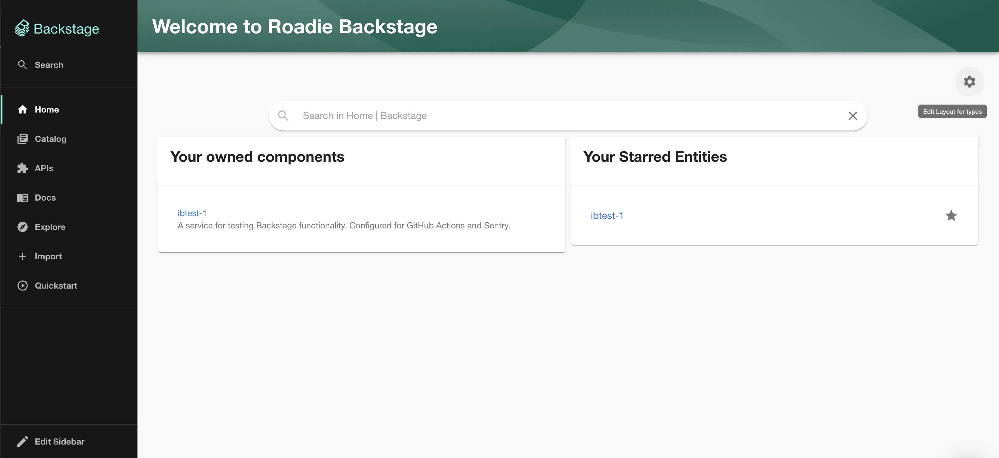

## Introduction

The [Backstage Home plugin](https://github.com/backstage/backstage/blob/master/plugins/home/README.md) provides a framework for building a dashboard style home page for Roadie. 

A home page can be composed of many cards from various plugins much like the overview tab for entities. Roadie provides an interface to build such a home page interactively in the UI.

## At a Glance
| | |
|---: | --- |
| **Prerequisites** |  |
| **Considerations** |  |
| **Supported Environments** | ☐ Private Network via Broker   ☐ Internet Accessible via IP Whitelist   ☒ Cloud Hosted | 

## Customize the UI

To view the home page navigate to `Home` via the sidebar.

Editing the home page is very similar to editing component dashboards. Click the cog icon to enter edit mode. To add
components click the "plus" icon or drag cards to reposition them. Read [this guide](/docs/getting-started/updating-the-ui#updating-the-home-page) 
for more details.

If you navigate to Home Page settings section within Administration -> Settings, you can see the available and in-use home page components that can be added to enhance the home page experience.