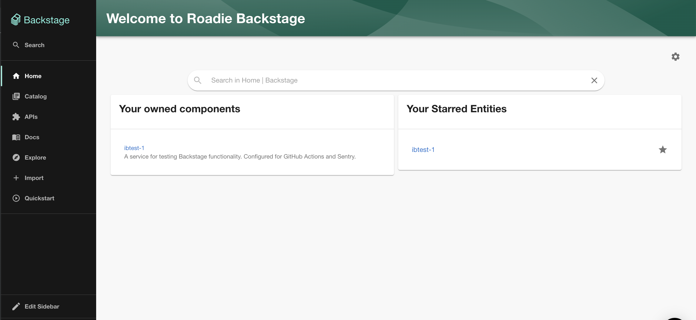
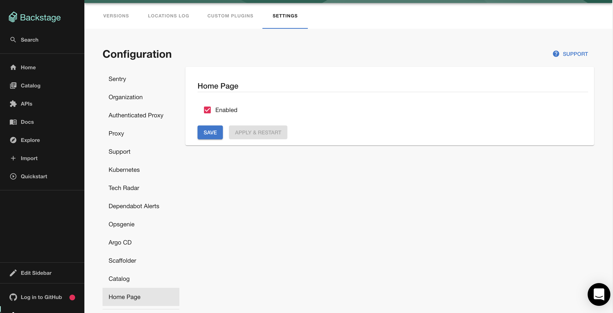
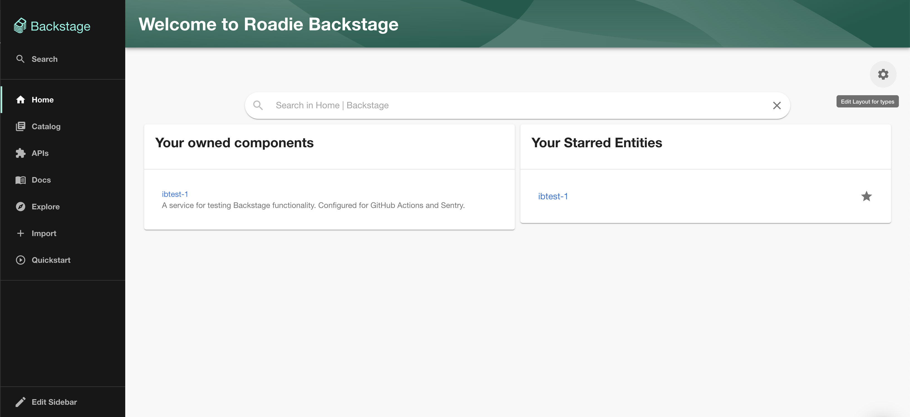

## Introduction

The [Backstage Home plugin](https://github.com/backstage/backstage/blob/master/plugins/home/README.md) provides a framework
for building a dashboard style home page for backstage. 

A home page can be composed of many cards from various plugins
much like the overview tab for entities. Roadie provides an interface to build such a home page interactively in the 
Backstage UI. 

This page will describe how to configure the home page plugin and customize the dashboard.

## Usage

### Enable the plugin

To enable the home page go to `Administration -> Settings -> Home Page`. 

Ensure `enable` is checked then click `Save` and `Save and Restart`

### Customize the UI

To view the home page navigate to `Home` via the sidebar.

Editing the home page is very similar to editing component dashboards. Click the cog icon to enter edit mode. To add
components click the "plus" icon or drag cards to reposition them. Read [this guide](/docs/getting-started/updating-the-ui#updating-the-home-page) 
for more details.

