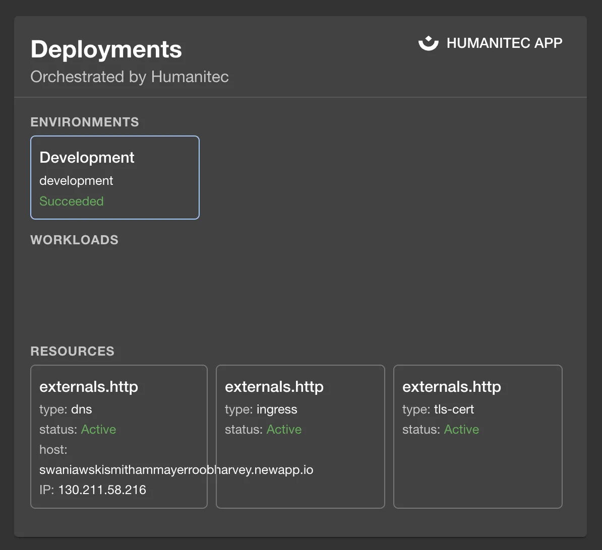

## Introduction

The [Backstage Humanitec plugin](https://github.com/humanitec/humanitec-backstage-plugins/tree/main/plugins/humanitec) integrates with Humanitec to show your deployment information inside Backstage where it can be associated with your services.



## At a Glance
| | |
|---: | --- |
| **Prerequisites** |  |
| **Considerations** |  |
| **Supported Environments** | ☐ Private Network via Broker <br /> ☐ Internet Accessible via IP Whitelist <br /> ☒ Cloud Hosted |

## Add Humanitec to one of your components

### Add the necessary annotation(s)

The Humanitec plugin enables 2 usable annotations that are available to correctly identify the deployments.

The available annotation can be seen below on the example catalog-info.yaml file:
```yaml
metadata:
  annotations:
    # mandatory annotation
    humanitec.com/orgId: <ord-id>
    humanitec.com/appId: <application-id>
```

### Create and add an API Key

Generate an API key on your Humanitec dashboard, then add it to Roadie at `https://<tenant-name>.roadie.so/administration/humanitec` by entering the token value from above into `HUMANITEC_TOKEN`.

### Enable and configure the plugin

In the same Humanitec configuration section, you can set an org id that is used as a fallback if the `humanitec.com/orgId` annotation is not added on a per component basis.

### Configure Roadie UI to display Humanitec information

In Roadie, find and select a relevant entity via the Catalog page or using Search that has an annotation for Humanitec.

The `HumanitecCardComponent` card can be added to the overview page of an entity by clicking the settings cog, and adding a new card.

## References

- [Humanitec Plugin Documentation](https://github.com/humanitec/humanitec-backstage-plugins/tree/main/plugins/humanitec)

