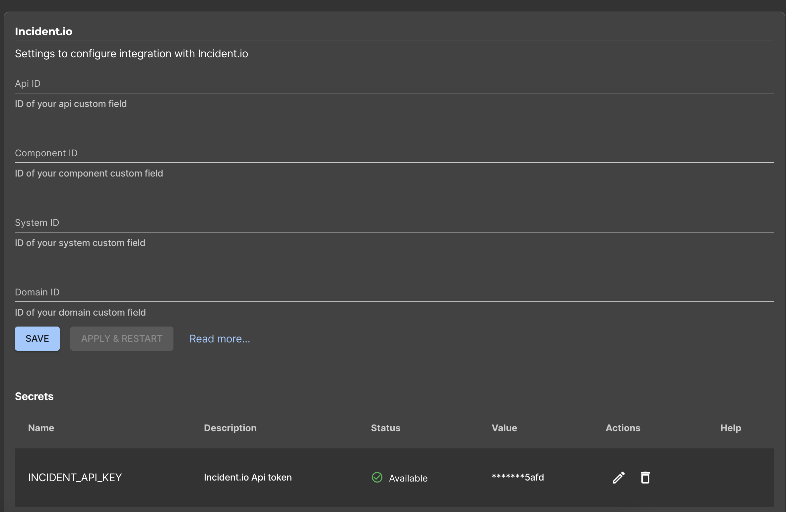
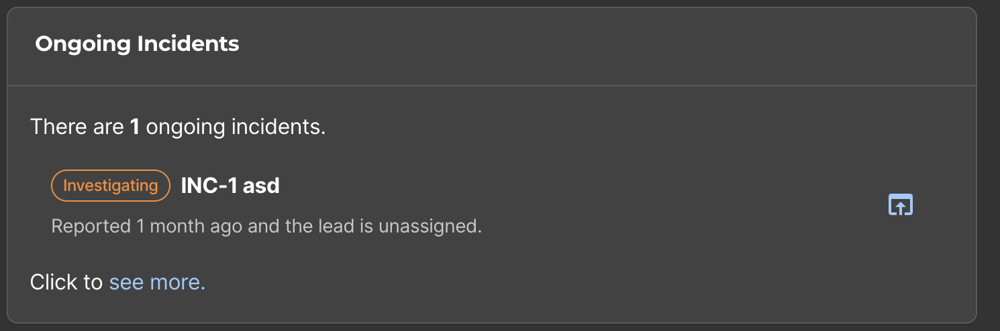

## Introduction

The [Incident.io plugin](https://www.npmjs.com/package/@incident-io/backstage) integrates with Incident.io to show your configured components and your curent on-going incidents inside Backstage.

### Create and add an API Key

Generate an API key on your Incident.io app, then add it to Roadie at `https://<tenant-name>.roadie.so/administration/incident` by entering the token value from above into `INCIDENT_API_KEY`.

### Configure the plugin

In the same incident.io configuration section, you can set your custom API ID, Component ID, System ID and Domain ID. These only needed if you created these custom fields in your incident.io application.

### Configure Roadie UI to display Incident.io information

In Roadie, find and select a relevant entity via the Catalog.

The `EntityIncidentCard` card can be added to the overview page of an entity by clicking the settings cog, and adding a new card.
The `HomePageIncidentCard` card can be added to the home page by clicking the settings cog and selecting the card from the dropdown.

## References

- [Incident.io Plugin Documentation](https://www.npmjs.com/package/@incident-io/backstage)
