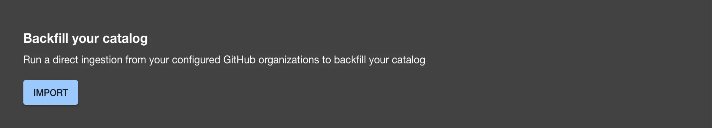
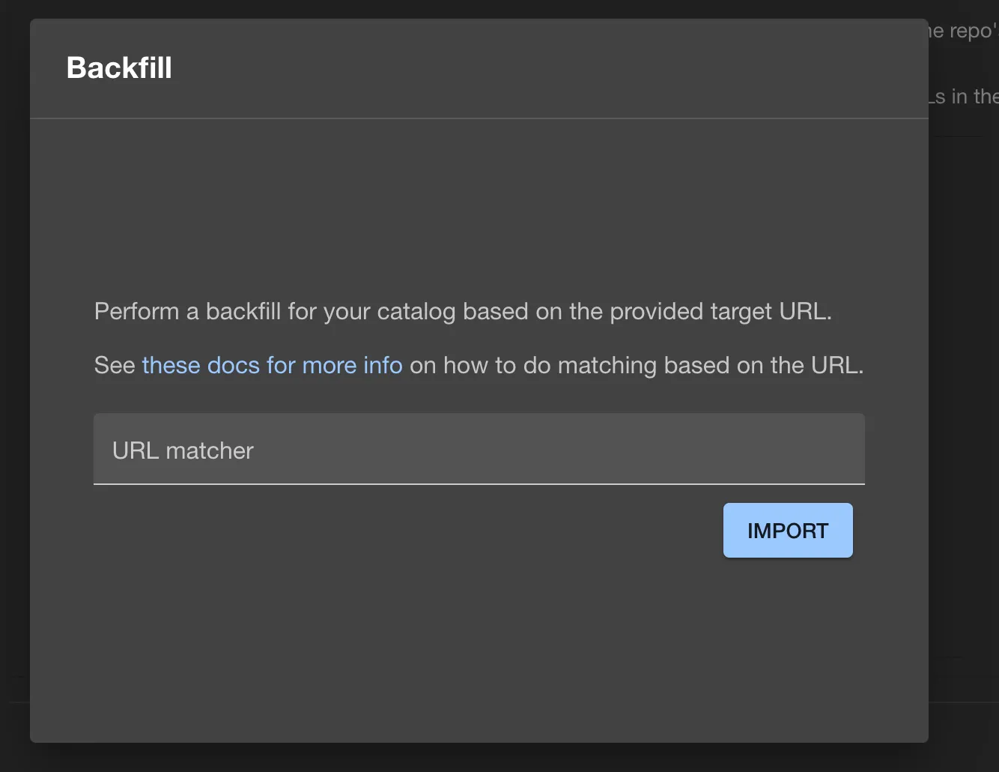
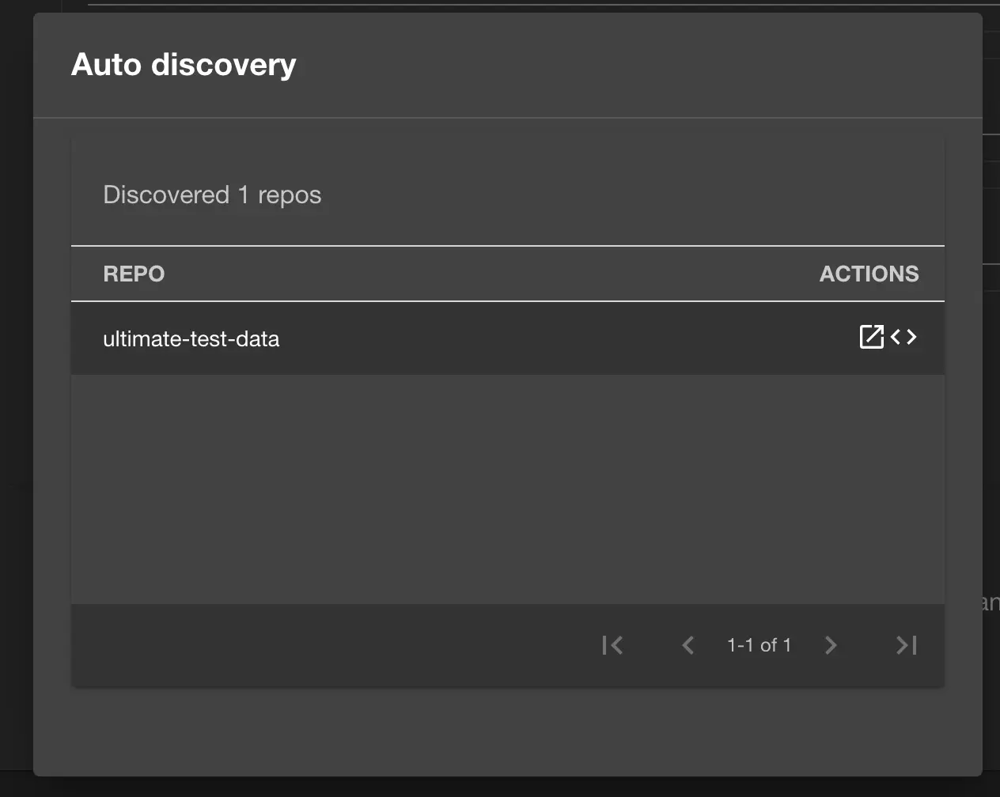

## Introduction

Roadie can perform on demand syncs with your organisation. This is useful in a case where you already have `catalog-info.yaml` files distributed in your organization before you installed the Roadie GitHub app.

## At a Glance
| | |
|---: | --- |
| **Prerequisites** | <ul><li>You must have installed the Roadie GitHub app in your organisation as described [here](/docs/getting-started/adding-a-catalog-item/)</li><li>You must be an Admin of Backstage, as [described here](/docs/getting-started/assigning-admins/).</li></ul> |
| **Considerations** |  |
| **Supported Environments** | ☐ Private Network via Broker   ☐ Internet Accessible via IP Whitelist   ☒ Cloud Hosted |

## Prerequisites

- You must have installed the Roadie GitHub app in your organisation as described [here](/docs/getting-started/adding-a-catalog-item/)
- You must be an Admin of Roadie Backstage, as [described here](/docs/getting-started/assigning-admins/).

## Steps

1. Visit the Administration > Settings page and click on GitHub under Integrations
2. Scroll down to the `Backfill your catalog` section.
   
3. Press the `IMPORT` button in the bottom left corner.
4. A modal will open up.
   
5. Type the target url that you used in your `app-config.yaml` files under the `catalog.locations` key with the type: github-discovery. You can either provide a wildcard(\*) in the place of the repo part of the url or you can use wildcards in the file path part.

   ✅ Use this if you have multiple repos with existing catalog-info.yaml files.

   `https://github.com/RoadieHQ/*/blob/-/catalog-info.yaml`

   ✅ Use this if you use monorepo. You'll need to import for all of your monorepos one time.

   `https://github.com/RoadieHQ/my-mono-repo/blob/-/**/catalog-info.yaml`

   ❌ You can not use wildcards in both places

   `https://github.com/RoadieHQ/*/blob/-/**/catalog-info.yaml`

6. Press the `IMPORT` button in the bottom right corner
7. You can see a table with all of the discovered repos that got added to the roadie catalog.
   

## Confirming it worked

You can go to the catalog and see your added components.
