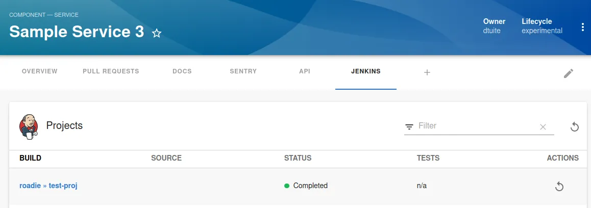
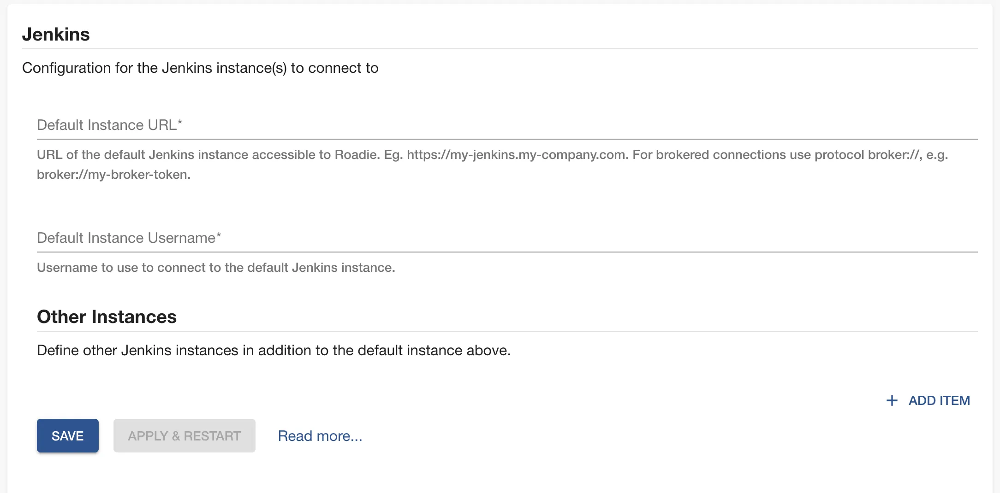
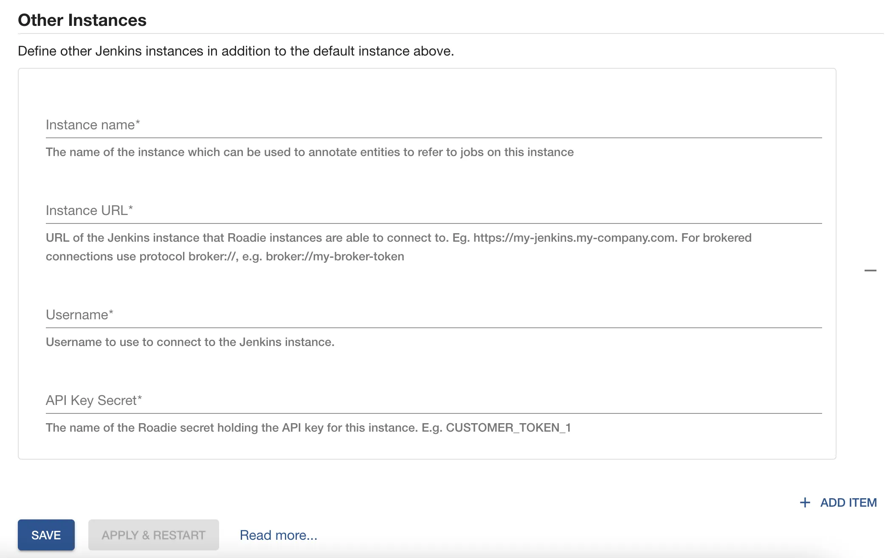

## Introduction

The Jenkins plugin can display build information from a GitHub Organization project in your Jenkins instances.

ℹ️ NB: Other Jenkins project types like Freestyle project and Pipeline are not supported yet.



This page explains how to configure it in Roadie Backstage.

## At a Glance

|                            |                                                                                                                                                                                                                                                                                                                                                                                                                                                |
| -------------------------: | ---------------------------------------------------------------------------------------------------------------------------------------------------------------------------------------------------------------------------------------------------------------------------------------------------------------------------------------------------------------------------------------------------------------------------------------------- |
|          **Prerequisites** | <ol><li>You must be an admin in Roadie. By default, the first Roadie user is an admin. Learn how to designate certain users as admins [here](/docs/getting-started/assigning-admins/).</li><li>Your Jenkins instance must be accessible by Roadie backend instances. To allow list Roadie access you can check our IPs [here](/docs/details/allowlisting-roadie-traffic/). </li></ol><br />**Configuration Data:** <ul><li>API Token</li></ul> |
|         **Considerations** | Multi-Instance is supported through multiple broker configuration blocks.                                                                                                                                                                                                                                                                                                                                                                      |
| **Supported Environments** | ☒ Private Network via Broker <br /> ☒ Internet Accessible via IP Whitelist <br /> ☐ Cloud Hosted                                                                                                                                                                                                                                                                                                                                               |

## Prerequisites

1. You must be an admin in Roadie. By default, the first Roadie user is an admin. Learn how to designate certain users as admins [here](/docs/getting-started/assigning-admins/).
2. Your Jenkins instance must be accessible by Roadie backend instances. To allow list Roadie access you can check our IPs [here](/docs/details/allowlisting-roadie-traffic/).

## Step 1: Create a Jenkins API token

Roadie requires an API token to be able to connect to Jenkins.

You can generate an API token for your user by visiting Jenkins UI at `<your-Jenkins-instance>/user/<your-account>/configure/` and by clicking "Generate" in the "API Token" section.

## Step 2: Configure Roadie with your Jenkins instance URL

Enter your Jenkins instance API endpoint and username into Roadie at `/administration/jenkins`. This information will be
used as the default Jenkins instance which will be used unless you specify otherwise in your component annotations. If
you've got multiple Jenkins instances you can [read more below](#multiple-jenkins-instances).

1. Click "Administration" in the sidebar, then "Settings" in the tabs.
2. Find "Jenkins" in the Configuration sidebar.
3. Enter your Jenkins instance URL and the username your Jenkins API token is owned by.
4. Add the Jenkins API token in the Secrets section.
5. Click "Save" then "Apply & Restart".



## Step 3: Add the UI elements

The Jenkins plugin provides two type of UI elements.

The `EntityLatestJenkinsRunCard` displays the latest runs for an entity.
This card can be [added to component dashboards](/docs/details/updating-the-ui/#updating-dashboards).

The `EntityJenkinsContent` presents a job folder in Jenkins and jobs it contains. It also display details of each job within the folder.
This component can be [added as a tab](/docs/getting-started/updating-the-ui#updating-tabs) to component layouts.

## Step 4: Modify your catalog files to contain references to Jenkins jobs

The Jenkins plugin uses `jenkins.io/job-full-name` annotation to determine the correct GitHub organization folder and job name within your Jenkins instance.
You can configure it as follows:

```yaml
// catalog-info.yaml
metadata:
  annotations:
    jenkins.io/job-full-name: [github-organization-project-name/job-name]

```

More information how to configure the plugin for your component can be found from [the plugins documentation](/backstage/plugins/jenkins/).

## Multiple Jenkins Instances

You must first create a default instance as in the docs above. This instance will be named "default" and use
`JENKINS_API_KEY` as the API key.

You can then define connection details for the rest of the Jenkins instances in the
"Other Instances" section. For each instance you must provide:

- An instance URL accessible to Roadie and a username
- A name for the instance. This name may not be "default".
- The name of a Roadie Secret which holds an API key for the instance. This could be something like `CUSTOMER_TOKEN_1`.
  Then click "Save" then "Apply & Restart".

To configure a component to fetch from a specific instance you must include the instance name in the jenkins annotation. e.g.
`jenkins.io/job-full-name: "instance-name:github-organization-cluster1-project/job-name". You can read more [here](https://github.com/backstage/community-plugins/tree/main/workspaces/jenkins/plugins/jenkins-backend#example---multiple-global-instances).



## References

- [Jenkins blog post for creating new format API tokens](https://www.jenkins.io/blog/2018/07/02/new-api-token-system/#new-approach)
- [Jenkins plugin documentation in Backstage](https://github.com/backstage/community-plugins/tree/main/workspaces/jenkins/plugins/jenkins-backend#defaultjenkinsinfoprovider)
- [More information about the components available with Jenkins plugin](https://github.com/backstage/community-plugins/tree/main/workspaces/jenkins/plugins/jenkins)
