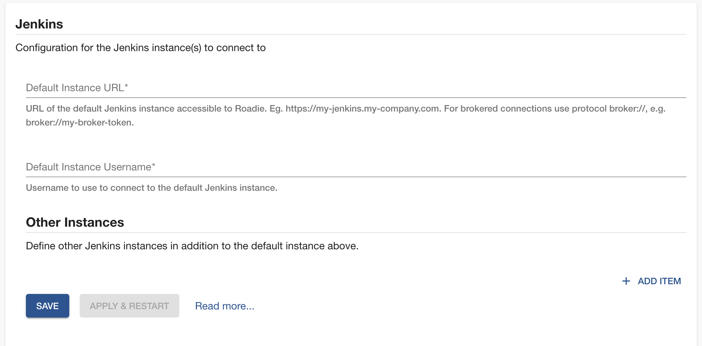

## Introduction

The Jenkins plugin can display build information from a GitHub Organization project in your Jenkins instances. 

ℹ️ NB: Other Jenkins project types like Freestyle project and Pipeline are not supported yet.


This page explains how to configure it in Roadie Backstage.

## Prerequisites

1. You must be an admin in Roadie. By default, all users are admins. Learn how to designate certain users as admins [here](/docs/getting-started/create-admin-group/).
2. Your Jenkins instance must be accessible by Roadie backend instances. To allow list Roadie access you can check our IPs [here](/docs/details/allowlisting-roadie-traffic/).  


## Step 1: Create a Jenkins API token

Roadie requires an API token to be able to connect to Jenkins.

You can generate an API token for your user by visiting Jenkins UI at `<your-Jenkins-instance>/user/<your-account>/configure/` and by clicking "Generate" in the "API Token" section.

## Step 2: Configure Roadie with your Jenkins instance URL

Enter your Jenkins instance API endpoint and username into Roadie at `/administration/jenkins`.

1. Click "Administration" in the sidebar, then "Settings" in the tabs.
2. Find "Jenkins" in the Configuration sidebar.
3. Enter your Jenkins instance URL and the username your Jenkins API token is owned by.
4. Add the Jenkins API token in the Secrets section. 
5. Click "Save" then "Apply & Restart".



## Step 3: Add the UI elements

The Jenkins plugin provides two type of UI elements.


The `EntityLatestJenkinsRunCard` displays the latest runs for an entity.
This card can be [added to component dashboards](/docs/getting-started/updating-the-ui/#updating-dashboards).


The `EntityJenkinsContent` presents a job folder in Jenkins and jobs it contains. It also display details of each job within the folder.
This component can be [added as a tab](/docs/getting-started/updating-the-ui#updating-tabs) to component layouts.


## Step 4: Modify your catalog files to contain references to Jenkins jobs

The Jenkins plugin uses `jenkins.io/job-full-name` annotation to determine the correct GitHub organization folder and job name within your Jenkins instance.
You can configure it as follows:

```yaml
// catalog-info.yaml
metadata:
  annotations:
    jenkins.io/job-full-name: [github-organization-project-name/job-name]

```

More information how to configure the plugin for your component can be found from [the plugins documentation](/backstage/plugins/jenkins/).


## Multiple Jenkins Instances

If you require integrating with multiple Jenkins instances contact Roadie via the in-app chat widget and we will enable it for you.

## References

- [Jenkins blog post for creating new format API tokens](https://www.jenkins.io/blog/2018/07/02/new-api-token-system/#new-approach)
- [Jenkins plugin documentation in Backstage](https://github.com/backstage/backstage/tree/master/plugins/jenkins-backend#defaultjenkinsinfoprovider)
- [More information about the components available with Jenkins plugin](https://github.com/backstage/backstage/tree/master/plugins/jenkins)
