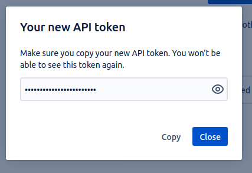

## Introduction

In order to use the Jira plugin, Roadie needs an API token to communicate with Jira APIs.


These are set within backstage at the following url:

```text
https://<tenant-name>.roadie.so/secrets
```

This page describes how to create and set up the API token.

## Steps

1. Start by visiting the user profile settings page for your Jira user: `https://id.atlassian.com/manage-profile/security/api-tokens`
   * It is a good practice to create an automation/bot account to Jira for API usage
2. Click on the "Create API token" button.

   

3. Give the token a label, so you can recognize it later, e.g. "Roadie Backstage"
4. Jira will show you the API token once, make note of this

   

5. The API token needs to be prefixed with the Jira username and base64 encoded
   * for example `jira-mail@example.com:hTBgqVcrcxRYpT5TCzTA9C0F` converts to `amlyYS1tYWlsQGV4YW1wbGUuY29tOmhUQmdxVmNyY3hSWXBUNVRDelRBOUMwRg==`
6. Prefix the base64 encoded token value with `Basic `
   * for example the above token would finally become `Basic amlyYS1tYWlsQGV4YW1wbGUuY29tOmhUQmdxVmNyY3hSWXBUNVRDelRBOUMwRg==`
7. Visit `https://<tenant-name>.roadie.so/secrets` and enter the base64 encoded and prefixed token value from above into `JIRA_API_TOKEN`

## References

- [Atlassian docs for creating API tokens](https://support.atlassian.com/atlassian-account/docs/manage-api-tokens-for-your-atlassian-account/)
