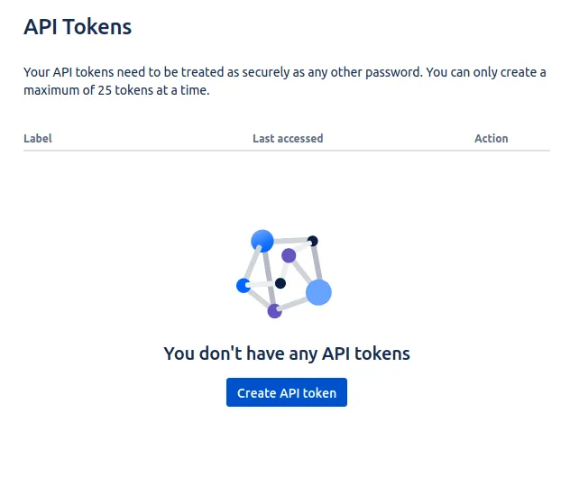
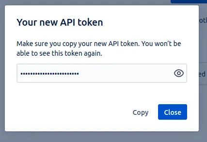

## Introduction

In order to use the Jira plugin, Roadie needs an API token to communicate with Jira APIs.


These are set within backstage at the following url:

```text
https://<tenant-name>.roadie.so/administration/jira
```

This page describes how to create and set up the API token.

## Steps

### Step 1: Create an API token

Start by visiting the user profile settings page for your Jira user: https://id.atlassian.com/manage-profile/security/api-tokens. Note that it is a good practice to create an automation/bot account to Jira for API usage 

Click on the "Create API token" button.

   

On the modal window you can give the token a label, so you can recognize it later, e.g. "Roadie Backstage" and finally Atlassian will show you the API token once. Make note of this token, you will only be able to see it once.

   

### Step 2: Add the Token in Roadie

(If using Jira Server/DC you can skip the encoding here and add the Bearer token directly. You'll need to configure an environment variable `JIRA_API_TOKEN_REALM` with the value `Bearer` in addition.)

Jira Cloud uses Basic auth so the token needs to be converted into a compatible format. 
First we need to prefix the token with the Jira user email and base64 encode it. 

For example
```
jira-mail@example.com:hTBgqVcrcxRYpT5TCzTA9C0F
```
would translate to
```
amlyYS1tYWlsQGV4YW1wbGUuY29tOmhUQmdxVmNyY3hSWXBUNVRDelRBOUMwRg==
```
Via the following command:
```bash
echo -n "<email>:<password>" | base64 
```
NOTE: the `-n` flag removes new line characters from the echo output.

Enter the token value from above into the `JIRA_API_TOKEN` secret in the Jira Administration page at `https://<tenant-name>.roadie.so/administration/jira`.

### Step 3: Add the Jira URL in Roadie
Visit `https://<tenant-name>.roadie.so/administration/jira` and:
* Add the URL to your Jira instance into `JIRA_API_URL`. The URL should not contain a trailing slash, e.g. `https://roadie.atlassian.net`.
* If you're using a Bearer token for Jira Server enter `Bearer` into `JIRA_API_TOKEN_REALM`.
* Optionally, provide a value for `User Email Suffix` this should be the email suffix of your Jira users, for example, @your-company.com.
  This setting is used by the Jira dashboard in conjunction with your Backstage username to construct a filter to display only your issues. 
  This may not be necessary if you're using version 3 of the Jira API. 

### Step 4: Add the required annotations to some components

Edit the YAML metadata of a Backstage component to add the following annotations:

```yaml
metadata:
  annotations:
    jira/project-key: <example-jira-project-key>
    jira/component: <example-component> # optional, you might skip this value to fetch data for all components
    jira/token-type: Bearer # optional, used for Activity stream feed.
    jira/label: label1, label2 # optional, can use multiple labels comma separated or a single value
```

Alternatively, you can add JQL expressions as annotations for the EntityJiraQueryCard component:

```yaml
metadata:
  annotations:
    jira/all-issues-jql: '<example-jql-expression>' # Used by default by EntityJiraQueryCard
    # To display several queries you can add custom annotations and associate those using the jqlQueryFromAnnotation prop
    # e.g. <EntityJiraQueryCard jqlQueryFromAnnotation="jira/custom-jql" />
    jira/custom-jql: <another-jql-expression>  
```

ℹ️ These JQL expressions have limited templating support e.g. `assignee = '{{ userEmail }}'` the available values are 
userEmail, userDisplayName and if any annotations are set those values also projectKey, component, label and team.

### Step 5: Add Jira components to the UI

There are two components which you can add to the catalog layout to display Jira information. 
* EntityJiraOverviewCard - can be added to the overview or other grid layouts. 
* EntityJiraDashboardContent - a tab component provided by the [Jira Dashboard](https://www.npmjs.com/package/@axis-backstage/plugin-jira-dashboard) plugin.
* EntityJiraQueryCard - A card which makes a JQL search query and displays the results. This can be provided by annotation
  as described above or directly as a prop `jqlQuery`.

You can read more about how to update the UI [here](/docs/details/updating-the-ui/).

## Caveats

* The Jira Dashboard plugin doesn't fully support version 3 of the Jira API. Some information will be missing if you're using
  version 3 with the EntityJiraDashboardContent tab such as the value in `Assignee` column. We hope to have this issue fixed
  in due course.
* The "Assigned to me" table is based on a JQL query where the username is taken from your login user profile (see `/administration/account` > Profile).
  This means your username in Roadie must match your username in Atlassian. Often your company email will be used in both cases
  but if you're using GitHub as the source of your users & groups this will likely not match.

## References

- [Atlassian docs for creating API tokens](https://support.atlassian.com/atlassian-account/docs/manage-api-tokens-for-your-atlassian-account/)
