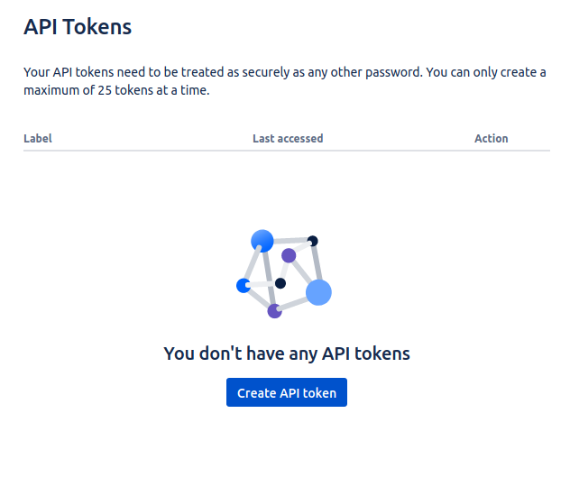
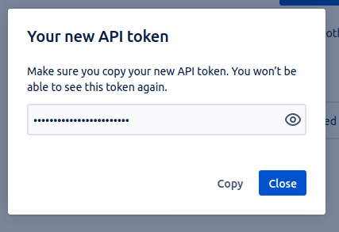

## Introduction

In order to use the Jira plugin, Roadie needs an API token to communicate with Jira APIs.


These are set within backstage at the following url:

```text
https://<tenant-name>.roadie.so/administration/jira
```

This page describes how to create and set up the API token.

## Steps

### Step 1: Create an API token

Start by visiting the user profile settings page for your Jira user: https://id.atlassian.com/manage-profile/security/api-tokens. Note that it is a good practice to create an automation/bot account to Jira for API usage 

Click on the "Create API token" button.

   

On the modal window you can give the token a label, so you can recognize it later, e.g. "Roadie Backstage" and finally Atlassian will show you the API token once. Make note of this token, you will only be able to see it once.

   

### Step 2: Base64 encode the credentials 

The Jira plugin handles authentication using Basic auth so the token needs to be converted into a compatible format. 
First we need to prefix the token with the Jira user email and base64 encode it. 

For example
```
jira-mail@example.com:hTBgqVcrcxRYpT5TCzTA9C0F
```
would translate to
```
amlyYS1tYWlsQGV4YW1wbGUuY29tOmhUQmdxVmNyY3hSWXBUNVRDelRBOUMwRg==
```
Via the following command:
```bash
read -s tmp; echo -n "jira-mail@example.com:$tmp" | base64 ; unset tmp 
```
NOTE: the `-n` flag removes new line characters from the echo output.

### Step 3: Store the credentials and Jira URL in Roadie
Visit `https://<tenant-name>.roadie.so/administration/jira` and: 
* Enter the base64 encoded and prefixed token value from above into `JIRA_API_TOKEN`.
* Add the URL to your Jira instance into `JIRA_API_URL`. The URL should not contain a trailing slash, e.g. `https://roadie.atlassian.net`.
* Optionally, provide a value for `User Email Suffix` this should be the email suffix of your Jira users, for example, @your-company.com.
  This setting is used by the Jira dashboard in conjunction with your Backstage username to construct a filter to display only your issues. 
  This may not be necessary if you're using version 3 of the Jira API. 

### Step 4: Add the required annotations to some components

Edit the YAML metadata of a Backstage component to add the following annotations:

```yaml
metadata:
  annotations:
    jira/project-key: <example-jira-project-key>
    jira/component: <example-component> # optional, you might skip this value to fetch data for all components
    jira/token-type: Bearer # optional, used for Activity stream feed.
```

### Step 5: Add Jira components to the UI

There are two components which you can add to the catalog layout to display Jira information. 
* EntityJiraOverviewCard - can be added to the overview or other grid layouts. 
* EntityJiraDashboardContent - a tab component provided by the [Jira Dashboard](https://www.npmjs.com/package/@axis-backstage/plugin-jira-dashboard) plugin.

You can read more about how to update the UI [here](/docs/details/updating-the-ui/).

## Caveats

The Jira Dashboard plugin doesn't fully support version 3 of the Jira API. Some information will be missing if you're using
version 3 with the EntityJiraDashboardContent tab such as the value in `Assignee` column. We hope to have this issue fixed
in due course.

## References

- [Atlassian docs for creating API tokens](https://support.atlassian.com/atlassian-account/docs/manage-api-tokens-for-your-atlassian-account/)
