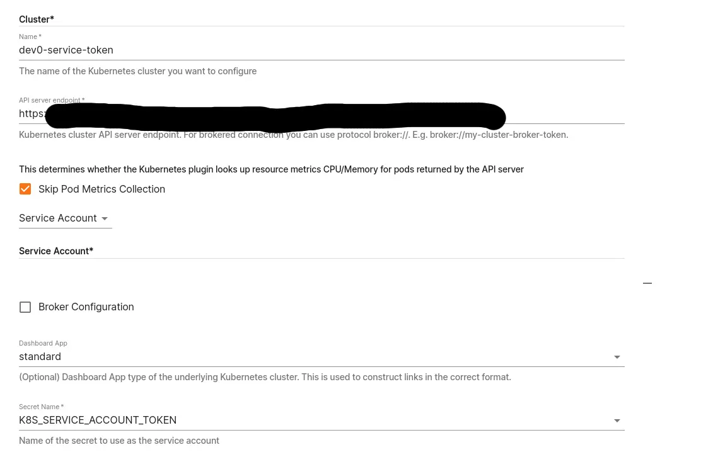
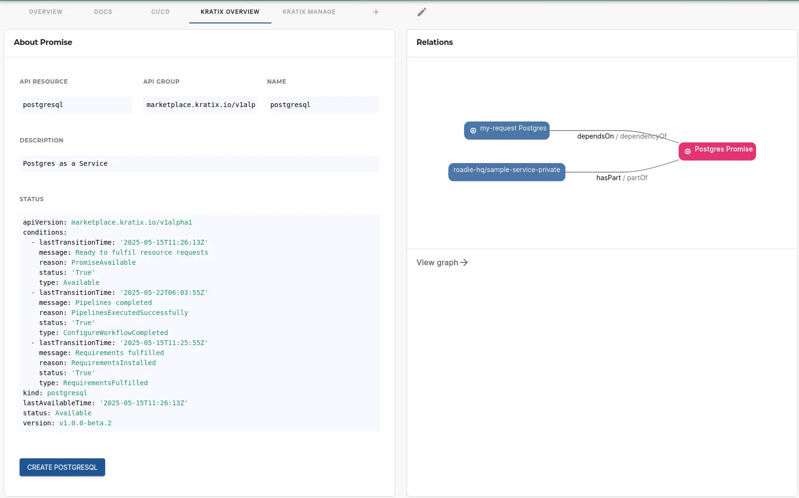
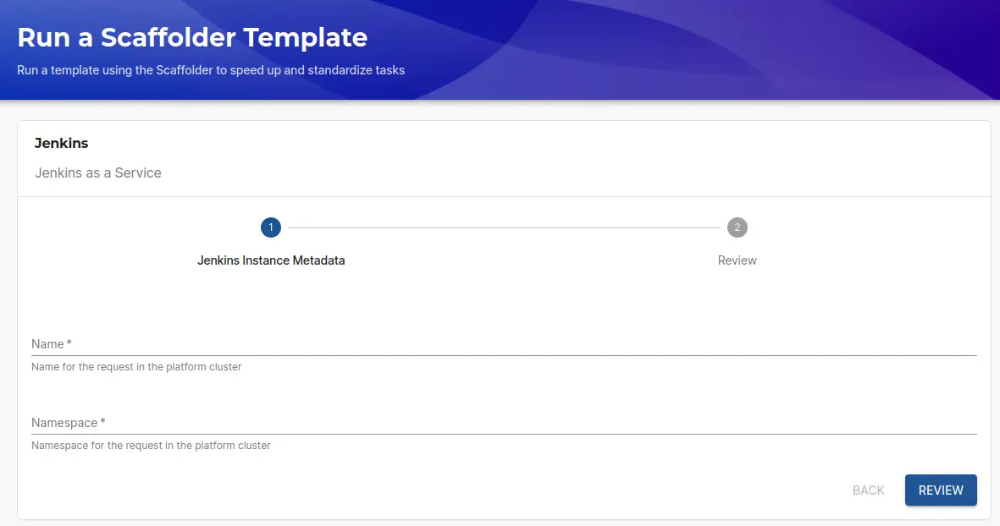

## At a Glance
| | |
|---: | --- |
| **Prerequisites** |  |
| **Considerations** |  |
| **Supported Environments** | ☐ Private Network via Broker   ☐ Internet Accessible via IP Whitelist   ☒ Cloud Hosted |

## Introduction

The Syntasso Kratix plugin integrates [Kratix](https://kratix.io/) with Roadie, allowing you to create and manage Kratix Promises and Resources directly from your Backstage instance. Kratix is a framework that enables platform teams to build a Kubernetes-based platform with a self-service API for application teams.

## Overview

Kratix allows platform teams to define "Promises" which are custom resources that application teams can request. These Promises can represent infrastructure, services, or any other resources that application teams need. The Kratix plugin enables:

1. Viewing available Kratix Promises
2. Creating new resources based on these Promises
3. Managing and monitoring the status of your Kratix resources

## Configuration

### Prerequisites

Before using the Kratix plugin in Roadie, you need to have:

1. A running Kratix installation in your Kubernetes cluster
2. Appropriate access permissions configured

### Plugin Configuration

The Kratix plugin can be configured through the Roadie UI. Kratix configuration needs to be on two places within the Roadie application. First you need to setup a Kubernetes configuration to be able to connect to your cluster where your Kratix installation is running. Navigate to `https://<your-tenant>.roadie.so/administration/settings/plugins/kubernetes` and set up a Service Account type Kubernetes connection to your cluster. 

Note that only Service Account type configuration is supported with the Syntasso Kratix plugin.

.
After configuring your Kubernetes connection, you can set up the Kratix plugin to use that connection. This will allow you to access your Kratix resources, promises, and tasks within the application.

To configure the Kratix plugin state store, you can refer to [Roadie AWS S3 configuration documentation](/docs/integrations/aws-s3/)

## Using the Kratix Plugin

The plugin exposes three components and a Scaffolder action that can be added to your Roadie application:
1. KratixAboutCard (Card type)
2. KratixOverviewTab (Content type)
3. KratixManageTab (Content type)

More information on how to add these UI components can be found from [Roadie UI customization](/docs/getting-started/configure-ui/) documentation.

### Viewing Available Promises

Once configured, you can view all available Kratix Promises in the KratixOverview tab of your Roadie instance. These represent the services and resources that can be requested.

### Creating Resources

To create a new resource based on a Promise:

1. Navigate to the Kratix tab in Roadie
2. Select the Promise you want to use
3. Click "Create Resource"
3. Fill in the required configuration parameters
4. Submit the request

More information about Scaffolder templates and how to write those for Kratix plugin can be found from the official Kratix documentation. 

### Monitoring Resources

After creating resources, you can monitor their status through the Kratix plugin. This includes:

- Deployment status
- Health checks
- Configuration details

## Additional Information

For more detailed information about Kratix and its capabilities, refer to the [official Kratix documentation](https://docs.kratix.io/).

For specific information about the Backstage integration, see:
- [YAML file format](https://docs.kratix.io/ske/integrations/backstage/yaml-file-format)
- [SKE Backtage Generator](https://docs.kratix.io/ske/integrations/backstage/generator)
