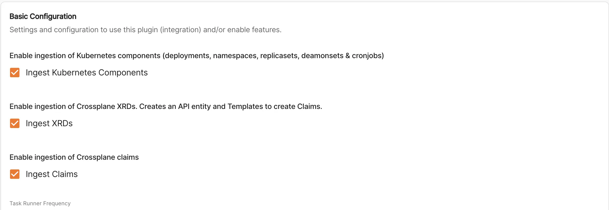

---
title: Kubernetes Ingestor and Crossplane plugin
publishedDate: '2025-05-14T14:00:00.0Z'
description: How to configure and use the TeraSky kubernetes ingestor & Crossplane plugin in Roadie.

humanName: Crossplane kubernetes Ingestor
logoImage: '../../../assets/logos/crossplane/crossplane.webp'
integrationType: OSS plugin
--- 

## At a Glance
| | |
|---: | --- |
| **Prerequisites** |  |
| **Considerations** |  |
| **Supported Environments** | ☐ Private Network via Broker <br /> ☐ Internet Accessible via IP Whitelist <br /> ☒ Cloud Hosted |

# Prerequisites

Access to this plugin is enabled by a feature flag. Ask Roadie to enable this for you if you want to use it.

Before configuring the kubernetes ingestor, you must first set up Kubernetes access in Roadie. Please follow the [Kubernetes setup guide](/docs/integrations/kubernetes) to configure your cluster access.

## Required RBAC Permissions

The plugin requires specific RBAC permissions to function properly. You'll need cluster role bindings for two ClusterRoles:

1. The `crossplane-view` ClusterRole (which should be created when you install crossplane)
2. A custom ClusterRole to read CustomResourceDefinitions:

```yaml
apiVersion: rbac.authorization.k8s.io/v1
kind: ClusterRole
metadata:
  name: backstage-crd-viewer
rules:
- apiGroups:
  - apiextensions.k8s.io
  resources:
  - customresourcedefinitions
  verbs:
  - get
  - list
  - watch
```

# Plugin Features

The TeraSky Crossplane plugin provides several key features for managing Crossplane resources in Roadie:

## Crossplane XRDs as Templates

The plugin ingests Crossplane Composite Resource Definitions (XRDs) and converts them into templates. These templates can be used to create new Crossplane Claims through a GitOps workflow. When a template is used, the plugin will:

1. Create a Pull Request to your specified repository
2. Include the generated Claim manifest in the PR
3. Allow for review and approval of the changes

## Template Updates

The plugin supports updating existing manifests after creation. 

## Crossplane Claims Visualization

The plugin ingests Crossplane Claims from your Kubernetes cluster and provides visualization capabilities:

- View all Crossplane Claims in your cluster
- See the status of each Claim
- Visualize associated Kubernetes resources

## Kubernetes Resource Import

The plugin can also import Kubernetes resources like deployments into Roadie. This feature is provided as-is with somewhat limited flexibility, but can be useful for basic resource visualization and management.

# Configuration

To configure the plugin, you'll need to:

1. Go to /administration/settings/crossplane-kubernetes-ingestor
2. Select the items you'd like to ingest. You can also choose to only include annotated resources, set the import frequency and exclude certain namespaces.
   
3. Click "save" then "apply and restart". It will take a few minutes for the entity provider to run and start importing entities.
4. If you're importing claims you can add UI components from the crossplane plugin. In the catalog select "components" and filter by type "crossplane-claim". You can then add the following components, the CrossplaneResourcesGraph tab, the CrossplaneResourcesTable tab and the CrossplaneOverviewCard. (See docs on [how to add components](../../details/updating-the-ui/))
5. If you want to update claim manifests created through the templates you'll need to [create a template](../../docs/getting-started/scaffolding-components/) with the following content ([source](https://github.com/TeraSky-OSS/backstage-plugins/blob/main/plugins/gitops-manifest-updater/templates/sample.yaml)):
```yaml
apiVersion: scaffolder.backstage.io/v1beta3
kind: Template
metadata:
  name: update-kubernetes-manifest
  title: Update Kubernetes Manifest
  labels:
    target: component
  description: A template to update a claim manifest in Git based on the registered OpenAPI Schema of the XRD
spec:
  owner: user:guest
  type: service
  parameters:
    - title: Entity Selection
      required:
        - entity
      properties:
        entity:
          title: Entity
          type: string
          description: Select the entity to update
          ui:field: EntityPicker
          ui:options:
            catalogFilter:
              - kind: Component
        sourceFileUrl:
          title: Source File URL
          type: string
          description: Override the source file URL (optional - only needed if entity doesn't have terasky.backstage.io/source-file-url annotation)
    - title: GitOps Manifest Updater
      required:
        - gitOpsManifestUpdater
      properties:
        gitOpsManifestUpdater:
          title: GitOps Manifest Updater
          type: object
          ui:field: GitOpsManifestUpdater
  steps:
    - id: get-entity
      name: Get Entity
      action: catalog:fetch
      input:
        entityRef: ${{ parameters.entity }}

    - id: get-annotation-url
      name: Get Annotation URL
      action: roadiehq:utils:jsonata
      input:
        data: 
          annotations: ${{ steps['get-entity'].output.entity.metadata.annotations }}
        expression: |
          annotations."terasky.backstage.io/source-file-url"

    - id: resolve-url
      name: Resolve URL
      action: roadiehq:utils:jsonata
      input:
        data: 
          sourceFileUrl: ${{ parameters.sourceFileUrl }}
          annotationUrl: ${{ steps['get-annotation-url'].output.result }}
        expression: |
          $exists(sourceFileUrl) ? sourceFileUrl : annotationUrl

    - id: validate-url
      name: Validate URL
      action: roadiehq:utils:jsonata
      input:
        data: ${{ steps['resolve-url'].output.result }}
        expression: |
          $string($) ? $ : $error("No source URL provided. Please either add the terasky.backstage.io/source-file-url annotation to the entity or provide a sourceFileUrl parameter")

    - id: get-filepath
      name: Get File Path
      action: roadiehq:utils:jsonata
      input:
        data: ${{ steps['validate-url'].output.result }}
        expression: |
          $join($filter($split($, "/"), function($v, $i) { $i >= 7}), "/")

    - id: fetch-base
      name: Fetch Current Manifest
      action: fetch:plain:file
      input:
        url: ${{ steps['validate-url'].output.result }}
        targetPath: ${{ steps['get-filepath'].output.result }}

    - id: serialize-patch
      name: Evaluate Changes
      action: roadiehq:utils:serialize:yaml
      input:
        data:
          spec: ${{ parameters.gitOpsManifestUpdater }}

    - id: merge-patch
      name: Merge Changes
      action: roadiehq:utils:merge
      input:
        path: ${{ steps['get-filepath'].output.result }}
        content: ${{ steps['serialize-patch'].output.serialized }}

    - id: read-file
      name: Read File
      action: roadiehq:utils:fs:parse
      input:
        path: ${{ steps['get-filepath'].output.result }}

    - id: parse-url
      name: Parse URL for PR
      action: roadiehq:utils:jsonata
      input:
        data: ${{ steps['validate-url'].output.result }}
        expression: |
          {
            "owner": $split($, "/")[3],
            "repo": $split($, "/")[4],
            "branch": $split($, "/")[6]
          }

    - id: format-branch-name
      name: Format Branch Name
      action: roadiehq:utils:jsonata
      input:
        data: ${{ steps['validate-url'].output.result }}
        expression: |
          "backstage-sourced-update-" & $join($filter($split($, "/"), function($v, $i) { $i >= 7}), "-")

    - id: create-pull-request
      name: create-pull-request
      action: publish:github:pull-request
      input:
        repoUrl: ${{ 'github.com?owner=' + steps['parse-url'].output.result.owner + '&repo=' + steps['parse-url'].output.result.repo }}
        branchName: ${{ steps['format-branch-name'].output.result }}
        title: Updating Kubernetes YAML for ${{ steps['get-entity'].output.entity.metadata.name }}
        description: Updating Kubernetes YAML for ${{ steps['get-entity'].output.entity.metadata.name }}
        targetBranchName: ${{ steps['parse-url'].output.result.branch }}

  output:
    links:
      - title: Pull Request
        url: ${{ steps['create-pull-request'].output.remoteUrl }}
      - title: Download YAML Manifest
        url: data:application/yaml;charset=utf-8,${{ steps['read-file'].output.content }}
```

# See Also

* [TeraSky Backstage Plugins repository](https://github.com/TeraSky-OSS/backstage-plugins). 