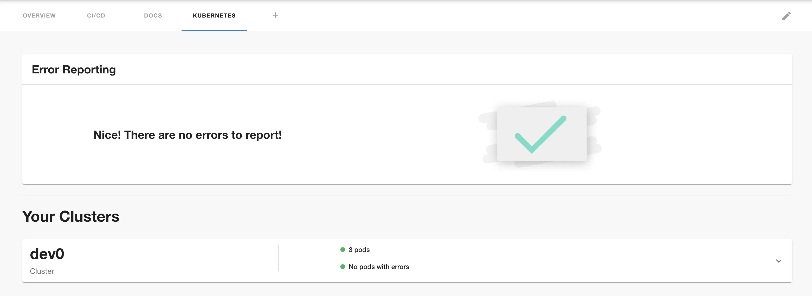

## At a Glance
| | |
|---: | --- |
| **Prerequisites** |  |
| **Considerations** |  |
| **Supported Environments** | ☐ Private Network via Broker <br /> ☐ Internet Accessible via IP Whitelist <br /> ☒ Cloud Hosted |



The Kubernetes plugin in Backstage allows you to add details about your services, pods, deployments etc to the component dashboard pages within Backstage. The plugin supports multiple different mechanisms to connect Backstage to your Kubernetes clusters.

Roadie supports the following connection setups:

- [Via Broker](#via-broker)
- [AWS EKS](#aws-eks)
- [GCloud GKE](#gcloud-gke)
- [Via Service Account](#via-service-account)

ℹ️ NB: **The API url of the cluster must be available to the Roadie infrastructure services if you are not using the Broker.** You can choose to limit the availablity to our [IP networks](/docs/details/allowlisting-roadie-traffic/). See instructions on setup of the broker in the instructions for your deployment type.

All three of these can use a Broker service that runs in your infrastructure and means that you do not have to expose your cluster via an AWS cross account Role, Google OAUTH App token or Service Account Token.

# Kubernetes Annotations

The k8s plugin uses two alternate ways of discovering resources in addition to a namespace annotation. You can find the Backstage docs on this [here](https://backstage.io/docs/features/kubernetes/configuration/#surfacing-your-kubernetes-components-as-part-of-an-entity).

## 1. backstage.io/kubernetes-id

You can add a label with the key `backstage.io/kubernetes-id` to all of your k8s resources relating to an entity and then using the same key as an annotation on your entity. It is recommended to use the name of the related Backstage entity for this id but not necessary.

Additionally, you can lookup resources by namespace using the `backstage.io/kubernetes-namespace` annotation.

NB: At a minimum for the frontend plugin to show useful data, a deployment and some related resources need the same matching labels.

### Backstage Entity

```yaml
---
apiVersion: backstage.io/v1alpha1
kind: Component
metadata:
  ...
  annotations:
    backstage.io/kubernetes-id: something
    backstage.io/kubernetes-namespace: roadie
...
```

### k8s Manifest

```yaml
---
apiVersion: apps/v1
kind: Deployment
metadata:
  namespace: roadie
  ...
  labels:
    backstage.io/kubernetes-id: backstage-backend
spec:
  ...
  template:
    metadata:
      namespace: roadie
      labels:
        backstage.io/kubernetes-id: backstage-backend
...
```

## 2. backstage.io/kubernetes-labels

Alternatively you can refer to existing labels on resources using the `backstage.io/kubernetes-label-selector` annotation on your Backstage entity, i.e. `'backstage.io/kubernetes-label-selector': 'app=my-app,component=front-end'`.

The same rule applies, that these labels must be on both deployments and related resources for them to appear in the k8s plugin UI.

You can again use an additional namespace label `backstage.io/kubernetes-namespace` to narrow down the search by Kubernetes namespace.

# Setup

## Via Broker

The [Broker](/docs/integrations/broker) can be used to securely access your Kubernetes clusters regardless of where they are deployed without needing any authentication credentials to be stored or negotiated on Roadie's side. You can learn more about the Broker and its security features here [https://docs.snyk.io/snyk-admin/snyk-broker#components-of-snyk-broker](https://docs.snyk.io/snyk-admin/snyk-broker#components-of-snyk-broker).

#### Step 1: Configure the Broker in Roadie

The Broker server runs on Roadie’s infrastructure and is secured by allow listing the customer’s IP addresses. You need to add your outbound IP addresses to the allow list in the settings page at `https://<your-tenant>.roadie.so/administration/settings/integrations/broker`. That will allow the Broker client (running on your VPC) to establish the connection to the server running on our side. After that connection is established, Roadie can use it to send requests back to Kubernetes.

ℹ️ NB: The IP addresses used by Roadie for requests to your Broker client are [listed here](/docs/details/allowlisting-roadie-traffic/).

#### Step 2: Create a Cluster Role, deploy the Broker Client

1. Connect to your cluster in your terminal.
2. [Apply](https://helm.sh/docs/intro/install/) the following Helm Chart to your cluster:

```shell
helm repo add roadie https://charts.roadie.io
helm install roadie-kubernetes-cluster-access roadie/roadie-kubernetes-cluster-access \
   --set broker.enabled=true \
   --set broker.token=<some-random-key> \
   --set broker.tenantName=<your-roadie-tenant-name>
```

ℹ️ _NB: <your-roadie-tenant-name> can be found in the url to your Roadie tenant i.e. https://[tenant-name].roadie.so_

You can test that Roadie is able to connect to the Broker you have just deployed by entering the broker token and testing here:
https://[tenant-name].roadie.so/administration/settings/integrations/broker

You can also view the connection logs on the broker pod deployed by the above Helm chart using kubectl to check whether requests are coming through and view any errors.

#### Step 3: Add your Kubernetes Broker config to Roadie

1. Navigate to ”https://[tenant-name].roadie.so/administration/settings/plugins/kubernetes” and click on add item.
2. Select the Service Account provider
3. Add the API endpoint as `broker://<the-token-from-step-2>`
4. Click `Save` and then `Apply and Restart`. Wait up to 10 minutes for the restart.
5. You can then test against entities with Kubernetes annotations unique to the cluster you want to test to see if the connection is working.

> You will need to annotate your entities (catalog-info.yaml) with the following if you want to see data: ”backstage.io/kubernetes-label-selector: 'app=my-app,component=frontend'”
> For more details please vist [here](https://backstage.io/docs/features/kubernetes/configuration#common-backstageiokubernetes-id-label)

## AWS EKS

In order to use the Kubernetes plugin for AWS, Roadie requires read-only access via a cross account AWS role in your account, or [a Broker connection](#via-broker).

ℹ️ NB: The cross account AWS role is the approach recommended by AWS for this type of access. See the following docs for more context:

- Assuming Role [learn more](https://docs.aws.amazon.com/STS/latest/APIReference/API_AssumeRole.html)
- Cross Account Federation [learn more](https://docs.aws.amazon.com/IAM/latest/UserGuide/id_roles_common-scenarios_third-party.html)
- Kubernetes RBAC [learn more](https://kubernetes.io/docs/reference/access-authn-authz/rbac/)
- Trust relationship [learn more](https://aws.amazon.com/en/blogs/security/how-to-use-trust-policies-with-iam-roles/)

### Setup Guide:

You can use a combination of a Cloudformation Template, a Helm Chart and the `eksctl` cli to set this up:

ℹ️ NB: Step 1 is only needed per AWS account you add. Steps 2 and 3 will need to be applied to each new cluster you add.

#### Step 1. Create a Cross Account Role

1. Create a new Role in your AWS account's IAM service using the pre-filled Cloudformation template by clicking the "Create Role" link in the Roadie Settings page inside a new EKS cluster config section `https://[tenant-name].roadie.so/administration/settings/plugins/kubernetes`
2. Navigate to `Outputs` after the Stack has finished, and copy the `RoadieIamRoleArn` and `ExternalID` into the role section of the EKS Kubernetes Settings page in Roadie - `https://[tenant-name].roadie.so/administration/settings/plugins/kubernetes`.
3. Click "Test Role" in the EKS Kubernetes Settings page in Roadie to check it is working - `https://[tenant-name].roadie.so/administration/settings/plugins/kubernetes`

#### Step 2. Add the Role Mapping in aws-auth

1. Log into your cluster
2. Edit your Kubernetes `aws-auth` pod's Configmap as per [the EKS docs](https://docs.aws.amazon.com/eks/latest/userguide/add-user-role.html).
   i.e. using eksctl `eksctl create iamidentitymapping --cluster <my-cluster> --region <region-code> --arn <RoadieIamRoleArn from step 1> --username roadie --group system:authenticated`

Running `kubectl describe -n kube-system configmap/aws-auth` the new entry should look something like this:

```yaml
 - mapRoles:
   - "groups":
      - "system:authenticated"
      "rolearn": "<RoadieIamRoleArn from step 1>"
      "username": "roadie"
```

#### Step 3. Create the Cluster Role and binding.

1. Connect to your EKS cluster [in your terminal](https://docs.aws.amazon.com/eks/latest/userguide/create-kubeconfig.html).
2. [Apply](https://helm.sh/docs/intro/install/) the Helm Chart to your cluster:

```shell
helm repo add roadie https://charts.roadie.io
helm install roadie-kubernetes-cluster-access roadie/roadie-kubernetes-cluster-access \
```

#### Step 4: Add the cluster settings in Roadie

1. Navigate to your Kubernetes settings in Roadie and click on add item `https://[tenant-name].roadie.so/administration/settings/plugins/kubernetes`
2. If not using the Broker, select EKS, add the Cluster's API Server Endpoint, the Cross Account Role ARN and External ID from Step 1.
3. Click `Save` and then `Apply and Restart`. Wait up to 10 minutes for the restart.
4. You can then test against entities with kubernetes annotations unique to the cluster you want to test to see if the connection is working.

> You will need to annotate your entities (catalog-info.yaml) with the following if you want to see data: ”backstage.io/kubernetes-label-selector: 'app=my-app,component=frontend'”
> For more details please vist [here](https://backstage.io/docs/features/kubernetes/configuration#common-backstageiokubernetes-id-label)

## GCloud GKE

GKE access can be set up [via the Roadie Broker](#via-broker) or using an OAuth App.

ℹ️ NB: you will need read access `Kubernetes engine viewer` at a minimum to a cluster. Without read access, you will be unable to see your Kubernetes resources, with this configuration.

#### Step 1: Create an OAuth app

Follow step 1 from [here](/docs/integrations/google-oauth-client/).

#### Step 2: Add secrets to backstage

Follow step 2 from [here](/docs/integrations/google-oauth-client/).

#### Step 3: Add your Cluster config to Roadie

1. Navigate to ”https://[tenant-name].roadie.so/administration/settings/plugins/kubernetes” and click on add item.
2. Select the Google provider
3. Add the load balancer url and name of cluster.
4. Click `Save` and then `Apply and Restart`. Wait up to 10 minutes for the restart.
5. You can then test against entities with kubernetes annotations unique to the cluster you want to test to see if the connection is working.

> You will need to annotate your entities (catalog-info.yaml) with the following if you want to see data: ”backstage.io/kubernetes-label-selector: 'app=my-app,component=frontend'”
> For more details please vist [here](https://backstage.io/docs/features/kubernetes/configuration#common-backstageiokubernetes-id-label)

## Via Service Account Token

You can integrate with Kubernetes using a standard Kubernetes Service Account.

In order to use the Kubernetes plugin using a service account, Roadie needs:

- A service account token
- The name of your cluster
- URL of your Kubernetes API Server endpoint.

#### Step 1: Add a Service Account token

Get a token from a Service Account in your cluster for use by Roadie. Then navigate to ”https://[tenant-name].roadie.so/administration/settings/secrets" and set the `K8S_SERVICE_ACCOUNT_TOKEN` secret to the service account token fro your cluster. Alternatively, if you are configuring multiple clusters, you can use one of `CUSTOMER_TOKEN_1`, `CUSTOMER_TOKEN_2` or `CUSTOMER_TOKEN_3`.

#### Step 2: Create the Cluster Role and Binding

1. Connect to your EKS cluster [in your terminal](https://docs.aws.amazon.com/eks/latest/userguide/create-kubeconfig.html).
2. [Apply](https://helm.sh/docs/intro/install/) the Helm Chart to your cluster:

```shell
helm repo add roadie https://charts.roadie.io
helm install roadie-kubernetes-cluster-access roadie/roadie-kubernetes-cluster-access \
  -n <namespace-of-service-account> \
   --set serviceAccount.enabled=true \
   --set serviceAccount.name=<name-of-service-account-you-have-a-token-for> \
   --set serviceAccount.namespace=<namespace-of-service-account>
```

#### Step 3:

1. Navigate to ”https://[tenant-name].roadie.so/administration/settings/plugins/kubernetes” and click on add item.
2. Select the Service Account provider and add the url and name of cluster.
3. Select the secret key for the correct token if not using the broker.
4. Click `Save` and then `Apply and Restart`. Wait up to 10 minutes for the restart.
5. You can then test against entities with kubernetes annotations unique to the cluster you want to test to see if the connection is working.

### References

- [Backstage Kubernetes plugin docs](https://backstage.io/docs/features/kubernetes/configuration#common-backstageiokubernetes-id-label)
- [Broker Configuration documentation](/docs/integrations/broker)
