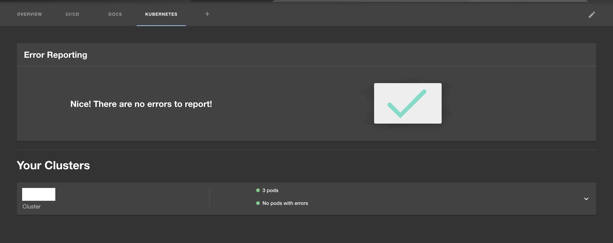

The Kubernetes plugin in Backstage allows you to add details about your services, pods, deployments etc to the component dashboard pages within Backstage. The plugin supports multiple different mechanisms to connect Backstage to kubernetes. 

Roadie supports 
- AWS EKS
- GCloud GKE 
- Self deployed kubernetes cluster

All three of these can use a Broker service that runs in your infrastructure and means that you do not have to expose your cluster via an AWS cross account Role, Google OAUTH App token or Service Account Token. 

ℹ️ NOTE: **The API url of the cluster must be available to the Roadie infrastructure services if you are not using the Broker.** You can choose to limit the availablity to our [IP networks](/docs/details/allowlisting-roadie-traffic/). See instructions on setup of the broker in the instructions for your deployment type.

# AWS EKS

### Prerequisites

In order to use the Kubernetes plugin for AWS, Roadie requires read-only access via a cross account AWS role in your account, or a Broker connection.

ℹ️ Note: The cross account AWS role is the approach recommended by AWS for this type of access. See the following docs for more context:
 * Assuming Role [learn more](https://docs.aws.amazon.com/STS/latest/APIReference/API_AssumeRole.html)
 * Cross Account Federation [learn more](https://docs.aws.amazon.com/IAM/latest/UserGuide/id_roles_common-scenarios_third-party.html)
 * Kubernetes RBAC [learn more](https://kubernetes.io/docs/reference/access-authn-authz/rbac/)
 * Trust relationship [learn more](https://aws.amazon.com/en/blogs/security/how-to-use-trust-policies-with-iam-roles/)


### Setup Guide:

You can use a combination of a Cloudformation Template, a Helm Chart and the `eksctl` cli to set this up:

ℹ️ NB: Step 1 is only needed per AWS account you add. Steps 2 and 3 will need to be applied to each new cluster you add.

### Step 1. Create a Cross Account Role (Skip if using the Broker)
1. Create a new Role in your AWS account's IAM service using this [Cloudformation template](https://console.aws.amazon.com/cloudformation/home#/stacks/create/review?templateURL=https://roadiehq-public-cloudformation-templates.s3.eu-west-1.amazonaws.com/create-role.template&stackName=roadie-role&param_roadieBackendRoleArn=arn:aws:iam::131774410247:role/roadie-backstage-backend-role-rV3ynEHv) NB: You can see the contents of the template by [downloading it here](https://roadiehq-public-cloudformation-templates.s3.eu-west-1.amazonaws.com/create-role.template).
2. Navigate to `Outputs` after the Stack has finished, and copy the `RoadieIamRoleArn` and `ExternalID` into the role section of the EKS Kubernetes Settings page in Roadie.

### Step 2. Create the Cluster Role and binding.
1. Connect to your EKS cluster [in your terminal](https://docs.aws.amazon.com/eks/latest/userguide/create-kubeconfig.html). 
2. Only if you want to use the Broker, create a `values.yaml` override file with the following:
```yaml
broker:
   enabled: true
   token: <some-random-key>
   tenantName: <your-roadie-tenant-name>
```

3. [Apply](https://helm.sh/docs/intro/install/) the Helm Chart to your cluster:
```shell
helm repo add roadie https://charts.roadie.io
helm install roadie-kubernetes-cluster-access roadie/roadie-kubernetes-cluster-access [-f <path-to-your-custom-values-file>.yaml]
```

### Step 3. Add the Role Mapping in aws-auth
1. Log into your cluster
2. Edit your Kubernetes `aws-auth` pod's Configmap as per [the EKS docs](https://docs.aws.amazon.com/eks/latest/userguide/add-user-role.html).
i.e. manually `kubectl edit -n kube-system configmap/aws-auth` or using eksctl `eksctl create iamidentitymapping --cluster <my-cluster> --region=<region-code> \
--arn arn:aws:iam::<your-account-number>:role/roadie-roadie-read-only-role --username roadie --group system:authenticated`

ℹ️ NB: The role arn is the same as the arn you copied from the Output `RoadieIamRoleArn` after running the Cloudformation template in step 1. 

Running `kubectl describe -n kube-system configmap/aws-auth` the new entry should look something like this:
``` yaml
 - mapRoles:
   - "groups":
      - "system:authenticated"
      "rolearn": "arn:aws:iam::<your-account-number>:role/roadie-roadie-read-only-role"
      "username": "roadie"
```

### Step 4: Add the cluster settings in Roadie

1. Navigate to your Kubernetes settings in Roadie and click on add item `https://[tenant-name].roadie.so/administration/settings/plugins/kubernetes`
2. If using the Broker, select Service Account type, add a name of your choice and an API endpoint of `broker://<the-token-from-step-2>`
3. If not using the Broker, select EKS, add the Cluster's API Server Endpoint, the Cross Account Role ARN and External ID from Step 1.
4. Click `Save` and then `Apply and Restart`. Wait up to 10 minutes for the restart.
5. You can then test against entities with kubernetes annotations unique to the cluster you want to test to see if the connection is working. 

> You will need to annotate your entities (catalog-info.yaml) with the following if you want to see data: ”backstage.io/kubernetes-label-selector: 'app=my-app,component=frontend'”
> For more details please vist [here](https://backstage.io/docs/features/kubernetes/configuration#common-backstageiokubernetes-id-label)

# GCloud GKE

GKE access can be set up via the Roadie Broker or using an OAuth App. 

### Using an OAuth App:
>  ℹ️  NB: you will need read access (`Kubernetes engine viewer`) at a minimum to a cluster. Without read access, you will be unable to see your Kubernetes resources, with this configuration. ℹ️

#### Step 1: Create an OAuth app

Follow step 1 from [here](/docs/integrations/google-oauth-client/).

#### Step 2: Add secrets to backstage

Follow step 2 from [here](/docs/integrations/google-oauth-client/).

#### Step 3: Add your Cluster config to Roadie

1. Navigate to ”https://[tenant-name].roadie.so/administration/settings/plugins/kubernetes” and click on add item.
2. Select the Google provider
3. Add the load balancer url and name of cluster.
4. Click `Save` and then `Apply and Restart`. Wait up to 10 minutes for the restart.
5. You can then test against entities with kubernetes annotations unique to the cluster you want to test to see if the connection is working.

> You will need to annotate your entities (catalog-info.yaml) with the following if you want to see data: ”backstage.io/kubernetes-label-selector: 'app=my-app,component=frontend'”
> For more details please vist [here](https://backstage.io/docs/features/kubernetes/configuration#common-backstageiokubernetes-id-label)


### Using the Broker:

#### Deploy the Broker via Helm to your Cluster
1. Connect to your GKE cluster in your terminal.
2. Create a `values.yaml` override file with the following:
```yaml
broker:
   enabled: true
   token: <some-random-key>
   tenantName: <your-roadie-tenant-name>
```
3. [Apply](https://helm.sh/docs/intro/install/) the Helm Chart to your cluster:
```shell
helm repo add roadie https://charts.roadie.io
helm install roadie-kubernetes-cluster-access roadie/roadie-kubernetes-cluster-access -f <path-to-your-custom-values-file>.yaml
```

# Service Account

You can also integrate with Kubernetes using a standard Kubernetes Service Account. With Service Account you can also use the [Broker connection](/docs/integration/broker) to make secure connections to your clusters.

In order to use the Kubernetes plugin using a service account, Roadie needs:
 * A service account token
 * The name of your cluster
 * URL of your Kubernetes API Server endpoint. If you are using brokered connection you can use protocol `broker://`, e.g. `broker://my-broker-token`.

#### Step 1: Add a Service Account token (Skip if using the Broker)
You will need to create a service account token for your cluster in the Kubernetes cluster for use by Roadie. Then navigate to ”https://[tenant-name].roadie.so/administration/settings/secrets" and set the `K8S_SERVICE_ACCOUNT_TOKEN` secret to the service account token fro your cluster. Alternatively, if you are configuring multiple clusters, you can use one of `CUSTOMER_TOKEN_1`, `CUSTOMER_TOKEN_2` or `CUSTOMER_TOKEN_3`. 

#### Step 2: Create the Cluster Role and Binding 
1. Connect to your EKS cluster [in your terminal](https://docs.aws.amazon.com/eks/latest/userguide/create-kubeconfig.html).
2. Create a `values.yaml` override file with the following:

*Without broker:*
```yaml
serviceAccount:
  enabled: true
  name: <name-of-service-account-you-have-a-token-for>
  namespace: <namespace-of-service-account>
```

*With Broker:*
```yaml
broker:
   enabled: true
   token: <some-random-key>
   tenantName: <your-roadie-tenant-name>
```

*NB: <your-roadie-tenant-name> can be found in the url to your Roadie tenant i.e. https://<tenant-name>.roadie.so*

3. [Apply](https://helm.sh/docs/intro/install/) the Helm Chart to your cluster:
```shell
helm repo add roadie https://charts.roadie.io
helm install roadie-kubernetes-cluster-access roadie/roadie-kubernetes-cluster-access -f <path-to-your-custom-values-file>.yaml -n <namespace-of-service-account>
```

#### Step 3: 
1. Navigate to ”https://[tenant-name].roadie.so/administration/settings/plugins/kubernetes” and click on add item.
2. Select the Service Account provider and add the url and name of cluster.
3. Select the secret key for the correct token if not using the broker. 
4. Click `Save` and then `Apply and Restart`. Wait up to 10 minutes for the restart.
5. You can then test against entities with kubernetes annotations unique to the cluster you want to test to see if the connection is working.

### References
* [Backstage Kubernetes plugin docs](https://backstage.io/docs/features/kubernetes/configuration#common-backstageiokubernetes-id-label)
* [Broker Configuration documentation](/docs/integration/broker)
