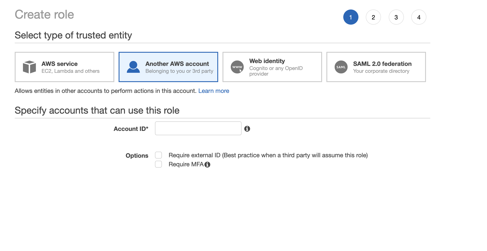
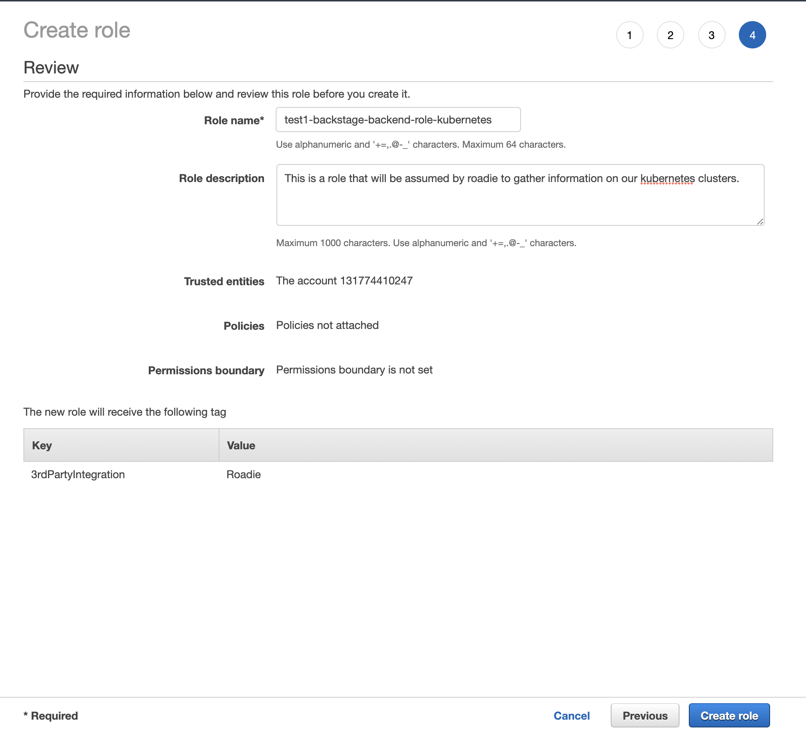
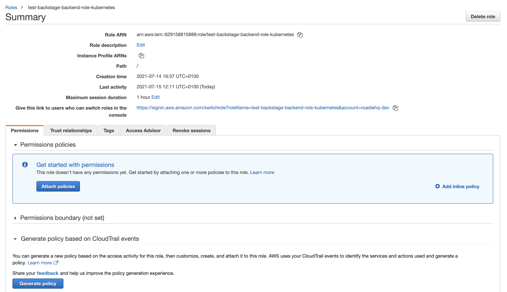
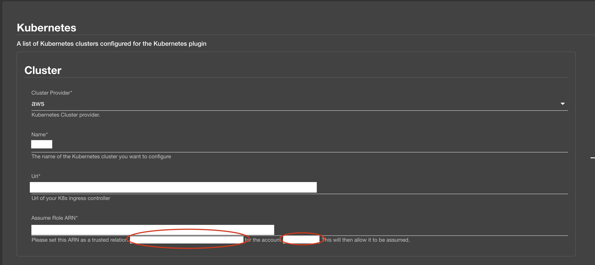

> Note, the Kubernetes plugin is only supported with AWS clusters.
> We are currently working on trying to get GKE as another supported provider.

# AWS

## Introduction

In order to use the Kubernetes plugin, Roadie needs:
 * An Assumed Role to fetch the resources from your cluster
 * The name of your cluster
 * URL of the loadbalancer/entry point to your kubernetes cluster


These are set within backstage at the following url:

```text
https://<tenant-name>.roadie.so/administration/settings/kubernetes
```

This page describes how to create and set up the API token.

## Steps

### Step 1: Creating the cross federation role

Start off by signing into your AWS console and navigating to the IAM service.
Once there, click on `Role` link (this should be on the left handside of your screen).

Now that we are in the Role tab, please click on the `Create Role` button.

Click on `Another AWS Account` and add the account number on on the kubernetes configuration page (Usually: 131774410247) and then click on `Next: permissions`.



Once you are on the next page, ignore attached policies and click on `Next: tags` (Roadie does not need to read your AWS resources, only access to your k8s cluster).

Optional: Add a tag, Key: `3rdPartyIntegration` Value: `Roadie`

Click `Next Review`

For the `Role Name` enter: `YOUR-COMPANY-NAME-backstage-backend-role-kubernetes`
For the `Role description` enter 

```
This is a role that will be assumed by roadie to gather information on our kubernetes clusters.
```
It should look like this



Click `Create role`. Your cross federation role is now created.

### Step 2: Modifying trust relationships to only include the new role

Search for IAM in the services box and then click on `Roles` on the left handside tab.

Search for your newly created role: `YOUR-COMPANY-NAME-backstage-backend-role-kubernetes` and click on it.

You should see a page like this



Click on `Trust Relationships` and then `Edit relationship`.

``` json
{
  "Version": "2012-10-17",
  "Statement": [
    {
      "Effect": "Allow",
      "Principal": {
        "AWS": "<ROLE FROM CONFIGURATION PAGE>"
      },
      "Action": "sts:AssumeRole"
    }
  ]
}
```



Save the changes.

### Step 3: Set RBAC for new role

Edit your k8s aws-auth Configmap as per: https://docs.aws.amazon.com/eks/latest/userguide/add-user-role.html

It should look something like this:
``` yaml
 - "groups":
      - "system:master"
      "rolearn": "<ROLE ARN FROM STEP TWO>"
      "username": "roadie"
```

Now lets create an RBAC for this user:

``` yaml
---
apiVersion: rbac.authorization.k8s.io/v1
kind: ClusterRole
metadata:
  name: roadie-assume-role
rules:
  - apiGroups: [""]
    resources:
      - pods
      - configmaps
      - services
      - deployments
      - replicasets
      - horizontalpodautoscalers
      - ingresses
    verbs: 
      - "get"
      - "list"
      - "watch"
  - apiGroups: ["extensions", "apps", "autoscaling", "networking.k8s.io"]
    resources: ["deployments", "ingresses", "replicasets", "horizontalpodautoscalers"]
    verbs: 
      - "get"
      - "list"
      - "watch"
---
apiVersion: rbac.authorization.k8s.io/v1
kind: ClusterRoleBinding
metadata:
  name: roadie-assume-role-binding
roleRef:
  apiGroup: rbac.authorization.k8s.io
  kind: ClusterRole
  name: roadie-assume-role
subjects:
  - kind: User
    name: roadie
```

Add this to your cluster and you should now be good to go!

> Note you can reuse the Role if you have multiple clusters
> You will have to configure the RBAC though

### Step 4: Adding a cluster to roadie

Navigate to `https://<tenant-name>.roadie.so/administration/settings/kubernetes` and click on add item. Add the load balancer url, role arn and name of cluster. Click save and exit!

> You will need to annotate your entities (catalog-info.yaml) with the following if you want to see data: `backstage.io/kubernetes-label-selector: 'whatever you like'`