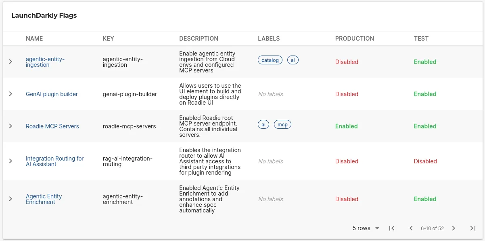

## Introduction

The LaunchDarkly plugin allows you to view feature flags on entity pages in Roadie. It provides multiple UI components to display feature flags for specific contexts, projects, and environments, helping teams manage and monitor their feature flag deployments directly within their service catalog.

This plugin supports viewing flags for individual contexts, comparing flags across multiple environments, and filtering flags by tags or queries to focus on relevant feature flags for each service.





## At a Glance

|                            |                                                                                                                                      |
|---------------------------:|--------------------------------------------------------------------------------------------------------------------------------------|
|          **Prerequisites** | **Configuration Data:** <ul><li>LaunchDarkly API Token</li></ul>                                                                     |
|         **Considerations** | Requires read-only API token with appropriate permissions in LaunchDarkly. Multiple UI components available for different use cases. |
| **Supported Environments** | ☐ Private Network via Broker <br /> ☐ Internet Accessible via IP Whitelist <br /> ☒ Cloud Hosted                                     |

## LaunchDarkly Entity Configuration

### Step 1: Create a LaunchDarkly API Token

Roadie requires an API token to connect to LaunchDarkly and retrieve feature flag information.

1. Log into your LaunchDarkly account
2. Navigate to Account Settings → Authorization
3. Create a new API token with read-only permissions
4. Copy the generated token for use in Roadie

You can learn more about generating API tokens by visiting the [LaunchDarkly API documentation](https://docs.launchdarkly.com/home/account/api).

### Step 2: Configure Roadie with your LaunchDarkly API Token

1. Navigate to the secrets page in Roadie at `/administration/secrets`
2. Enter the API token you generated in the secret called `LAUNCHDARKLY_API_KEY`
3. Save the configuration

### Step 3: Add UI Components

The LaunchDarkly plugin provides multiple UI components that can be added to entity pages:

#### EntityLaunchdarklyContextOverviewCard

Displays feature flags for a specific LaunchDarkly context. This card shows flags relevant to the entity's configured context and is ideal for service-specific flag monitoring.

This card can be [added to component dashboards](/docs/details/updating-the-ui/#updating-dashboards).

#### EntityLaunchdarklyCard

Displays LaunchDarkly flags across multiple environments with column toggling capabilities. This component provides a comprehensive view of how flags are configured across different environments (e.g., development, staging, production).


### Step 4: Annotate Your Entities

Add the following annotations to your `catalog-info.yaml` files to connect entities with LaunchDarkly feature flags:


#### Basic Configuration

```yaml
metadata:
  annotations:
    launchdarkly.com/project-key: default
    launchdarkly.com/environment-key: production
    launchdarkly.com/context: '{"kind":"tenant","key":"roadie","name":"roadie"}'
```

#### Advanced Configuration with Filtering

```yaml
metadata:
  annotations:
    launchdarkly.com/project-key: default
    launchdarkly.com/environment-key: production
    launchdarkly.com/context: '{"kind":"tenant","key":"roadie","name":"roadie"}'
    launchdarkly.com/filter-tags: '["frontend", "api"]'
    launchdarkly.com/filter-query: 'dark-mode'
```

For the `EntityLaunchdarklyContextOverviewCard` component `project-key`, `environment-key` and `context` are needed.
`EntityLaunchdarklyCard` component supports `project-key` and `filter-query`.


## Annotation Reference

| Annotation                         | Description                      | Required | Example                                              |
|------------------------------------|----------------------------------|----------|------------------------------------------------------|
| `launchdarkly.com/project-key`     | LaunchDarkly project identifier  | Yes      | `default`                                            |
| `launchdarkly.com/environment-key` | Environment within the project   | Yes      | `production`                                         |
| `launchdarkly.com/context`         | JSON context for flag evaluation | No       | `'{"kind":"tenant","key":"roadie","name":"roadie"}'` |
| `launchdarkly.com/filter-tags`     | Array of tags to filter flags    | No       | `'["frontend", "api"]'`                              |
| `launchdarkly.com/filter-query`    | Query string to filter flags     | No       | `'dark-mode'`                                        |

## Troubleshooting

### Feature flags not appearing

1. **Verify API token configuration**
   - Check that `LAUNCHDARKLY_API_KEY` is correctly set in Roadie secrets
   - Ensure the API token has not expired
   - Verify the token has appropriate read permissions

2. **Check entity annotations**
   - Confirm `launchdarkly.com/project-key` matches your LaunchDarkly project
   - Verify `launchdarkly.com/environment-key` exists in your project
   - Ensure JSON context format is valid if using context annotation

3. **Validate LaunchDarkly configuration**
   - Confirm the project and environment exist in LaunchDarkly. Note that launchdarkly environment name and the environment key may not be the same.
   - Check that feature flags exist in the specified environment
   - Verify network connectivity to LaunchDarkly API

### UI components not displaying

1. **Check component availability**
   - Verify the LaunchDarkly plugin is enabled in your Roadie instance
   - Ensure UI components are properly configured on entity pages
   - Check browser console for JavaScript errors

2. **Validate entity conditions**
   - Confirm entities have the required LaunchDarkly annotations
   - Check that the entity type supports the configured UI components

### Filtering not working

1. **Verify filter syntax**
   - Ensure `filter-tags` is a valid JSON array
   - Check that tag names match exactly with LaunchDarkly flag tags
   - Verify `filter-query` syntax matches [LaunchDarkly search capabilities](https://launchdarkly.com/docs/api/feature-flags/get-feature-flags#filtering-flags).

2. **Check flag configuration**
   - Confirm flags have the expected tags in LaunchDarkly
   - Verify flag names contain the query string if using query filtering

## References

- [LaunchDarkly Plugin on npm](https://www.npmjs.com/package/@roadiehq/backstage-plugin-launchdarkly)
- [LaunchDarkly API Documentation](https://docs.launchdarkly.com/home/account/api)
- [LaunchDarkly Feature Flag Documentation](https://docs.launchdarkly.com/home/flags)
- [Backstage Entity Annotations](https://backstage.io/docs/features/software-catalog/well-known-annotations)
