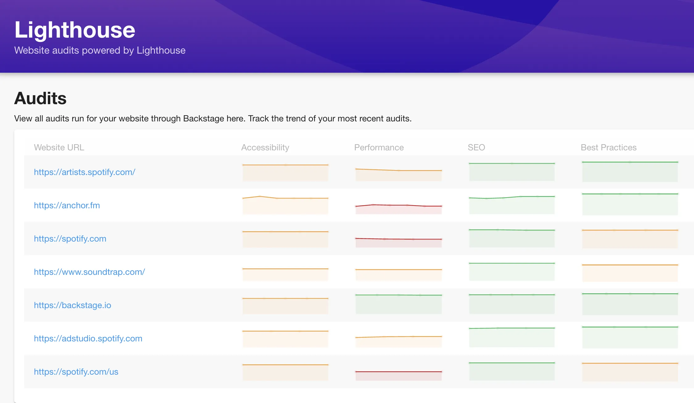
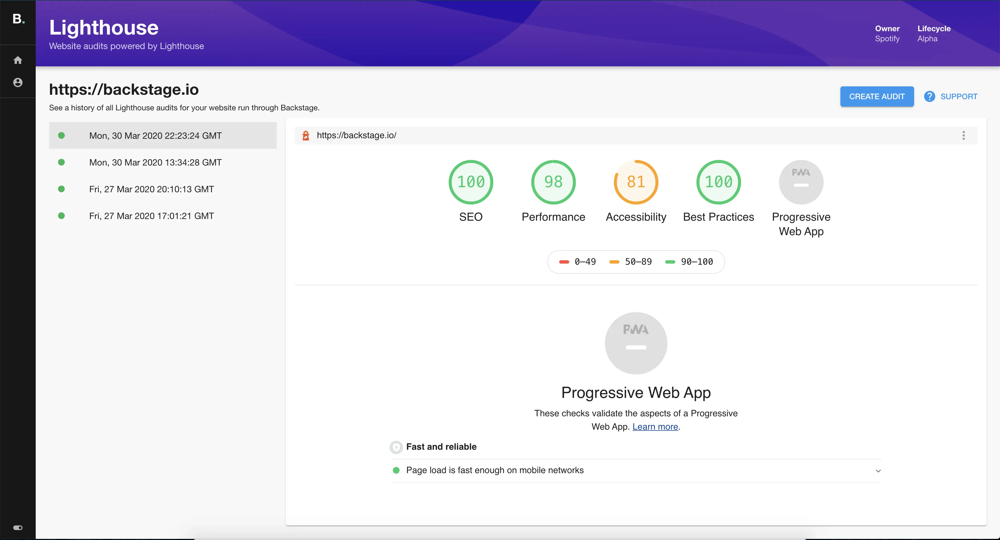
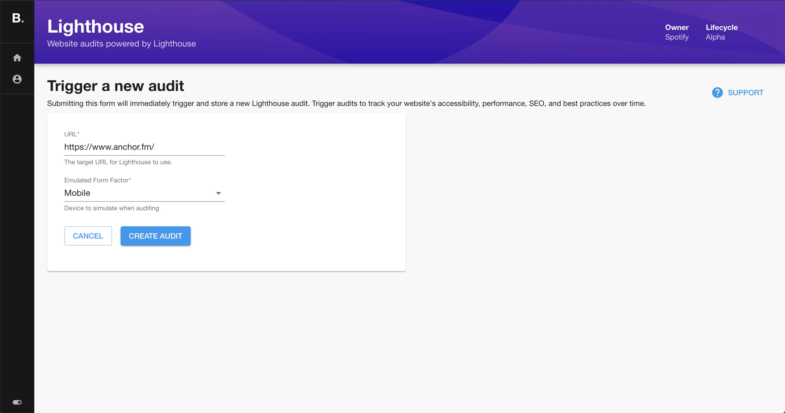
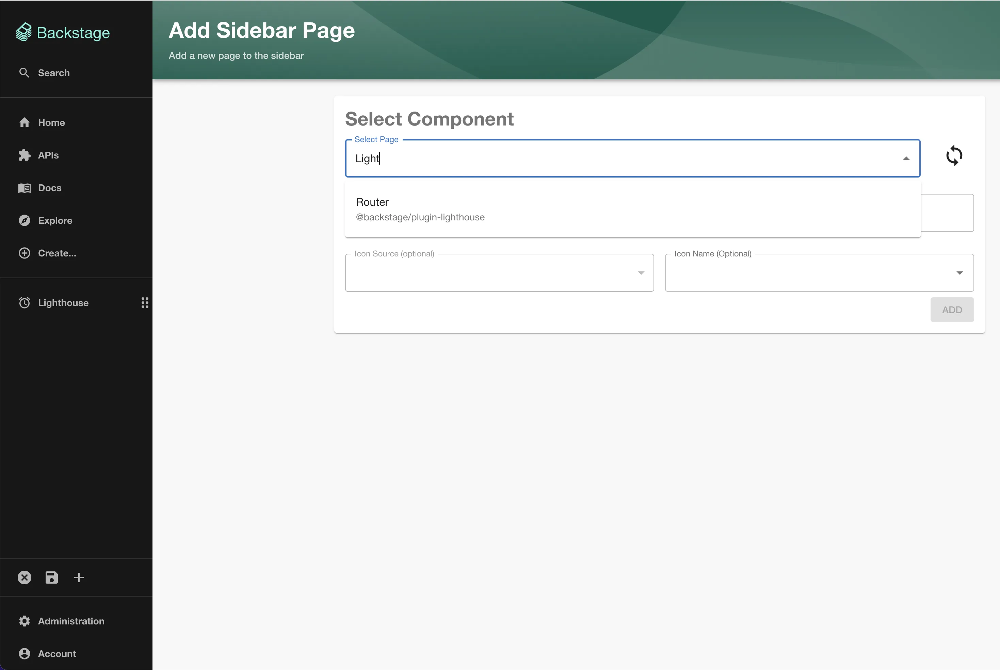
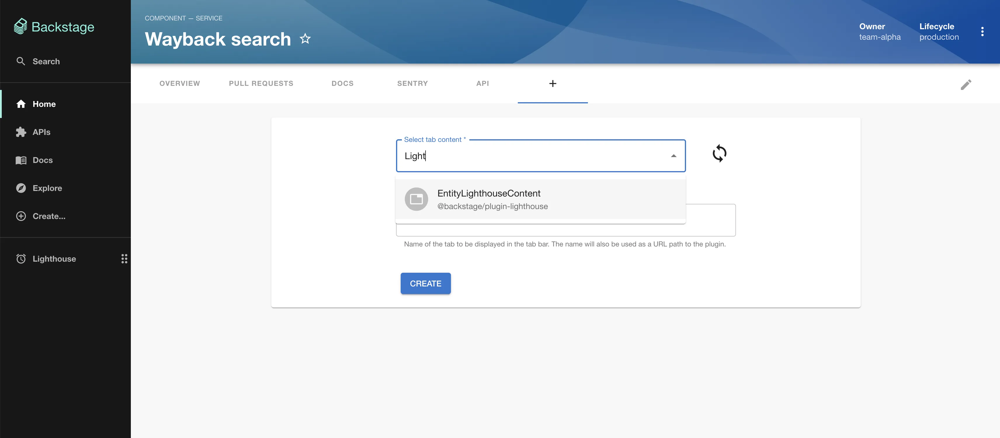
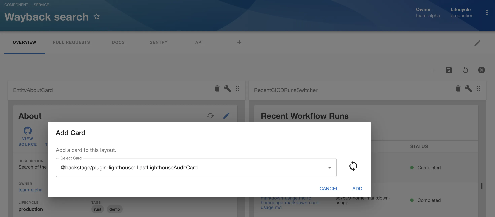

## Introduction

Google's Lighthouse auditing tool for websites is a great open-source resource for benchmarking and improving the accessibility, performance, SEO, and best practices of your site.

This plugin allows you to trigger Lighthouse audits on websites and track them.

- Track multiple websites' audit performance over time using the main metrics that Lighthouse outputs:


- Travel back and forth through your audit history


- Trigger a fresh audit directly from Backstage


## At a Glance
| | |
|---: | --- |
| **Prerequisites** |  |
| **Considerations** |  |
| **Supported Environments** | ☐ Private Network via Broker <br /> ☐ Internet Accessible via IP Whitelist <br /> ☒ Cloud Hosted |

## Prerequisites

In order to use the Lighthouse plugin, you need to have a running version of Spotify's Lighthouse Audit Service and a 
publicly accessible url for it.

## Adding the plugin

First, set the url of your Lighthouse Audit Service deployment within Roadie by going to Administration->Settings->Lighthouse or at the following url:

```text
https://<tenant-name>.roadie.so/administration/settings/lighthouse
```

After you have added your url, you can add a full page Lighthouse tab to your sidebar by clicking Edit Sidebar and then the plus icon:


You can also add an annotation to your components and add the page as a tab for individual websites:


Or a widget on the Overview page for a website in your Catalog.


## References

- [Lighthouse plugin documentation](https://github.com/backstage/community-plugins/tree/main/workspaces/lighthouse/plugins/lighthouse/README.md)
