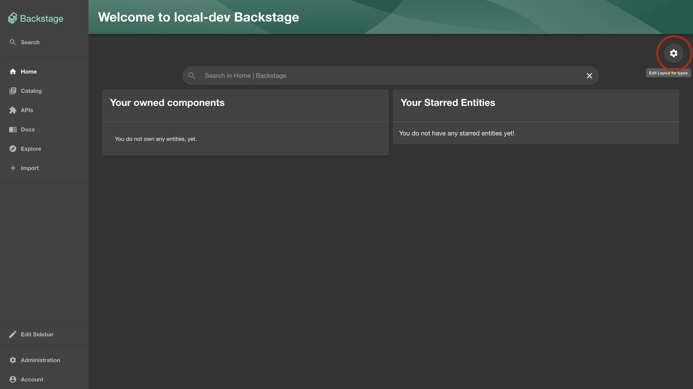
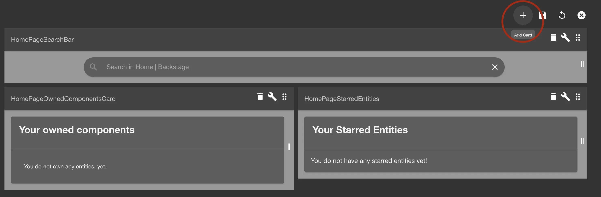
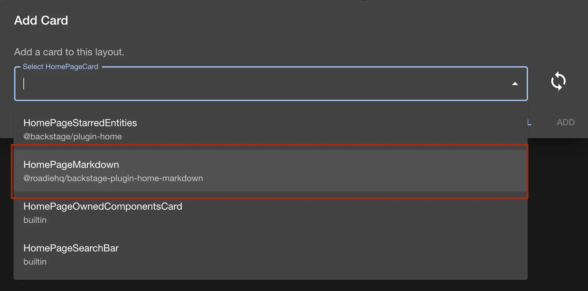
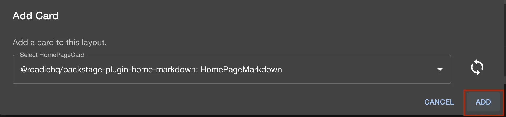
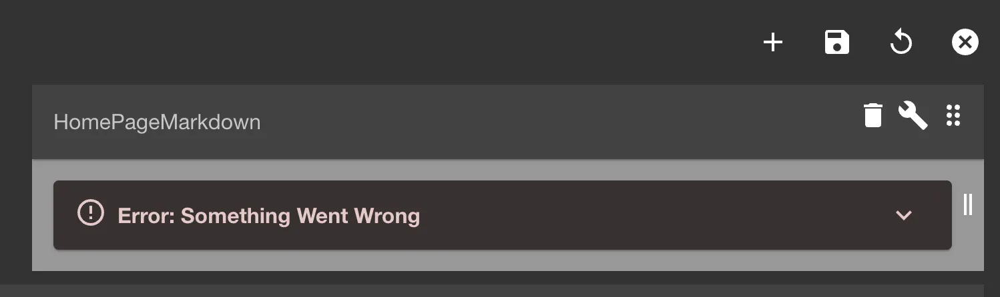
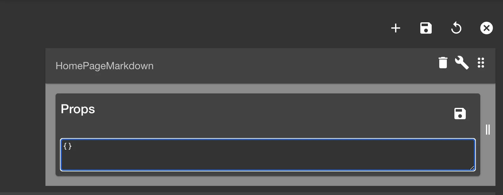

## Introduction

Roadie provides two different versions of Markdown Card plugins that can be used to display content on either the [Home page](/docs/integrations/home-page/) or [Catalog dashboard pages](/docs/details/updating-the-ui/#updating-dashboards).

## At a Glance
| | |
|---: | --- |
| **Prerequisites** |  |
| **Considerations** |  |
| **Supported Environments** | ☐ Private Network via Broker <br /> ☐ Internet Accessible via IP Whitelist <br /> ☒ Cloud Hosted | 


#### OAuth Home Page Markdown Card

This is a plugin that renders a markdown file from GitHub as a homepage component.

It fetches the .md file from GitHub on every load and caches it's content.
To be able to see the rendered content make sure you are logged into GitHub.

#### Roadie Markdown Card

The Roadie Markdown Card provides the possibility to retrieve and display markdown content from sources that you have configured integrations for on your Roadie instance. To see available integrations, take a look at the integrations section on the [plugins page](/docs/integrations/). 

Roadie Markdown Card can be enabled on both the Home Page as well as individual entity pages. 

### Setup

To use this plugin on the home page, make sure you already have the [Backstage Home plugin](https://github.com/backstage/backstage/blob/master/plugins/home/README.md) enabled.

#### Add Markdown Card to your homepage

1.  To enable this plugin go to your `Home` page via the sidebar.

    Once you are on the home page click on the cogwheel icon.

    

2.  Click the plus sign to add a new Card
    

3.  Select `HomePageMarkdown` or `HomePageMarkdownCard` from the list.
    

    Click add
    

    You will see a similar error message for the added component, but do now worry, we need to configure the plugin to point to your markdown file. You'll see instructions in the next section
    

#### Roadie Home Page Markdown Card - Configure plugin via props

To configure the Roadie Home Page Markdown Card to point to your desired location, you need to add props to the Card configuration to point to a wanted Markdown file.

1.  Click on the `wrench` icon to edit the props of the component.
    
    Add the following JSON as props. The `path` prop supports URLs from integrations that you have configured on your Roadie instance. 

    ```json
    {
      "path": "https://github.com/my-org/my-repo/my-markdown-file.md",
      "title": "My Markdown Card"
    }
    ```

2.  Click Save

    Now it should load and render the markdown file you provided the path for.
 

#### OAuth Markdown Card - Configure plugin via props

To configure the OAuth Markdown card to point to your desired location, you need to add props to the Card configuration to point to a wanted Markdown file.

1.  Click on the `wrench` icon to edit the props of the component.
    
    Add the following json as props, where the keys are the valid properties for the `HomePageMarkdown` [component](https://www.npmjs.com/package/@roadiehq/backstage-plugin-home-markdown) Make sure you change the values to the appropriate for your own markdown file.

    ```json
    {
      "path": ".backstage/home-page.md",
      "owner": "RoadieHQ",
      "repo": "roadie-backstage-plugins",
      "title": "Roadie.io Neeews!"
    }
    ```

    - `path` is the path to the .md file inside the repository
    - `owner` is the github owner of the repository that hosts the .md file
    - `repo` is the github repository name
    - `title` will be the name of the card in the header of the card
    - `branch` (optional) param if you want to point to a specific branch in your repo instead of the default one.

2.  Click Save

    Now it should load and render the markdown file you provided the path for.

#### Adding Markdown Card to Entity pages

To add Roadie Markdown Card to entity pages, you can follow similar steps as outlined above for the Homepage version. The Entity Markdown Card expects a single optional prop called `title` to display a title for the card.


The path of the Markdown file itself is configured in the entity as an annotation. To do this, add an annotation called `roadie.io/markdown-content` to the entity manifest. This annotation should point to a full, non-relative, path of a Markdown file.

<div role="alert">
  <div class="docs-cta__tip_title">Be aware</div>
  <div  class="docs-cta__tip_message">
    <p>If you are attempting to import markdown files from branches containing `/` (forward slashes), that is unfortunately not possible.</p>
  </div>
</div> 


