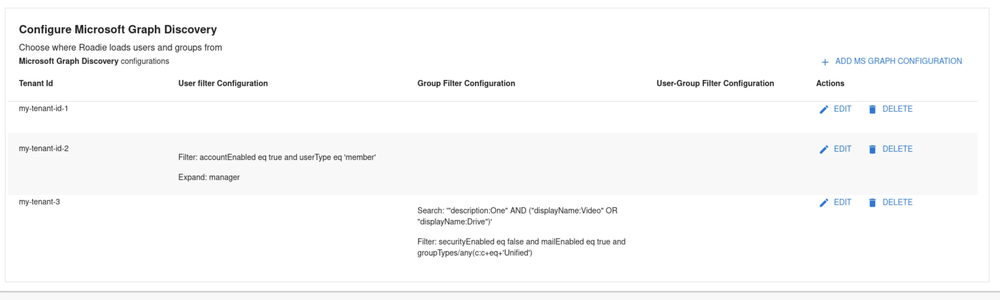
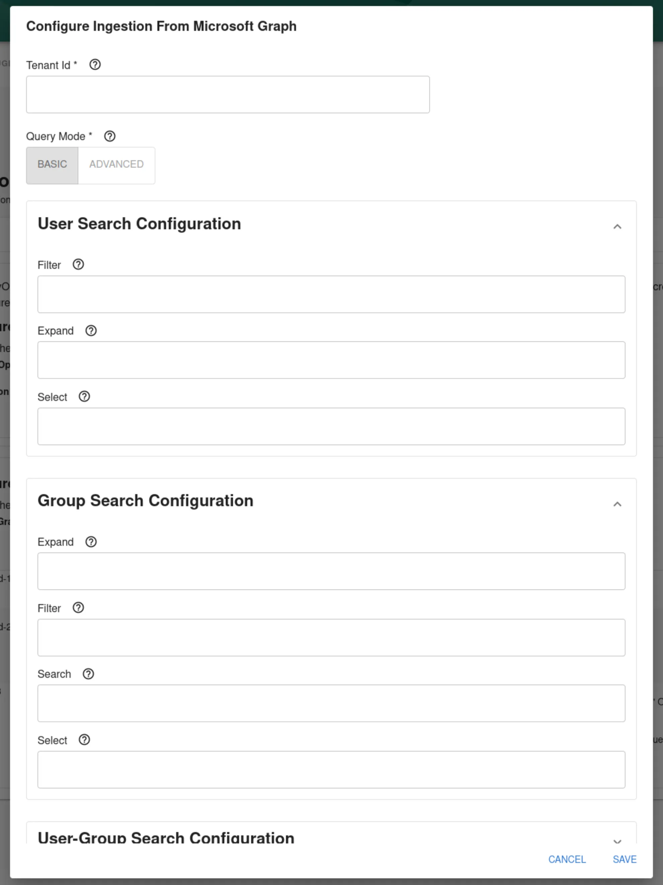

## Introduction

Roadie supports retrieving user and group information from Microsoft Azure Active Directory. 

This guide describes how to set up access for Roadie to your Azure AD and automatically ingest entities from that source.

## At a Glance
| | |
|---: | --- |
| **Prerequisites** |  |
| **Considerations** |  |
| **Supported Environments** | ☐ Private Network via Broker   ☐ Internet Accessible via IP Whitelist   ☒ Cloud Hosted |  

##  Step 1: Create Azure App Registration relevant to your Azure AD 

Azure AD discovery use Client ID and secret from App registration to authenticate to retrieve relevant data. Create a new App Registration in MS Azure with the following permissions:
* `GroupMember.Read.All`  
* `User.Read.All`

##  Step 2: Store App Registration credentials as a secret in Roadie

Navigate to `https://<tenant-name>.roadie.so/administration/secrets` and locate secrets `AZURE_CLIENT_ID` and `AZURE_CLIENT_SECRET`. Add the App Registration Client ID from the registration created above into the `AZURE_CLIENT_ID` secret. Within the 'Certificates & secrets' section of your App Registration in Azure create a new Client Secret. Store the value from the created secret in to `AZURE_CLIENT_SECRET` in Roadie.

##  Step 3: Configure your Microsoft Graph Org ingestion Provider

Navigate to `https://<tenant-name>.roadie.so/administration/settings/integrations/azure` and find the section 'Configure Microsoft Graph Discovery'. In the list you can see already inserted provider configurations.  

You can create a new configuration by clicking 'Add MS Graph configuration'. This will open a dialog window where you can input your wanted configuration values.

## Configuration Options

| Section         | Configuration option | Required | Description                                                                                                                                                                                                                                                                                                                                            |
|:----------------|----------------------|----------|--------------------------------------------------------------------------------------------------------------------------------------------------------------------------------------------------------------------------------------------------------------------------------------------------------------------------------------------------------|
|                 | Tenant Id            | Yes      | Your Azure Id tenant id. Usually in a form of UUID                                                                                                                                                                                                                                                                                                     |
|                 | Query Mode           | Yes      | Mode that the provider uses for querying which defaults to "basic". By default, the Microsoft Graph API only provides the basic feature set for querying. Certain features are limited to advanced querying capabilities. (See https://docs.microsoft.com/en-us/graph/aad-advanced-queries)                                                            |
| User            | Filter               | No       | Optional filter for user, see Microsoft Graph API for the syntax. See https://docs.microsoft.com/en-us/graph/api/resources/user?view=graph-rest-1.0#properties. and for the syntax https://docs.microsoft.com/en-us/graph/query-parameters#filter-parameter. This and userGroupMemberFilter are mutually exclusive, only one can be specified          |
| User            | Expand               | No       | Optional parameter to include the expanded resource or collection referenced by a single relationship (navigation property) in your results. Only one relationship can be expanded in a single request. See https://docs.microsoft.com/en-us/graph/query-parameters#expand-parameter. Can be combined with userGroupMember[...] instead of userFilter. |
| Group           | Expand               | No       | Optional parameter to include the expanded resource or collection referenced by a single relationship (navigation property) in your results. Only one relationship can be expanded in a single request. See https://docs.microsoft.com/en-us/graph/query-parameters#expand-parameter. Can be combined with userGroupMember[...] instead of userFilter. |
| Group           | Filter               | No       | Optional filter for group, see Microsoft Graph API for the syntax. See https://docs.microsoft.com/en-us/graph/api/resources/group?view=graph-rest-1.0#properties                                                                                                                                                                                       |
| Group           | Search               | No       | Optional search for groups, see Microsoft Graph API for the syntax. See https://docs.microsoft.com/en-us/graph/search-query-parameter                                                                                                                                                                                                                  |
| Group           | Select               | No       | Optional select for groups, this will allow you work with schemaExtensions. in order to add extra information to your groups that can be used on your custom groupTransformers. See  https://docs.microsoft.com/en-us/graph/api/resources/schemaextension?view=graph-rest-1.0                                                                          |
| UserGroupMember | Filter               | No       | Optional filter for users, use group membership to get users. (Filtered groups and fetch their members.) This and userFilter are mutually exclusive, only one can be specified. See https://docs.microsoft.com/en-us/graph/search-query-parameter                                                                                                      |
| UserGroupMember | Search               | No       | Optional search for groups, see Microsoft Graph API for the syntax. See https://docs.microsoft.com/en-us/graph/search-query-parameter                                                                                                                                                                                                                  |

Target and Authority configurations are defaulting to use `https://graph.microsoft.com/v1.0` and `https://login.microsoftonline.com` respectively. If you have a need to modify these or alternatively use multiple Client IDs and Secrets, Please contact support. 

For more information about query patterns see the linked provider plugin in the references section below.

## References

- [Microsoft Graph Org Provider documentation in Backstage repository](https://github.com/backstage/backstage/tree/master/plugins/catalog-backend-module-msgraph)

