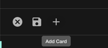
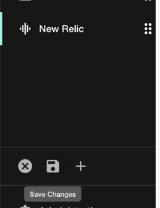

## Introduction

In order to make requests to the NewRelic API, you must provide Roadie with an API key.

## Steps

1. Go to https://one.newrelic.com/launcher/api-keys-ui.api-keys-launcher and follow the steps to create a user-api-key for NewRelic.

2. Give the token a name and click "Create a key".

3. Click the icon along side the key you have created and click "Copy key"

4. Login to Roadie and visit the administration -> settings -> secrets (https://\<tenant name\>.roadie.so/administration/settings/secrets) page.

5. Click the pencil icon alongside the "NEW_RELIC_REST_API_KEY" and paste the API key you copied earlier.

6. It can take up to 2 minutes for the API key to be applied.

7. In the meantime, you can add the new-relic plugin to the Sidebar.

8. Hover over the sidebar on the left and click the "Edit Sidebar" icon

   
9. Click "Add Card"

10. Select the option "@backstage/plugin-newrelic: NewRelicPage", pick a name for the menu item the path, and an Icon. Click Add.

11. You should see a new item in the sidebar for NewRelic, click the sidebar save button.

